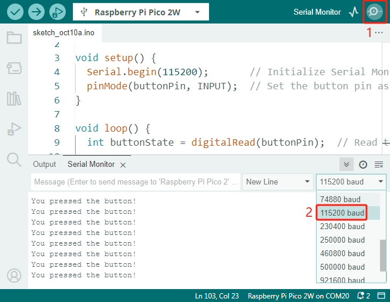

.. note::

    Hello, welcome to the SunFounder Raspberry Pi & Arduino & ESP32 Enthusiasts Community on Facebook! Dive deeper into Raspberry Pi, Arduino, and ESP32 with fellow enthusiasts.

    **Why Join?**

    - **Expert Support**: Solve post-sale issues and technical challenges with help from our community and team.
    - **Learn & Share**: Exchange tips and tutorials to enhance your skills.
    - **Exclusive Previews**: Get early access to new product announcements and sneak peeks.
    - **Special Discounts**: Enjoy exclusive discounts on our newest products.
    - **Festive Promotions and Giveaways**: Take part in giveaways and holiday promotions.

    👉 Ready to explore and create with us? Click [|link_sf_facebook|] and join today!

.. _ar_button:

2.5 Reading Button Value
=============================

In this lesson, we'll learn how to read input from a pushbutton using the Raspberry Pi Pico 2w. So far, we've used the GPIO pins mainly for output, like lighting up LEDs. Now, we'll use a GPIO pin as an input to detect when a button is pressed. This is a fundamental skill for creating interactive projects.

* :ref:`cpn_button`

**Required Components**

In this project, we need the following components. 

It's definitely convenient to buy a whole kit, here's the link: 

.. list-table::
    :widths: 20 20 20
    :header-rows: 1

    *   - Name	
        - ITEMS IN THIS KIT
        - PURCHASE LINK
    *   - Pico 2 W Starter Kit	
        - 450+
        - |link_pico2w_kit|

You can also buy them separately from the links below.

.. list-table::
    :widths: 5 20 5 20
    :header-rows: 1

    *   - SN
        - COMPONENT INTRODUCTION	
        - QUANTITY
        - PURCHASE LINK

    *   - 1
        - :ref:`cpn_pico_2w`
        - 1
        - |link_pico2w_buy|
    *   - 2
        - Micro USB Cable
        - 1
        - 
    *   - 3
        - :ref:`cpn_breadboard`
        - 1
        - |link_breadboard_buy|
    *   - 4
        - :ref:`cpn_wire`
        - Several
        - |link_wires_buy|
    *   - 5
        - :ref:`cpn_resistor`
        - 1(10KΩ)
        - |link_resistor_buy|
    *   - 6
        - :ref:`cpn_button`
        - 1
        - |link_button_buy|

**Schematic**

|sch_button|

As long as one side of the button pin is connected to 3.3v, and the other side pin is connected to GP14, then when the button is pressed, GP14 will be high. However, when the button is not pressed, GP14 is in a suspended state and may be high or low. In order to get a stable low level when the button is not pressed, GP14 needs to be reconnected to GND through a 10K pull-down resistor.

* **Button Not Pressed**: The GP14 pin is connected to GND through the resistor, so it reads **LOW (0)**.
* **Button Pressed**: The GP14 pin is connected to 3.3V through the button, so it reads **HIGH (1)**.

**Wiring**

A four-pin button is shaped like an H. Its left two pins or right two pins are connected, which means that when it crosses the central gap, it connects two half rows with the same row number. (For example, in my circuit, E23 and F23 are already connected, as are E25 and F25).

Until the button is pressed, the left and right pins are independent of each other and current cannot flow from one side to the other.

|wiring_button|

**Code**

.. note::

    * You can open the file ``2.5_reading_button_value.ino`` under the path of ``pico-2w-kit-main/arduino/2.5_reading_button_value``. 
    * Or copy this code into **Arduino IDE**.
    * Don't forget to select the board(Raspberry Pi Pico) and the correct port before clicking the **Upload** button.

.. code-block:: Arduino

   const int buttonPin = 14;  // GPIO pin connected to the button

   void setup() {
     Serial.begin(115200);       // Initialize Serial Monitor at 115200 baud
     pinMode(buttonPin, INPUT);  // Set the button pin as input
   }

   void loop() {
     int buttonState = digitalRead(buttonPin);  // Read the state of the button

     if (buttonState == HIGH) {
       Serial.println("You pressed the button!");
     }
     delay(100);  // Small delay to avoid reading the button too frequently
   }

* After uploading the code, click on the magnifying glass icon(Serial Monitor) in the top-right corner of the Arduino IDE.
* Set the baud rate to 115200 to match the ``Serial.begin(115200);`` line in your code.
* Each time you press the button, "You pressed the button!" should appear in the Serial Monitor.

**Understanding the Code**

#. Initializing Serial Communication:

   Starts serial communication at a baud rate of 115200. This allows us to print messages to the Serial Monitor.

   .. code-block:: Arduino

        Serial.begin(115200);

#. Setting Up the Button Pin:

   Configures ``buttonPin`` (GP14) as an input to read the button state.

   .. code-block:: Arduino

        pinMode(buttonPin, INPUT);

#. Reading the Button State:

   Reads the current state of the button. It will be ``HIGH`` when pressed and ``LOW`` when not pressed.

   .. code-block:: Arduino

        int buttonState = digitalRead(buttonPin);

#. Responding to Button Press:

   If the button is pressed, print a message to the Serial Monitor.

   .. code-block:: Arduino

        if (buttonState == HIGH) {
          Serial.println("You pressed the button!");
        }

**Alternative: Pull-Up Resistor Configuration**

You can also wire the button using a pull-up resistor. In this configuration:

* **Button Not Pressed**: GP14 reads HIGH (1) due to the pull-up resistor connected to 3.3V.
* **Button Pressed**: GP14 is connected to GND when the button is pressed, so it reads LOW (0).

* Wiring Instructions:

  * Connect a 10KΩ resistor from GP14 to 3.3V.
  * Connect one side of the button to GP14.
  * Connect the other side of the button to GND.

* Code Modification:

  Change the condition in the ``if`` statement:

  .. code-block:: Arduino

        if (buttonState == LOW) {
          Serial.println("You pressed the button!");
        }

**Using Internal Pull-Up Resistor**

The Raspberry Pi Pico 2 allows you to enable internal pull-up resistor, eliminating the need for external resistor.

Using internal resistor simplifies wiring and saves space by eliminating the need for additional external resistor on the breadboard.

* **Button Not Pressed**: GP14 reads HIGH (1) due to the internal pull-up resistor.
* **Button Pressed**: GP14 is connected to GND when the button is pressed, so it reads LOW (0).

* Wiring Instructions:

  * Remove the 10KΩ resistor.

* Code Modification:

  * Set the button pin as input with an internal pull-up resistor.
  * Change the condition in the ``if`` statement.

  .. code-block:: Arduino

     const int buttonPin = 14;  // GPIO pin connected to the button
  
     void setup() {
       Serial.begin(115200);       // Initialize Serial Monitor at 115200 baud
       pinMode(buttonPin, INPUT_PULLUP);  // Set the button pin as input with an internal pull-up resistor
     }
  
     void loop() {
       int buttonState = digitalRead(buttonPin);  // Read the state of the button
  
       if (buttonState == LOW) {
         Serial.println("You pressed the button!");
       }
       delay(100);  // Small delay to avoid reading the button too frequently
     }

**Conclusion**

In this lesson, you've learned how to read input from a pushbutton using the Raspberry Pi Pico. This fundamental skill allows you to create interactive projects where the program responds to user input.

**Further Exploration**

* **Control an LED**: Modify the code to turn an LED on when the button is pressed.
* **Debouncing**: Implement code to handle button bouncing for more reliable input.
* **Multiple Buttons**: Try reading input from multiple buttons to perform different actions.