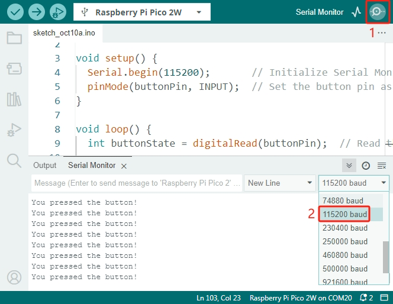

.. note:: 

    Hallo und willkommen in der SunFounder Raspberry Pi & Arduino & ESP32 Enthusiasten-Community auf Facebook! Tauche tiefer in die Welt von Raspberry Pi, Arduino und ESP32 ein und teile dein Wissen mit Gleichgesinnten.

    **Warum beitreten?**

    - **Experten-Support**: Erhalte Hilfe von unserer Community und unserem Team bei technischen Herausforderungen und nach dem Kauf auftretenden Problemen.
    - **Lernen & Teilen**: Tausche Tipps und Anleitungen aus, um deine Fähigkeiten zu verbessern.
    - **Exklusive Vorschauen**: Erhalte frühzeitigen Zugang zu neuen Produktankündigungen und exklusiven Einblicken.
    - **Spezielle Rabatte**: Profitiere von exklusiven Rabatten auf unsere neuesten Produkte.
    - **Festliche Aktionen und Gewinnspiele**: Nimm an Gewinnspielen und saisonalen Aktionen teil.

    👉 Bereit, mit uns zu experimentieren und zu erschaffen? Klicke auf [|link_sf_facebook|] und tritt noch heute bei!

.. _ar_button:

2.5 Den Taster auslesen
=============================

In dieser Lektion lernen wir, wie man mit dem Raspberry Pi Pico 2 W den Zustand eines Tasters einliest. Bisher haben wir die GPIO-Pins hauptsächlich als Ausgang verwendet, z. B. um LEDs zu steuern. Jetzt nutzen wir einen GPIO-Pin als Eingang, um zu erkennen, wann ein Taster gedrückt wird. Dies ist eine grundlegende Fähigkeit für interaktive Projekte.

* :ref:`cpn_button`

**Erforderliche Komponenten**

Für dieses Projekt benötigen wir folgende Komponenten:

Ein Komplett-Kit ist besonders praktisch, hier ist der Link: 

.. list-table::
    :widths: 20 20 20
    :header-rows: 1

    *   - Name	
        - ENTHALTENE TEILE
        - KAUFLINK
    *   - Pico 2 W Starter Kit	
        - 450+
        - |link_pico2w_kit|

Alternativ kannst du die Komponenten auch einzeln kaufen:

.. list-table::
    :widths: 5 20 5 20
    :header-rows: 1

    *   - SN
        - KOMPONENTENBESCHREIBUNG	
        - MENGE
        - KAUFLINK

    *   - 1
        - :ref:`cpn_pico_2w`
        - 1
        - |link_pico2w_buy|
    *   - 2
        - Micro-USB-Kabel
        - 1
        - 
    *   - 3
        - :ref:`cpn_breadboard`
        - 1
        - |link_breadboard_buy|
    *   - 4
        - :ref:`cpn_wire`
        - Mehrere
        - |link_wires_buy|
    *   - 5
        - :ref:`cpn_resistor`
        - 1 (10 kΩ)
        - |link_resistor_buy|
    *   - 6
        - :ref:`cpn_button`
        - 1
        - |link_button_buy|

**Schaltplan**

|sch_button|

Eine Seite des Tasters ist mit 3.3 V verbunden, die andere Seite mit GP14. Wird der Taster gedrückt, erhält GP14 ein HIGH-Signal (1). Ist der Taster nicht gedrückt, befindet sich GP14 in einem undefinierten Zustand (floating) und kann sowohl HIGH als auch LOW sein. Um ein stabiles LOW-Signal (0) im ungedrückten Zustand sicherzustellen, wird GP14 mit einem 10-kΩ-Pull-Down-Widerstand auf GND gezogen.

* **Taster nicht gedrückt**: GP14 ist über den Widerstand mit GND verbunden und liest **LOW (0)**.
* **Taster gedrückt**: GP14 wird mit 3.3 V verbunden und liest **HIGH (1)**.

**Verdrahtung**

Ein vierpoliger Taster hat die Form eines "H". Die beiden linken Pins sowie die beiden rechten Pins sind jeweils miteinander verbunden. Das bedeutet, dass beim Überbrücken der mittleren Trennlinie zwei halbe Reihen mit derselben Reihennummer verbunden werden. (Zum Beispiel sind in meiner Schaltung E23 und F23 bereits verbunden, ebenso wie E25 und F25).

Solange der Taster nicht gedrückt wird, sind die linken und rechten Pins voneinander isoliert, sodass kein Strom von einer Seite zur anderen fließen kann.

|wiring_button|

**Code**

.. note::

    * Die Datei ``2.5_reading_button_value.ino`` befindet sich unter ``pico-2w-kit-main/arduino/2.5_reading_button_value``. 
    * Alternativ kannst du den Code in die **Arduino IDE** kopieren.
    * Vergiss nicht, das Board (Raspberry Pi Pico) und den richtigen Port auszuwählen, bevor du auf **Upload** klickst.

.. code-block:: Arduino

   const int buttonPin = 14;  // GPIO-Pin, der mit dem Taster verbunden ist

   void setup() {
     Serial.begin(115200);       // Seriellen Monitor mit 115200 Baud initialisieren
     pinMode(buttonPin, INPUT);  // Taster-Pin als Eingang definieren
   }

   void loop() {
     int buttonState = digitalRead(buttonPin);  // Zustand des Tasters auslesen

     if (buttonState == HIGH) {
       Serial.println("You pressed the button!");
     }
     delay(100);  // Kurze Verzögerung, um zu häufige Abfragen zu vermeiden
   }

* Nach dem Hochladen des Codes klicke in der Arduino IDE auf das Lupensymbol (Serieller Monitor).
* Stelle die Baudrate auf 115200, um mit ``Serial.begin(115200);`` übereinzustimmen.
* Jedes Mal, wenn du den Taster drückst, sollte die Nachricht "Taste gedrückt!" im seriellen Monitor erscheinen.

**Den Code verstehen**

#. Serielle Kommunikation initialisieren:

   Startet die serielle Verbindung mit einer Baudrate von 115200. Dadurch können wir Nachrichten an den seriellen Monitor senden.

   .. code-block:: Arduino

        Serial.begin(115200);

#. Taster-Pin konfigurieren:

   Legt ``buttonPin`` (GP14) als Eingang fest, um den Tasterzustand auszulesen.

   .. code-block:: Arduino

        pinMode(buttonPin, INPUT);

#. Zustand des Tasters auslesen:

   Liest den aktuellen Zustand des Tasters. Dieser ist ``HIGH``, wenn er gedrückt wird, und ``LOW``, wenn er nicht gedrückt wird.

   .. code-block:: Arduino

        int buttonState = digitalRead(buttonPin);

#. Auf Tastendruck reagieren:

   Falls der Taster gedrückt wird, wird eine Nachricht im seriellen Monitor ausgegeben.

   .. code-block:: Arduino

        if (buttonState == HIGH) {
          Serial.println("You pressed the button!");
        }

**Alternative: Pull-Up-Widerstand verwenden**

Der Taster kann auch mit einem Pull-Up-Widerstand verdrahtet werden:

* **Taster nicht gedrückt**: GP14 liest HIGH (1), da er über den Widerstand mit 3.3 V verbunden ist.
* **Taster gedrückt**: GP14 wird mit GND verbunden und liest LOW (0).

* Verdrahtung:

  * Verbinde einen 10-kΩ-Widerstand zwischen GP14 und 3,3 V.
  * Eine Seite des Tasters wird an GP14 angeschlossen.
  * Die andere Seite wird mit GND verbunden.

* Code-Änderung:

  Passe die Bedingung im ``if``-Statement an:

  .. code-block:: Arduino

        if (buttonState == LOW) {
          Serial.println("You pressed the button!");
        }

**Interner Pull-Up-Widerstand nutzen**

Der Raspberry Pi Pico kann den internen Pull-Up-Widerstand aktivieren, 
wodurch kein externer Widerstand nötig ist. Dies reduziert den Verdrahtungsaufwand.

* **Taster nicht gedrückt**: GP14 liest HIGH (1) aufgrund des internen Pull-Up-Widerstands.
* **Taster gedrückt**: GP14 wird mit GND verbunden und liest LOW (0).

* Verdrahtung:

  * Entferne den 10-kΩ-Widerstand.

* Code-Änderung:

  * Setze den Button-Pin als Eingang mit internem Pull-Up-Widerstand.
  * Ändere die Bedingung im ``if``-Statement.

  .. code-block:: Arduino

     const int buttonPin = 14;  // GPIO-Pin für den Taster
  
     void setup() {
       Serial.begin(115200);       // Seriellen Monitor mit 115200 Baud initialisieren
       pinMode(buttonPin, INPUT_PULLUP);  // Taster-Pin als Eingang mit internem Pull-Up-Widerstand
     }
  
     void loop() {
       int buttonState = digitalRead(buttonPin);  // Zustand des Tasters auslesen
  
       if (buttonState == LOW) {
         Serial.println("You pressed the button!");
       }
       delay(100);  // Kurze Verzögerung, um zu häufige Abfragen zu vermeiden
     }

**Fazit**

In dieser Lektion hast du gelernt, wie man mit dem Raspberry Pi Pico einen Taster ausliest. Dies ist eine wichtige Grundlage für interaktive Projekte, bei denen das Programm auf Benutzereingaben reagiert.

**Weitere Experimente**

* **Eine LED steuern**: Ändere den Code, sodass eine LED eingeschaltet wird, wenn der Taster gedrückt wird.
* **Tasten-Entprellung**: Implementiere eine Entprellung für eine zuverlässigere Eingabe.
* **Mehrere Taster nutzen**: Lese mehrere Taster ein, um verschiedene Aktionen auszulösen.
