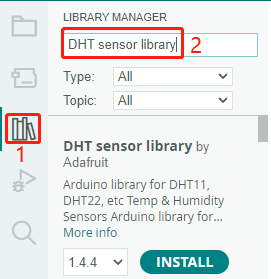
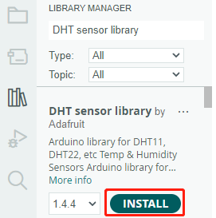

.. note:: 

    こんにちは、SunFounder Raspberry Pi & Arduino & ESP32愛好者コミュニティへようこそ！ Raspberry Pi、Arduino、ESP32について、他の愛好者と一緒に深く学びましょう。

    **なぜ参加するべきか？**

    - **専門家サポート**: 購入後の問題や技術的な課題をコミュニティやチームのサポートで解決できます。
    - **学びと共有**: ヒントやチュートリアルを交換し、スキルを向上させましょう。
    - **限定プレビュー**: 新製品の発表や先行情報をいち早くチェックできます。
    - **特別割引**: 最新製品の限定割引をお楽しみいただけます。
    - **お得なプロモーションやプレゼント**: プレゼント企画やホリデープロモーションに参加しましょう。

    👉 一緒に探求し、創造を始めませんか？ [|link_sf_facebook|] をクリックして、今すぐ参加しましょう！

1.4 ライブラリのインストール（重要）
======================================

多くのライブラリは、Arduinoの **ライブラリマネージャー** から直接インストールできます。 **ライブラリマネージャー** にアクセスするには、以下の手順を実行します：

**ライブラリマネージャー** では、ライブラリの名前で検索したり、さまざまなカテゴリをブラウズして目的のライブラリを見つけることができます。

.. note::

   ライブラリのインストールが必要なプロジェクトでは、インストールすべきライブラリが案内されます。例えば、「ここではDHTセンサライブラリが使用されます。 **ライブラリマネージャー** からインストールできます」といった指示があります。案内に従って、推奨されたライブラリをインストールしてください。

インストールしたいライブラリを見つけたら、それをクリックし、次に **インストール** ボタンをクリックします。

Arduino IDEは自動的にライブラリをダウンロードし、インストールを行います。

.. note::

   インストールされたライブラリは、通常、Arduino IDEのデフォルトライブラリディレクトリに保存されます。このディレクトリは通常、 ``C:\Users\xxx\Documents\Arduino\libraries`` にあります。

   ライブラリディレクトリが異なる場合は、 **ファイル** -> **環境設定** から確認できます。

      .. image:: img/install_lib1.png