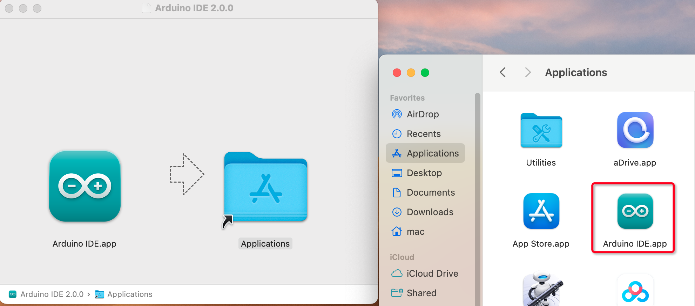

.. note:: 

    Hallo, willkommen in der SunFounder Raspberry Pi & Arduino & ESP32 Enthusiasten-Community auf Facebook! Tauche tiefer in die Welt von Raspberry Pi, Arduino und ESP32 ein – zusammen mit Gleichgesinnten.

    **Why Join?**

    - **Expert Support**: Löse Probleme nach dem Kauf und technische Herausforderungen mit Hilfe unserer Community und unseres Teams.
    - **Learn & Share**: Tausche Tipps und Tutorials aus, um deine Fähigkeiten zu verbessern.
    - **Exclusive Previews**: Erhalte frühzeitigen Zugang zu neuen Produktankündigungen und exklusiven Vorschauen.
    - **Special Discounts**: Profitiere von exklusiven Rabatten auf unsere neuesten Produkte.
    - **Festive Promotions and Giveaways**: Nimm an Gewinnspielen und Sonderaktionen zu Feiertagen teil.

    👉 Bereit, mit uns zu entdecken und zu kreieren? Klicke auf [|link_sf_facebook|] und tritt noch heute bei!

.. _install_arduino:

1.1 Installation der Arduino IDE (Wichtig)
============================================

Die Arduino IDE (Arduino Integrated Development Environment) bietet alle notwendigen Software-Tools, um Arduino-Projekte zu erstellen.  
Es handelt sich um eine speziell für Arduino entwickelte Programmiersoftware, die vom Arduino-Team bereitgestellt wird und es ermöglicht, Programme zu schreiben und auf das Arduino-Board hochzuladen.

Die Arduino IDE 2.0 ist ein Open-Source-Projekt und stellt einen großen Fortschritt gegenüber ihrem Vorgänger, der Arduino IDE 1.x, dar.  
Sie bietet eine überarbeitete Benutzeroberfläche, einen verbesserten Board- & Bibliotheksmanager, einen Debugger, eine Autovervollständigungsfunktion und vieles mehr.

In diesem Tutorial zeigen wir dir, wie du die Arduino IDE 2.0 auf deinem Windows-, Mac- oder Linux-Computer herunterladen und installieren kannst.

Anforderungen
---------------------

* Windows - Win 10 oder neuer, 64-Bit
* Linux - 64-Bit
* Mac OS X - Version 10.14 "Mojave" oder neuer, 64-Bit

Arduino IDE 2.0 herunterladen
----------------------------------

#. Besuche die Seite |link_download_arduino|.
#. Lade die IDE-Version für dein Betriebssystem herunter.

    .. image:: img/sp_001.png

Installation
------------------------------

Windows
^^^^^^^^^^^^^

#. Doppelklicke auf die Datei ``arduino-ide_xxxx.exe``, um das heruntergeladene Installationsprogramm auszuführen.

#. Lies die Lizenzvereinbarung und stimme ihr zu.

    .. image:: img/sp_002.png

#. Wähle die gewünschten Installationsoptionen.

    .. image:: img/sp_003.png

#. Wähle den Installationspfad. Es wird empfohlen, die Software auf einem anderen Laufwerk als dem Systemlaufwerk zu installieren.

    .. image:: img/sp_004.png

#. Schließe die Installation ab.

    .. image:: img/sp_005.png

macOS
^^^^^^^^^^^^^^^^

Doppelklicke auf die heruntergeladene Datei ``arduino_ide_xxxx.dmg`` und folge den Anweisungen, um die **Arduino IDE.app** in den **Programme**-Ordner zu kopieren.  
Nach wenigen Sekunden sollte die Arduino IDE erfolgreich installiert sein.

Linux
^^^^^^^^^^^^

Für eine detaillierte Anleitung zur Installation der Arduino IDE 2.0 auf einem Linux-System besuche bitte: https://docs.arduino.cc/software/ide-v2/tutorials/getting-started/ide-v2-downloading-and-installing#linux

Die IDE öffnen
--------------

#. Beim ersten Öffnen der Arduino IDE 2.0 werden automatisch die Arduino AVR Boards, integrierte Bibliotheken und andere erforderliche Dateien installiert.

    .. image:: img/sp_901.png

#. Zudem kann es vorkommen, dass dein Firewall- oder Sicherheitsprogramm einige Meldungen anzeigt und dich auffordert, Treiber zu installieren. Bitte installiere alle erforderlichen Treiber.

    .. image:: img/sp_104.png

#. Nun ist deine Arduino IDE einsatzbereit!

    .. note::
        Falls einige Installationen aufgrund von Netzwerkproblemen oder anderen Gründen nicht erfolgreich abgeschlossen wurden, kannst du die Arduino IDE erneut öffnen, um den Installationsvorgang abzuschließen. Das Ausgabefenster wird nach Abschluss aller Installationen nicht automatisch geöffnet, es sei denn, du klickst auf Verify oder Upload.
