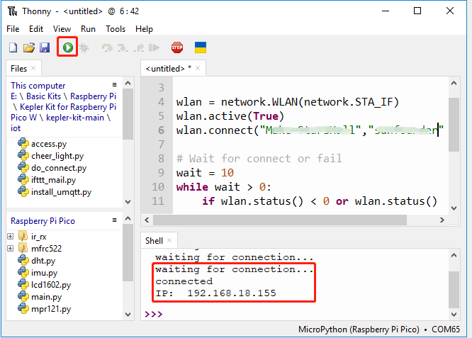

.. note::
    Hallo und willkommen in der SunFounder Raspberry Pi & Arduino & ESP32 Enthusiasten-Gemeinschaft auf Facebook! Tauche tiefer in die Welt des Raspberry Pi, Arduino und ESP32 ein mit anderen Enthusiasten.

    **Warum beitreten?**

    - **Expertenunterstützung**: Löse Nachverkaufsprobleme und technische Herausforderungen mit Hilfe unserer Gemeinschaft und unseres Teams.
    - **Lernen & Teilen**: Austausch von Tipps und Tutorials zur Verbesserung deiner Fähigkeiten.
    - **Exklusive Vorschauen**: Erhalte frühen Zugang zu neuen Produktankündigungen und Einblicke.
    - **Sonderangebote**: Genieße exklusive Rabatte auf unsere neuesten Produkte.
    - **Festliche Aktionen und Gewinnspiele**: Nimm an Gewinnspielen und Feiertagsaktionen teil.

    👉 Bist du bereit, mit uns zu erkunden und zu kreieren? Klicke auf [|link_sf_facebook|] und trete heute bei!

.. _py_iot_access:

8.1 Zugang zum Netzwerk
========================

.. note::

    Wenn du von einem anderen IoT-Projekt kommst, beginne bitte ab Schritt 3, um mit der Erstellung von ``do_connect.py`` und ``secrets.py`` fortzufahren.

Lass uns nun sehen, wie es sich mit unserem Wi-Fi-Netzwerk verbindet.

**Benötigte Komponenten**

Für dieses Projekt benötigen wir die folgenden Komponenten.

Es ist definitiv praktisch, ein ganzes Kit zu kaufen, hier ist der Link:

.. list-table::
    :widths: 20 20 20
    :header-rows: 1

    *   - Name
        - ARTIKEL IN DIESEM KIT
        - LINK
    *   - Pico 2 W Starter Kit
        - 450+
        - |link_pico2w_kit|

Du kannst sie auch einzeln über die untenstehenden Links kaufen.

.. list-table::
    :widths: 5 20 5 20
    :header-rows: 1

    *   - SN
        - KOMPONENTE
        - MENGE
        - LINK

    *   - 1
        - :ref:`cpn_pico_2w`
        - 1
        - |link_pico2w_buy|
    *   - 2
        - Micro USB-Kabel
        - 1
        - 

1. Verbindung zum Internet
-------------------------------------

Mit nur fünf Zeilen MicroPython ist unser Raspberry Pi Pico 2 W glücklich mit dem Internet verbunden.

Diese 5 Zeilen Code können direkt aus der Shell ausgeführt werden, indem man nach der Eingabe die ``Enter``-Taste drückt.
Oder befolge die folgende Methode und erstelle eine neue ``.py``-Datei, um sie auszuführen.

.. code-block:: python

    import network
    wlan = network.WLAN(network.STA_IF)
    wlan.active(True)
    wlan.connect("SSID","PASSWORD")
    print(wlan.isconnected())

#. Erstelle ein neues Skript, indem du auf die Schaltfläche **Neu** in Thonny klickst und den obigen Code hineinkopierst, wobei du ``SSID`` und ``PASSWORD`` durch deine eigenen ersetzt.

   .. image:: img/access1.png

#. Um das Skript auszuführen, klicke auf die Schaltfläche **Aktuelles Skript ausführen** oder drücke F5. Wenn die Verbindung erfolgreich ist, wird ``true`` gedruckt.

   .. note::

       Stelle sicher, dass der Raspberry Pi Pico 2 W über ein USB-Kabel mit dem Computer verbunden ist, dann klicke in der unteren rechten Ecke, um MicroPython (Raspberry Pi Pico).COMXxx als Interpreter auszuwählen.

   .. image:: img/access2.png

2. Timeout-Beurteilung und IP-Anzeige
------------------------------------------------

Angesichts einiger schlechter Netzwerkbedingungen, fügen wir unserem Code einige Timeout-Beurteilungen hinzu.

Wenn die Verbindung erfolgreich ist, wird die IP des Pico 2 W nach dem Kopieren und Ausführen des Skripts angezeigt.

.. code-block:: python

    import network
    import time

    wlan = network.WLAN(network.STA_IF)
    wlan.active(True)
    wlan.connect("SSID","PASSWORD")

    # Warte auf Verbindung oder Fehler
    wait = 10
    while wait > 0:
        if wlan.status() < 0 or wlan.status() >= 3:
            break
        wait -= 1
        print('waiting for connection...')
        time.sleep(1)

    # Fehlerbehandlung bei Verbindung
    if wlan.status() != 3:
        raise RuntimeError('wifi connection failed')
    else:
        print('connected')
        print('IP: ', wlan.ifconfig()[0])

* ``wlan.status()`` Funktion: Gibt den aktuellen Status der drahtlosen Verbindung zurück, der Rückgabewert ist in der Tabelle unten angezeigt.

    .. list-table::
        :widths: 40 10 50

        * - Status
          - Wert
          - Beschreibung
        * - STAT_IDLE
          - 0
          - keine Verbindung und keine Aktivität,
        * - STAT_CONNECTING
          - 1
          - Verbindung wird hergestellt,
        * - STAT_WRONG_PASSWORD
          - -3
          - gescheitert aufgrund falsches Passworts,
        * - STAT_NO_AP_FOUND
          - -2
          - gescheitert, weil kein Zugangspunkt antwortete,
        * - STAT_CONNECT_FAIL
          - -1
          - gescheitert aufgrund anderer Probleme,
        * - STAT_GOT_IP
          - 3
          - Verbindung erfolgreich.

* ``wlan.ifconfig()`` Funktion: Erhält IP-Adressen, Subnetzmasken, Gateways und DNS-Server. Diese Methode gibt ein 4-Tupel zurück, das die obigen Informationen enthält, wenn sie direkt aufgerufen wird. In diesem Fall drucken wir nur die IP-Adresse.

*  `class WLAN – MicroPython Docs <https://docs.micropython.org/en/latest/library/network.WLAN.html>`_

.. _create_secrets:

3. Speichern privater Informationen in ``secrets.py``
-------------------------------------------------------------

Wenn du dein Pico 2 W-Projekt teilst, möchtest du nicht, dass andere dein WLAN-Passwort oder deinen API-Schlüssel sehen.
Für eine gute Sicherheit können wir eine ``secrets.py``-Datei erstellen, um deine privaten Informationen zu speichern.

#. Kopiere den folgenden Code in eine neue Skriptdatei auf Thonny. Achte darauf, ``SSID`` und ``PASSWORD`` durch deine eigenen zu ersetzen.

    .. code-block:: python

        secrets = {
        'ssid': 'SSID',
        'password': 'PASSWORD',
        }

#. Wähle Raspberry Pi Pico im Popup-Fenster aus, das erscheint, wenn du auf die Speichern-Schaltfläche klickst oder ``Ctrl+S`` drückst.

    .. image:: img/access4.png

#. Benenne sie als ``secrets.py``.

    .. image:: img/access5.png

#. Jetzt kannst du dieses Skript in deinem Raspberry Pi Pico 2 W sehen.

    .. image:: img/access6.png

#. In anderen Skripten kannst du es wie folgt aufrufen. Wenn du es ausführst, wirst du eine erfolgreiche Wi-Fi-Verbindung sehen. Die Datei ``secrets.py`` wird als Bibliothek importiert, daher müssen wir uns keine Sorgen über Informationsleckagen machen.

    .. code-block:: python
        :emphasize-lines: 3,7

        import network
        import time
        from secrets import secrets

        wlan = network.WLAN(network.STA_IF)
        wlan.active(True)
        wlan.connect(secrets['ssid'], secrets['password'])

        # Warte auf Verbindung oder Fehler
        wait = 10
        while wait > 0:
            if wlan.status() < 0 or wlan.status() >= 3:
                break
            wait -= 1
            print('waiting for connection...')
            time.sleep(1)

        # Fehlerbehandlung bei Verbindung
        if wlan.status() != 3:
            raise RuntimeError('wifi connection failed')
        else:
            print('connected')
            print('IP: ', wlan.ifconfig()[0])

    .. image:: img/access8.png

.. _do_connect:

4. Verbindung zum Internet über ``do_connect.py``
----------------------------------------------------------------

In Anbetracht dessen, dass jedes unserer nächsten Projekte eine Netzwerkverbindung benötigt, warum erstellen wir nicht eine neue Datei ``do_connect.py`` und schreiben die relevanten Funktionen hinein zur Wiederverwendung, was den Code komplexer Projekte erheblich vereinfachen kann.

#. Kopiere den folgenden Code in eine neue Skriptdatei und speichere sie als ``do_connect.py`` auf Raspberry Pi Pico.

    .. code-block:: python

        import network
        import time
        from secrets import *

        def do_connect(ssid=secrets['ssid'],psk=secrets['password']):
            wlan = network.WLAN(network.STA_IF)
            wlan.active(True)
            wlan.connect(ssid, psk)

            # Warte auf Verbindung oder Fehler
            wait = 10
            while wait > 0:
                if wlan.status() < 0 or wlan.status() >= 3:
                    break
                wait -= 1
                print('waiting for connection...')
                time.sleep(1)

            # Fehlerbehandlung bei Verbindung
            if wlan.status() != 3:
                raise RuntimeError('wifi connection failed')
            else:
                print('connected')
                ip=wlan.ifconfig()[0]
                print('network config: ', ip)
                return ip

    .. image:: img/access7.png

#. Durch das Aufrufen in anderen Skripten ermöglicht dies dem Raspberry Pi Pico 2 W, sich mit dem Netzwerk zu verbinden.

    .. code-block:: python

        from do_connect import *
        do_connect()

.. https://www.tomshardware.com/reviews/raspberry-pi-pico-w

