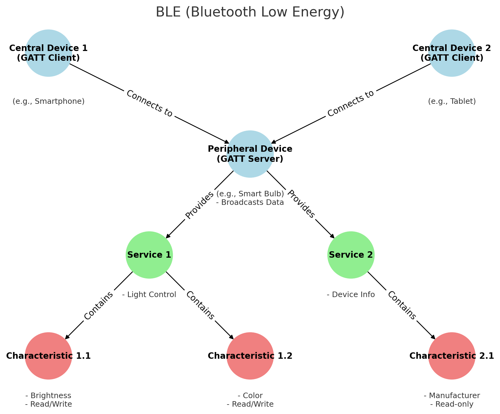

8.10 Get started with bluetooth
=================================

The Raspberry Pi Pico 2 W features an Infineon CYW43439 modem, providing 2.4GHz 802.11n Wi-Fi and Bluetooth 5.2 connectivity. In MicroPython, only Bluetooth Low Energy (BLE) is currently supported; classic Bluetooth isn't available.

Several BLE examples are provided to help you begin developing Bluetooth projects. Before starting, refer to the following article to familiarize yourself with the basic concepts of BLE.

Basic Concepts of Bluetooth Low Energy
++++++++++++++++++++++++++++++++++++++++++++++++

**Bluetooth Low Energy (BLE)** is a low-power wireless communication technology, designed specifically for short-range interactions. Distinguished from classic Bluetooth, BLE focuses on power efficiency and rapid connection, making it an ideal choice for a range of applications including Internet of Things (IoT) devices and health monitoring equipment.

BLE communications rely on two key protocols: **Generic Attribute Profile (GATT)** and **Generic Access Profile (GAP)**. GATT is used for data exchange, while GAP is responsible for device discovery and connection.

Peripheral Devices (Typically GATT Servers)
--------------------------------------------------

In the BLE network, **peripheral devices** primarily broadcast data to be discovered and accessed by central devices (typically acting as GATT clients). Such devices are usually sensors or small hardware like heart rate monitors, temperature sensors, or smart bulbs.

In the BLE communication model, peripheral devices often provide one or more **services**, each containing a set of **characteristics**. These services and characteristics collaboratively enable specific functionalities or use-cases, allowing central devices to read or manipulate relevant data.

- **Services**

  In BLE, Services act as high-level abstractions used to organize and encapsulate related Characteristics. Services in BLE can be categorized into standard services and custom services based on their origin and purpose.

  - Standard Services: Defined by the Bluetooth SIG (Bluetooth Special Interest Group), these are intended for specific functions. For example, the heart rate service for heart rate monitors, device information service providing manufacturer, model, and version details, and battery service indicating battery level and status. Reference: |link_standard_service_uuids| 
  - Custom Services: These are defined by developers or device manufacturers to meet the requirements of specific applications or devices. For instance, a smart home device manufacturer might define a custom service to control light color and brightness.

- **Characteristics**

  Characteristics in BLE are the fundamental units of data exposed by the peripheral devices. They're enclosed within a Service and define various types of data and the operations that can be performed on them. Each characteristic is identified by a UUID and has a set of associated attributes like value, descriptor, and permissions.

  - Permissions: In BLE, each characteristic is associated with a set of permissions that dictate whether the characteristic is readable, writable, or notify-able. This helps in securing the data and defining how to interact with it.

- **UUID**

  Services, characteristics, and descriptors are collectively identified as attributes, each having a unique UUID. The Bluetooth SIG has reserved a set of UUIDs for standard attributes. These UUIDs are usually represented as 16-bit or 32-bit identifiers in the BLE protocol for efficiency, rather than the 128 bits required for a full UUID. For instance, the Device Information service is represented by the short code 0x180A.

Central Devices (Typically GATT Clients)
--------------------------------------------------

**Central devices** in the BLE network scan for nearby peripheral devices and establish connections to acquire or control data. These devices are generally more complex and feature-rich, such as smartphones, tablets, or specialized gateway hardware. They're responsible for discovering peripheral devices, connecting to them, and accessing or subscribing to services and characteristics offered by the peripherals to serve various applications or solve specific problems.

Central devices interact with characteristics in the following ways:

- **Read**: Request the peripheral device to send the current value of a characteristic. This is commonly used for characteristics that don't change often, like configuration settings or version numbers.
- **Write**: Modify the value of a characteristic, typically used for command-like operations, like instructing a peripheral device to turn a motor on or off.
- **Subscribe**: Request the peripheral device to continuously send updated values of a characteristic, eliminating the need for the central device to repeatedly request this data.
