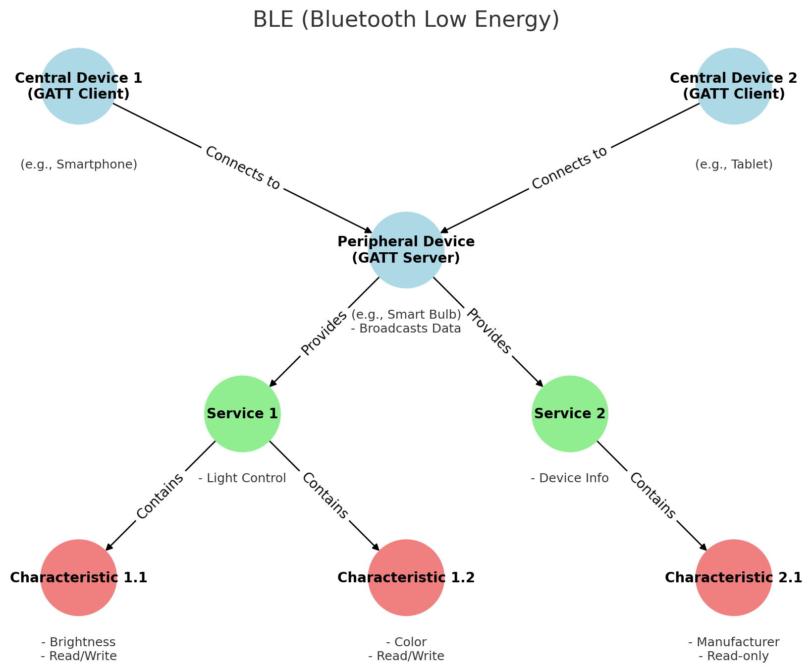

.. note:: 

    こんにちは、SunFounder Raspberry Pi & Arduino & ESP32 Enthusiasts Communityへようこそ！仲間たちと一緒にRaspberry Pi、Arduino、ESP32についてさらに深く学びましょう。

    **参加する理由は？**

    - **専門家のサポート**: コミュニティやチームの助けを借りて、購入後の問題や技術的な課題を解決できます。
    - **学びと共有**: ヒントやチュートリアルを交換し、スキルを向上させましょう。
    - **限定プレビュー**: 新製品の発表や先行情報をいち早く手に入れましょう。
    - **特別割引**: 最新製品の特別割引をお楽しみください。
    - **イベント・プレゼント**: プレゼント企画や祝日セールに参加しましょう。

    👉 一緒に探求し、創造を楽しみませんか？[|link_sf_facebook|]をクリックして、今すぐ参加しましょう！

8.10 Bluetoothを使い始める
=================================

Raspberry Pi Pico 2 Wは、Infineon CYW43439モデムを搭載しており、2.4GHz 802.11n Wi-FiとBluetooth 5.2接続を提供しています。MicroPythonでは、現在Bluetooth Low Energy (BLE)のみがサポートされており、従来のBluetoothは利用できません。

BLEのプロジェクトを開発するためのいくつかの例が提供されています。始める前に、以下の記事を参考にして、BLEの基本概念を理解してください。

Bluetooth Low Energyの基本概念
++++++++++++++++++++++++++++++++++++++++++++++++

**Bluetooth Low Energy (BLE)** は、特に短距離の通信に特化した低消費電力の無線通信技術です。従来のBluetoothとは異なり、BLEは電力効率と迅速な接続に重点を置いており、IoTデバイスや健康管理機器など、さまざまな用途に理想的な選択肢です。

BLE通信は、2つの主要なプロトコルに依存しています： **Generic Attribute Profile (GATT)** と **Generic Access Profile (GAP)** 。GATTはデータ交換に使用され、GAPはデバイスの発見と接続を担当します。

周辺機器（通常はGATTサーバ）
--------------------------------------------------

BLEネットワークにおける **周辺機器** は、主にデータを送信し、中央デバイス（通常はGATTクライアント）によって発見され、アクセスされます。このようなデバイスは、通常、心拍数モニター、温度センサー、スマートライトなどのセンサーや小型のハードウェアです。

BLE通信モデルでは、周辺機器は1つまたは複数の **サービス** を提供することがよくあり、各サービスは複数の **特徴** を含んでいます。これらのサービスと特徴が連携することで、特定の機能やユースケースが可能となり、中央デバイスは関連データを読み取ったり操作したりできます。

- **サービス**

  BLEにおけるサービスは、関連する特徴を整理してカプセル化するための高レベルの抽象化です。サービスは、その起源と目的に基づいて、標準サービスとカスタムサービスに分類できます。

  - 標準サービス：Bluetooth SIG（Bluetooth Special Interest Group）によって定義され、特定の機能のために設計されています。例えば、心拍数モニター用の心拍数サービス、デバイス情報サービス（製造元、モデル、バージョンの詳細を提供）、バッテリーサービス（バッテリーレベルと状態を示す）などがあります。参照リンク： |link_standard_service_uuids|
  - カスタムサービス：開発者やデバイス製造者が特定のアプリケーションやデバイスの要求に基づいて定義します。たとえば、スマートホームデバイスの製造業者は、ライトの色や明るさを制御するカスタムサービスを定義することがあります。

- **特徴**

  BLEにおける特徴は、周辺機器が提供するデータの基本的な単位です。特徴はサービス内に格納され、さまざまな種類のデータとそれに対して実行できる操作を定義します。各特徴はUUIDで識別され、値、記述子、権限といった一連の属性を持っています。

  - 権限：BLEでは、各特徴にはその特徴が読み取り可能、書き込み可能、または通知可能であるかを決定する権限のセットが関連付けられています。これにより、データのセキュリティが確保され、どのように対話するかが定義されます。

- **UUID**

  サービス、特徴、および記述子は、すべて属性として識別され、各属性には一意のUUIDがあります。Bluetooth SIGは、標準属性のために一連のUUIDを予約しています。これらのUUIDは通常、BLEプロトコル内で効率のために16ビットまたは32ビットの識別子として表現され、完全なUUIDに必要な128ビットでは表現されません。例えば、デバイス情報サービスは短縮コード0x180Aで表されます。

中央機器（通常はGATTクライアント）
--------------------------------------------------

BLEネットワークにおける **中央機器** は、近くの周辺機器をスキャンして接続し、データを取得または制御します。これらの機器は一般的により複雑で機能が豊富なもの（スマートフォン、タブレット、または専門的なゲートウェアハードウェア）であり、周辺機器の発見、接続、サービスや特徴のアクセス・購読を担当します。これにより、さまざまなアプリケーションを提供したり、特定の問題を解決したりできます。

中央機器は、特徴と以下の方法でやり取りします：

- **読み取り**：周辺機器に特徴の現在の値を送信するように要求します。これは、設定やバージョン番号など、あまり変化しない特徴に使われます。
- **書き込み**：特徴の値を変更します。これは、例えば周辺機器にモーターのオン/オフを指示するようなコマンド操作で使用されます。
- **購読**：周辺機器に特徴の更新された値を継続的に送信するよう要求します。これにより、中央機器がデータを繰り返し要求する必要がなくなります。
