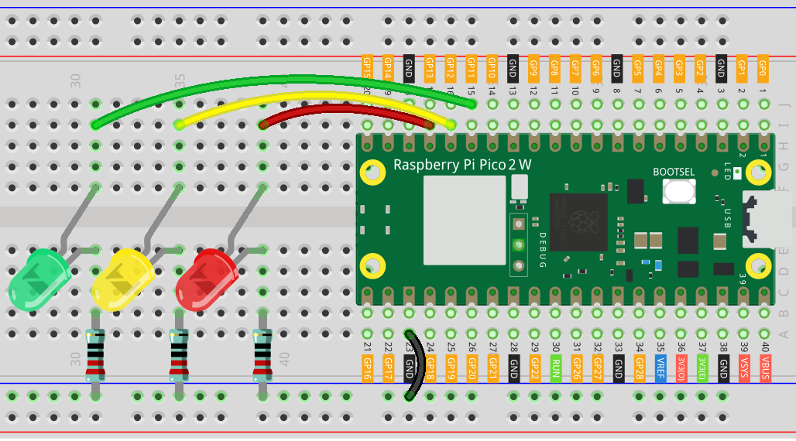

.. _py_iot_read_ble:

8.12 Read data from bluetooth
=================================

In this project, the Pico 2 W functions as a peripheral device in a Bluetooth Low Energy (BLE) network. It offers a custom BLE service to control an LED-based traffic light system. This service includes a writable characteristic, allowing a central device, such as a smartphone or computer, to send commands. The Pico board processes these commands to toggle the red, yellow, or green LEDs, simulating traffic light operations. Debugging information, including received commands, is displayed on the serial monitor to assist development.

The onboard LED indicates the connection status: it lights up when a central device is connected and turns off when the connection is lost. 

1. Build the circuit
+++++++++++++++++++++++++++++++++

2. Upload the code
+++++++++++++++++++++++++++++++++

Copy the following code into your IDE. Alternatively, you can find it in our repository at the path: ``pico-2w-kit/micropython/iot/8.12-read_from_ble/ble_trafficlight.py``.

Note: This code depends on the ``ble_advertising.py`` and ``ble_simple_peripheral.py`` file. Make sure to upload it to the Pico board before running the script.

.. code-block:: python

   # Import necessary modules
   from machine import Pin 
   import bluetooth
   from ble_example.ble_simple_peripheral import BLESimplePeripheral
   
   # Create a Bluetooth Low Energy (BLE) object
   ble = bluetooth.BLE()
   
   # Create an instance of the BLESimplePeripheral class with the BLE object
   sp = BLESimplePeripheral(ble,"pico2w")
   
   # Create a Pin object for the onboard LED, configure it as an output
   led = Pin("LED", Pin.OUT)
   
   red = machine.Pin(13, machine.Pin.OUT)
   yellow = machine.Pin(12, machine.Pin.OUT)
   green = machine.Pin(11, machine.Pin.OUT)
   
   def update_traffic(data):
       
       decoded_data = data.decode('utf-8').rstrip('\r\n')
       
       red.off()
       green.off()
       yellow.off()
       
       if decoded_data == "R" or decoded_data == "r":
           red.on()
       elif decoded_data == "G" or decoded_data == "g":
           green.on()
       elif decoded_data == "Y" or decoded_data == "y":
           yellow.on()
       
   
   # Define a callback function to handle received data
   def on_rx(data):
       print("Data received: ", data)  # Print the received data
       
       update_traffic(data)
   
   # Start an infinite loop
   while True:
       if sp.is_connected():  # Check if a BLE connection is established
           sp.on_write(on_rx)  # Set the callback function for data reception

3. Write data to bluetooth
+++++++++++++++++++++++++++++++++

To interact with the services and characteristics defined in this code, use a generic Bluetooth® Low Energy central app, such as LightBlue (available for iOS and Android) or nRF Connect (for Android).

This section uses LightBlue as an example to demonstrate how to control the Pico 2 W’s features via Bluetooth. 

a. Install LightBlue

   Download the LightBlue app from the |link_lightblue_apple| (for iOS) or |link_lightblue_google| (for Android).

   .. image:: img/lightblue.png
      :width: 90%

b. Connect Pico 2 W

   Launch LightBlue and enable location and Bluetooth permissions if prompted. On the **Peripherals** page, search for “pico” in the search bar, and tap to connect to the Pico 2 W device.

   .. image:: img/11-1-connect-pico.png
      :width: 60%
      :align: center

c. Send data to toggle the light

   After connecting, LightBlue displays detailed information about the Pico 2 W Bluetooth device. Scroll down to locate the **Service (6E400001-B5A3-F393-E0A9-E50E24DCCA9E)** and **Characteristic (6E400002-B5A3-F393-E0A9-E50E24DCCA9E)**.

   Tap the characteristic 6E400002-B5A3-F393-E0A9-E50E24DCCA9E. The app shows the properties of this characteristic: it's writable.

   .. image:: img/12-2-new.png
      :width: 100%

   In the top-right corner, select **"UTF-8 String"** as the data type.

   .. image:: img/12-4-new.png
      :width: 100%   

   Click **"Write New Value"** and input ``R``. This character will be sent to the Pico board via Bluetooth. The Pico board will interpret the received character and control specific LEDs accordingly:  
   
   - ``r`` lights up the red LED
   - ``y`` lights up the yellow LED
   - ``g`` lights up the green LED

   .. image:: img/12-6-new.png
      :width: 100%  