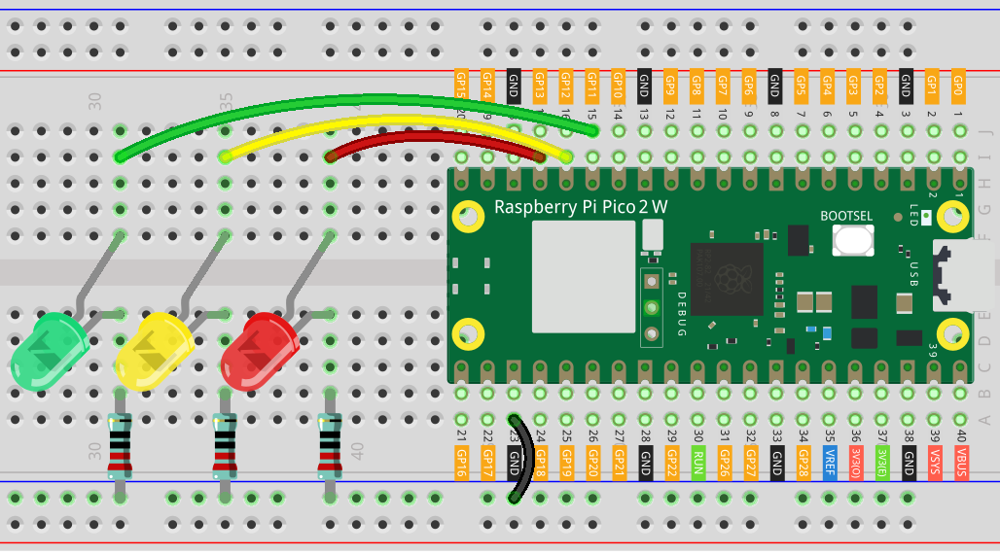

.. note:: 

    こんにちは、SunFounder Raspberry Pi & Arduino & ESP32 Enthusiasts Communityへようこそ！仲間たちと一緒にRaspberry Pi、Arduino、ESP32についてさらに深く学びましょう。

    **参加する理由は？**

    - **専門家のサポート**: コミュニティやチームの助けを借りて、購入後の問題や技術的な課題を解決できます。
    - **学びと共有**: ヒントやチュートリアルを交換し、スキルを向上させましょう。
    - **限定プレビュー**: 新製品の発表や先行情報をいち早く手に入れましょう。
    - **特別割引**: 最新製品の特別割引をお楽しみください。
    - **イベント・プレゼント**: プレゼント企画や祝日セールに参加しましょう。

    👉 一緒に探求し、創造を楽しみませんか？[|link_sf_facebook|]をクリックして、今すぐ参加しましょう！

.. _py_iot_read_ble:

8.12 Bluetoothからデータを読み取る
=====================================

このプロジェクトでは、Pico 2 WがBluetooth Low Energy（BLE）ネットワークの周辺機器として機能します。カスタムBLEサービスを提供し、LEDベースの信号機システムを制御します。このサービスには、書き込み可能な特徴が含まれており、スマートフォンやコンピュータなどの中央機器がコマンドを送信できるようになっています。Picoボードはこれらのコマンドを処理し、赤、黄、緑のLEDを切り替えて信号機の動作をシミュレートします。受信したコマンドを含むデバッグ情報は、開発支援のためにシリアルモニターに表示されます。

オンボードLEDは接続状態を示します：中央機器が接続すると点灯し、接続が失われると消灯します。

1. 回路を作成する
+++++++++++++++++++++++++++++++++

**必要なコンポーネント**

このプロジェクトでは、以下のコンポーネントが必要です。

一式を購入するのが便利です。こちらのリンクを参照してください：

.. list-table::
    :widths: 20 20 20
    :header-rows: 1

    *   - 名称  
        - このキットに含まれているアイテム  
        - リンク  
    *   - Pico 2 W スターターキット  
        - 450+  
        - |link_pico2w_kit|

以下のリンクから個別に購入することもできます。

.. list-table::
    :widths: 5 20 5 20
    :header-rows: 1

    *   - SN  
        - コンポーネント  
        - 数量  
        - リンク  

    *   - 1  
        - :ref:`cpn_pico_2w`  
        - 1  
        - |link_pico2w_buy|  
    *   - 2  
        - マイクロUSBケーブル  
        - 1  
        -  
    *   - 3
        - :ref:`cpn_breadboard`
        - 1
        - |link_breadboard_buy|
    *   - 4
        - :ref:`cpn_wire`
        - Several
        - |link_wires_buy|
    *   - 5
        - :ref:`cpn_resistor`
        - 3(220Ω)
        - |link_resistor_buy|
    *   - 6
        - :ref:`cpn_led`
        - 3
        - |link_led_buy|

2. コードをアップロードする
+++++++++++++++++++++++++++++++++

以下のコードをIDEにコピーしてください。別途、リポジトリのパス「 ``pico-2w-kit/micropython/iot/8.12-read_from_ble/ble_trafficlight.py`` 」にもあります。

注：このコードは、 ``ble_advertising.py`` および ``ble_simple_peripheral.py`` ファイルに依存しています。実行前にPicoボードにアップロードしてください。

.. code-block:: python

   # 必要なモジュールをインポート
   from machine import Pin 
   import bluetooth
   from ble_example.ble_simple_peripheral import BLESimplePeripheral
   
   # Bluetooth Low Energy（BLE）オブジェクトを作成
   ble = bluetooth.BLE()
   
   # BLESimplePeripheralクラスのインスタンスを作成し、BLEオブジェクトを渡す
   sp = BLESimplePeripheral(ble,"pico2w")
   
   # オンボードLEDのPinオブジェクトを作成し、出力として設定
   led = Pin("LED", Pin.OUT)
   
   red = machine.Pin(13, machine.Pin.OUT)
   yellow = machine.Pin(12, machine.Pin.OUT)
   green = machine.Pin(11, machine.Pin.OUT)
   
   def update_traffic(data):
       
       decoded_data = data.decode('utf-8').rstrip('\r\n')
       
       red.off()
       green.off()
       yellow.off()
       
       if decoded_data == "R" or decoded_data == "r":
           red.on()
       elif decoded_data == "G" or decoded_data == "g":
           green.on()
       elif decoded_data == "Y" or decoded_data == "y":
           yellow.on()
       
   
   # 受信データを処理するコールバック関数を定義
   def on_rx(data):
       print("Data received: ", data)  # 受信データを表示
       
       update_traffic(data)
   
   # 無限ループを開始
   while True:
       if sp.is_connected():  # BLE接続が確立されているか確認
           sp.on_write(on_rx)  # データ受信のコールバック関数を設定

3. Bluetoothにデータを書き込む
+++++++++++++++++++++++++++++++++

このコードで定義されたサービスと特徴を操作するには、LightBlueなどの一般的なBluetooth® Low Energyセントラルアプリを使用します。

このセクションでは、LightBlueを使って、Bluetooth経由でPico 2 Wの機能を制御する方法を示します。

a. LightBlueのインストール

   LightBlueアプリを |link_lightblue_apple| （iOS）または |link_lightblue_google| （Android）からダウンロードします。

   .. image:: img/lightblue.png
      :width: 90%

b. Pico 2 Wに接続

   LightBlueを起動し、位置情報とBluetoothの権限を有効にします。 **Peripherals** ページで検索バーに「pico」と入力し、Pico 2 Wデバイスに接続します。

   .. image:: img/11-1-connect-pico.png
      :width: 60%
      :align: center

c. ライトを切り替えるためにデータを送信

   接続後、LightBlueはPico 2 WのBluetoothデバイスに関する詳細情報を表示します。スクロールして **サービス（6E400001-B5A3-F393-E0A9-E50E24DCCA9E）** と **特徴（6E400002-B5A3-F393-E0A9-E50E24DCCA9E）** を見つけます。

   特徴6E400002-B5A3-F393-E0A9-E50E24DCCA9Eをタップします。この特徴のプロパティが表示され、書き込み可能であることが確認できます。

   .. image:: img/12-2-new.png
      :width: 100%

   右上隅で **"UTF-8 String"** をデータタイプとして選択します。

   .. image:: img/12-4-new.png
      :width: 100%   

   **"新しい値を書き込む"** をクリックし、 ``R`` を入力します。この文字はBluetooth経由でPicoボードに送信されます。Picoボードは受信した文字を解釈し、特定のLEDを制御します：  
   
   - ``r`` で赤色LEDを点灯
   - ``y`` で黄色LEDを点灯
   - ``g`` で緑色LEDを点灯

   .. image:: img/12-6-new.png
      :width: 100%