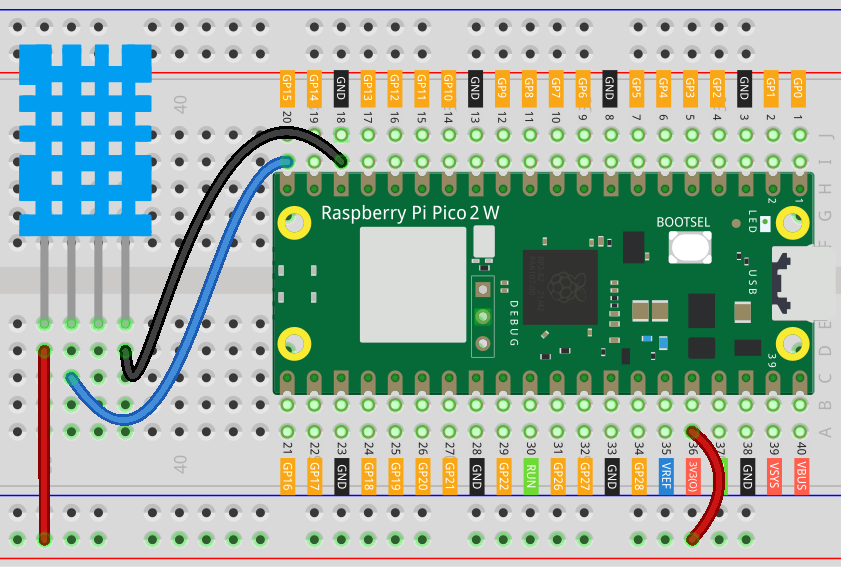

.. note::

    Hello, welcome to the SunFounder Raspberry Pi & Arduino & ESP32 Enthusiasts Community on Facebook! Dive deeper into Raspberry Pi, Arduino, and ESP32 with fellow enthusiasts.

    **Why Join?**

    - **Expert Support**: Solve post-sale issues and technical challenges with help from our community and team.
    - **Learn & Share**: Exchange tips and tutorials to enhance your skills.
    - **Exclusive Previews**: Get early access to new product announcements and sneak peeks.
    - **Special Discounts**: Enjoy exclusive discounts on our newest products.
    - **Festive Promotions and Giveaways**: Take part in giveaways and holiday promotions.

    👉 Ready to explore and create with us? Click [|link_sf_facebook|] and join today!

.. _py_iot_ble_home:

8.13 Bluetooth Environmental Monitor
==========================================

The project uses an Android app built with |link_appinventor| to receive and display environmental data from a Raspberry Pi Pico 2 W board. The Raspberry Pi Pico 2 W collects temperature and humidity data using a DHT11 sensor. Once collected, the data is transmitted via Bluetooth. Upon receiving the data, the app displays it on the screen.

The Android application will be developed using |link_appinventor|, a free online platform. This project provides an excellent opportunity to learn about interfacing Arduino with smartphones.

1. Build the Circuit
+++++++++++++++++++++++++++++++++

.. raw:: html

    

2. Create the Android App
+++++++++++++++++++++++++++++++++

You will develop the Android application using |link_appinventor|, a free web application ideal for beginners in Android development. It offers intuitive drag-and-drop features for creating functional applications.

Follow these steps to get started:

#. Go to |link_appinventor_login|, and click "online tool" to login. You will need a Google account to register with MIT App Inventor.

   .. image:: img/13-ai-signup.png
       :width: 90%
       :align: center

#. After logging in, navigate to **Projects** -> **Import project (.aia) from my computer**. Subsequently, upload the ``ble_environmental_monitor_picow.aia`` file located in the following path: ``pico-2w-kit/micropython/iot/8.13-environmental_monitor``.

   Alternatively, you can download the file directly: :download:`ble_environmental_monitor_picow.aia</_static/other/ble_environmental_monitor_picow.aia>`

   .. image:: img/13-ai-import.png
        :align: center

#. Once uploaded, the app template will appear in the MIT App Inventor interface. This pre-configured template can be customized after you become familiar with the platform.

#. MIT App Inventor has two main sections: **Designer** and **Blocks**. You can switch between these two sections in the upper right corner of the page.

   .. image:: img/13-ai-intro-1.png

#. The **Designer** allows you to add buttons, text, screens, and modify the overall aesthetic of your app.

   .. image:: img/13-ai-intro-2.png
      :width: 100%
   
#. Next, there's the **Blocks** section. This section lets you craft custom functionalities for your app, allowing you to program each component on the app's GUI to achieve desired features.

   .. image:: img/13-ai-intro-3.png
      :width: 100%

#. To install the app on a phone, navigate to the **Build** tab.

   .. image:: img/13-ai-intro-4.png
      :width: 60%
      :align: center

   * Generate a ``.apk`` file. After selecting this option, a page will appear allowing you to choose between downloading a ``.apk`` file or scanning a QR code for installation. Follow the installation guide to complete the application installation. 

     Alternatively, download our pre-compiled APK file here: :download:`ble_environmental_monitor.apk</_static/other/ble_environmental_monitor_picow.apk>`

   * If you wish to publish this app to Google Play or another app marketplace, you can generate a ``.aab`` file.

3. Run the Code
+++++++++++++++++++++++++++++++++

Open the ``8.13-environmental_monitor.py`` file under the path of ``pico-2w-kit/micropython/iot/8.13-environmental_monitor``, or copy this code into your IDE.
   
.. note:: 
   This code depends on the ``ble_advertising.py`` file. Make sure to upload it to the Pico board before running the script.

.. code-block:: python

   import bluetooth
   import random
   import struct
   import time
   import machine
   import ubinascii
   import dht
   from ble_example.ble_advertising import advertising_payload
   from micropython import const
   from machine import Pin
   
   _IRQ_CENTRAL_CONNECT = const(1)
   _IRQ_CENTRAL_DISCONNECT = const(2)
   _IRQ_GATTS_INDICATE_DONE = const(20)
   
   _FLAG_READ = const(0x0002)
   _FLAG_NOTIFY = const(0x0010)
   _FLAG_INDICATE = const(0x0020)
   
   # org.bluetooth.service.environmental_sensing
   _ENV_SENSE_UUID = bluetooth.UUID(0x181A)
   # org.bluetooth.characteristic.temperature
   _TEMP_CHAR = (
       bluetooth.UUID(0x2A6E),
       _FLAG_READ | _FLAG_NOTIFY | _FLAG_INDICATE,
   )
   _HUM_CHAR = (
       bluetooth.UUID(0x2A6F),
       _FLAG_READ | _FLAG_NOTIFY | _FLAG_INDICATE,
   )
   _ENV_SENSE_SERVICE = (
       _ENV_SENSE_UUID,
       (_TEMP_CHAR,_HUM_CHAR),
   )
   
   # org.bluetooth.characteristic.gap.appearance.xml
   _ADV_APPEARANCE_GENERIC_THERMOMETER = const(768)
   
   class BLETempHumidity:
       def __init__(self, ble, name=""):
   
           self._ble = ble
           self._ble.active(True)
           self._ble.irq(self._irq)
           
           ((self._temp_handle, self._hum_handle),) = self._ble.gatts_register_services((_ENV_SENSE_SERVICE,))
           self._connections = set()
   
           # If no name is provided, it will be automatically generated based on the MAC address.
           if len(name) == 0:
               name = 'Pico %s' % ubinascii.hexlify(self._ble.config('mac')[1],':').decode().upper()
           print('Sensor name %s' % name)
   
           self._payload = advertising_payload(
               name=name, services=[_ENV_SENSE_UUID]
           )
           self._advertise()
   
       def _irq(self, event, data):
           # Track connections so we can send notifications.
           if event == _IRQ_CENTRAL_CONNECT:
               conn_handle, _, _ = data
               self._connections.add(conn_handle)
           elif event == _IRQ_CENTRAL_DISCONNECT:
               conn_handle, _, _ = data
               self._connections.remove(conn_handle)
               # Start advertising again to allow a new connection.
               self._advertise()
           elif event == _IRQ_GATTS_INDICATE_DONE:
               conn_handle, value_handle, status = data
   
       def update_values(self, temperature_c, humidity_perc, notify=False, indicate=False):
           # Write the temperature to the temperature characteristic (unit: 0.01°C)
           temp_int = int(temperature_c * 100)
           self._ble.gatts_write(self._temp_handle, struct.pack("<h", temp_int))
   
           # Write the humidity to the humidity characteristic (unit: 0.01%RH)
           hum_int = int(humidity_perc * 100)
           self._ble.gatts_write(self._hum_handle, struct.pack("<H", hum_int))
   
           if notify or indicate:
               for conn_handle in self._connections:
                   if notify:
                       self._ble.gatts_notify(conn_handle, self._temp_handle)
                       self._ble.gatts_notify(conn_handle, self._hum_handle)
                   if indicate:
                       self._ble.gatts_indicate(conn_handle, self._temp_handle)
                       self._ble.gatts_indicate(conn_handle, self._hum_handle)
   
       def _advertise(self, interval_us=500000):
           self._ble.gap_advertise(interval_us, adv_data=self._payload)
   
       def is_connected(self):
           return len(self._connections) > 0
   
   def demo():
       sensor = dht.DHT11(machine.Pin(15))
       led = Pin('LED', Pin.OUT)
   
       ble = bluetooth.BLE()
       temp_hum = BLETempHumidity(ble,"pico2w")
   
       counter = 0
       while True:
   
           if temp_hum.is_connected():
               led.on()
           else:
               led.off()
   
           try:
               if counter % 10 == 0:
                   sensor.measure()
                   temperature_c = sensor.temperature
                   humidity = sensor.humidity
                   
                   print("Temp: %.2f C, Hum: %.2f %%" % (temperature_c, humidity))
                   temp_hum.update_values(temperature_c, humidity, notify=True, indicate=False)
           except Exception as e:
               print(f"Error: {e}") 
           
           time.sleep_ms(1000)
           counter += 1
   
   if __name__ == "__main__":
       demo()

4. App and Bluetooth Connection
++++++++++++++++++++++++++++++++++++++++++

Ensure that the Environmental Monitor BLE app created earlier is installed on your phone.

#. Enable Bluetooth on your phone.

#. Open the **Environmental Monitor BLE** app.

   .. image:: img/13_app_2.png
      :width: 25%
      :align: center

#. When you open the app for the first time, you will see two consecutive prompts requesting permissions. These permissions are required for Bluetooth functionality.

   .. image:: img/13_app_3.png
      :width: 100%
      :align: center

#. In the APP, click on **Connect** button to establish a connection between the APP and Pico 2 W via bluetooth.

   .. image:: img/13_app_4.png
      :width: 55%
      :align: center

#. This page displays a list of all Bluetooth devices. Choose the ``xx.xx.xx.xx.xx.xx pico2w`` option from the list. Each device name is displayed alongside its MAC address.

   .. image:: img/13_app_5.png
      :width: 60%
      :align: center

#. If no devices appear in the list, try enabling the location feature on your phone. (On some Android versions, the location setting is linked to Bluetooth functionality.)

#. Once connected, you will be redirected to the main screen displaying temperature and humidity readings.

   .. image:: img/13_app_7.png
      :width: 60%
      :align: center