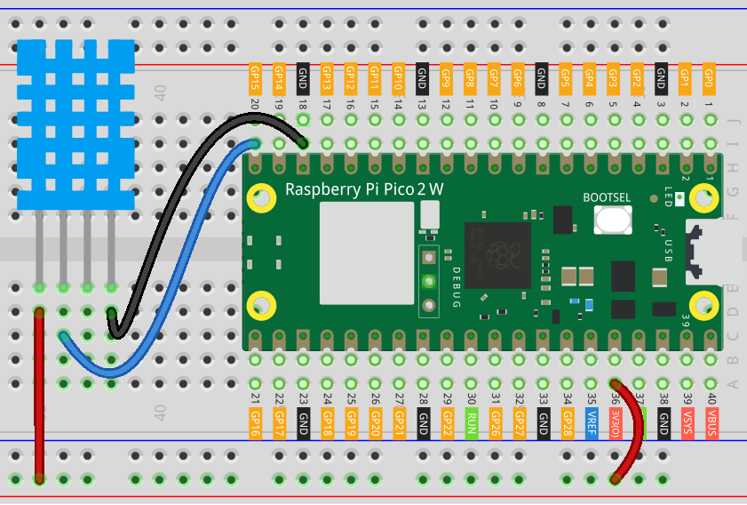

.. note:: 

    こんにちは、SunFounder Raspberry Pi & Arduino & ESP32 Enthusiasts Communityへようこそ！仲間たちと一緒にRaspberry Pi、Arduino、ESP32についてさらに深く学びましょう。

    **参加する理由は？**

    - **専門家のサポート**: コミュニティやチームの助けを借りて、購入後の問題や技術的な課題を解決できます。
    - **学びと共有**: ヒントやチュートリアルを交換し、スキルを向上させましょう。
    - **限定プレビュー**: 新製品の発表や先行情報をいち早く入手できます。
    - **特別割引**: 最新製品の特別割引をお楽しみください。
    - **イベント・プレゼント**: プレゼント企画や祝日セールに参加しましょう。

    👉 一緒に探求し、創造を楽しみませんか？[|link_sf_facebook|]をクリックして、今すぐ参加しましょう！

.. _py_iot_ble_home:

8.13 Bluetooth環境モニター
==========================================

このプロジェクトでは、 |link_appinventor| で開発したAndroidアプリを使って、Raspberry Pi Pico 2 Wボードから環境データを受信・表示します。Raspberry Pi Pico 2 WはDHT11センサーを使用して温度と湿度のデータを収集し、Bluetoothでデータを送信します。アプリ側では、受信したデータを画面に表示します。

Androidアプリは、初心者向けの無料オンラインプラットフォーム |link_appinventor| で開発します。Arduinoとスマートフォンの連携を学ぶ上で最適なプロジェクトです。

1. 回路を作成する
+++++++++++++++++++++++++++++++++

**必要なコンポーネント**

このプロジェクトでは、以下のコンポーネントが必要です。

キット一式を購入するのが便利です。こちらのリンクから購入できます：

.. list-table::
    :widths: 20 20 20
    :header-rows: 1

    *   - 名前	
        - このキットに含まれるアイテム
        - リンク
    *   - Pico 2 W スターターキット	
        - 450以上
        - |link_pico2w_kit|

別々に購入することもできます。以下のリンクから購入可能です。

.. list-table::
    :widths: 5 20 5 20
    :header-rows: 1

    *   - SN
        - コンポーネント	
        - 数量
        - リンク

    *   - 1
        - :ref:`cpn_pico_2w`
        - 1
        - |link_pico2w_buy|
    *   - 2
        - Micro USBケーブル
        - 1
        - 
    *   - 3
        - :ref:`cpn_breadboard`
        - 1
        - |link_breadboard_buy|
    *   - 4
        - :ref:`cpn_wire`
        - 複数
        - |link_wires_buy|
    *   - 5
        - :ref:`cpn_dht11`
        - 1
        - \-

.. raw:: html

    

2. Androidアプリを作成する
+++++++++++++++++++++++++++++++++

このAndroidアプリは |link_appinventor| という無料のウェブアプリケーションを使用して開発します。直感的なドラッグアンドドロップ操作で、機能的なアプリを簡単に作成でき、Android開発を始める方にも最適です。

次の手順に従って開始してください：

#. |link_appinventor_login| へアクセスし、"online tool"をクリックしてログインします。MIT App Inventorに登録するにはGoogleアカウントが必要です。

   .. image:: img/13-ai-signup.png
       :width: 90%
       :align: center

#. ログイン後、 **Projects** -> **Import project (.aia) from my computer** を選択します。その後、 ``pico-2w-kit/micropython/iot/8.13-environmental_monitor`` にある ``ble_environmental_monitor_picow.aia`` ファイルをアップロードしてください。

   または、こちらから直接ファイルをダウンロードできます：:download:`ble_environmental_monitor_picow.aia</_static/other/ble_environmental_monitor_picow.aia>`

   .. image:: img/13-ai-import.png
        :align: center

#. アップロードが完了すると、MIT App Inventorのインターフェイスにアプリのテンプレートが表示されます。このテンプレートは、プラットフォームに慣れた後にカスタマイズ可能です。

#. MIT App Inventorには、 **Designer** と **Blocks** の2つの主要セクションがあります。ページ右上でこの2つを切り替えられます。

   .. image:: img/13-ai-intro-1.png

#. **Designer** では、ボタン、テキスト、画面などを追加し、アプリの全体的な見た目を変更できます。

   .. image:: img/13-ai-intro-2.png
      :width: 100%
   
#. **Blocks** セクションでは、アプリにカスタム機能を追加するためのブロックを組み合わせ、各コンポーネントに必要な動作をプログラミングできます。

   .. image:: img/13-ai-intro-3.png
      :width: 100%

#. アプリをスマートフォンにインストールするには、 **Build** タブに移動します。

   .. image:: img/13-ai-intro-4.png
      :width: 60%
      :align: center

   * ``.apk`` ファイルを生成します。選択後、 ``.apk`` ファイルをダウンロードするか、QRコードをスキャンしてインストールするかを選択できます。インストールガイドに従ってアプリのインストールを完了してください。

     または、以下から事前コンパイル済みのAPKファイルをダウンロードできます： :download:`ble_environmental_monitor.apk</_static/other/ble_environmental_monitor_picow.apk>`

   * Google Playなどのアプリマーケットに公開したい場合は、 ``.aab`` ファイルを生成します。

3. コードを実行する
+++++++++++++++++++++++++++++++++

``pico-2w-kit/micropython/iot/8.13-environmental_monitor`` のパスにある ``8.13-environmental_monitor.py`` ファイルを開くか、下記のコードをIDEにコピーしてください。
   
.. note:: 
   このコードは ``ble_advertising.py`` ファイルに依存しています。実行前にPicoボードにアップロードしてください。

.. code-block:: python

   import bluetooth
   import random
   import struct
   import time
   import machine
   import ubinascii
   import dht
   from ble_example.ble_advertising import advertising_payload
   from micropython import const
   from machine import Pin
   
   _IRQ_CENTRAL_CONNECT = const(1)
   _IRQ_CENTRAL_DISCONNECT = const(2)
   _IRQ_GATTS_INDICATE_DONE = const(20)
   
   _FLAG_READ = const(0x0002)
   _FLAG_NOTIFY = const(0x0010)
   _FLAG_INDICATE = const(0x0020)
   
   # org.bluetooth.service.environmental_sensing
   _ENV_SENSE_UUID = bluetooth.UUID(0x181A)
   # org.bluetooth.characteristic.temperature
   _TEMP_CHAR = (
       bluetooth.UUID(0x2A6E),
       _FLAG_READ | _FLAG_NOTIFY | _FLAG_INDICATE,
   )
   _HUM_CHAR = (
       bluetooth.UUID(0x2A6F),
       _FLAG_READ | _FLAG_NOTIFY | _FLAG_INDICATE,
   )
   _ENV_SENSE_SERVICE = (
       _ENV_SENSE_UUID,
       (_TEMP_CHAR,_HUM_CHAR),
   )
   
   # org.bluetooth.characteristic.gap.appearance.xml
   _ADV_APPEARANCE_GENERIC_THERMOMETER = const(768)
   
   class BLETempHumidity:
       def __init__(self, ble, name=""):
   
           self._ble = ble
           self._ble.active(True)
           self._ble.irq(self._irq)
           
           ((self._temp_handle, self._hum_handle),) = self._ble.gatts_register_services((_ENV_SENSE_SERVICE,))
           self._connections = set()
   
           # 名前が指定されない場合、MACアドレスに基づいて自動生成
           if len(name) == 0:
               name = 'Pico %s' % ubinascii.hexlify(self._ble.config('mac')[1],':').decode().upper()
           print('Sensor name %s' % name)
   
           self._payload = advertising_payload(
               name=name, services=[_ENV_SENSE_UUID]
           )
           self._advertise()
   
       def _irq(self, event, data):
           # Track connections so we can send notifications.
           if event == _IRQ_CENTRAL_CONNECT:
               conn_handle, _, _ = data
               self._connections.add(conn_handle)
           elif event == _IRQ_CENTRAL_DISCONNECT:
               conn_handle, _, _ = data
               self._connections.remove(conn_handle)
               # 切断後に再び広告を開始し、新たな接続を許可
               self._advertise()
           elif event == _IRQ_GATTS_INDICATE_DONE:
               conn_handle, value_handle, status = data
   
       def update_values(self, temperature_c, humidity_perc, notify=False, indicate=False):
           # 温度を特性に書き込み（単位: 0.01°C）
           temp_int = int(temperature_c * 100)
           self._ble.gatts_write(self._temp_handle, struct.pack("<h", temp_int))
   
           # 湿度を特性に書き込み（単位: 0.01%RH）
           hum_int = int(humidity_perc * 100)
           self._ble.gatts_write(self._hum_handle, struct.pack("<H", hum_int))
   
           if notify or indicate:
               for conn_handle in self._connections:
                   if notify:
                       self._ble.gatts_notify(conn_handle, self._temp_handle)
                       self._ble.gatts_notify(conn_handle, self._hum_handle)
                   if indicate:
                       self._ble.gatts_indicate(conn_handle, self._temp_handle)
                       self._ble.gatts_indicate(conn_handle, self._hum_handle)
   
       def _advertise(self, interval_us=500000):
           self._ble.gap_advertise(interval_us, adv_data=self._payload)
   
       def is_connected(self):
           return len(self._connections) > 0
   
   def demo():
       sensor = dht.DHT11(machine.Pin(15))
       led = Pin('LED', Pin.OUT)
   
       ble = bluetooth.BLE()
       temp_hum = BLETempHumidity(ble,"pico2w")
   
       counter = 0
       while True:
   
           if temp_hum.is_connected():
               led.on()
           else:
               led.off()
   
           try:
               if counter % 10 == 0:
                   sensor.measure()
                   temperature_c = sensor.temperature
                   humidity = sensor.humidity
                   
                   print("Temp: %.2f C, Hum: %.2f %%" % (temperature_c, humidity))
                   temp_hum.update_values(temperature_c, humidity, notify=True, indicate=False)
           except Exception as e:
               print(f"Error: {e}") 
           
           time.sleep_ms(1000)
           counter += 1
   
   if __name__ == "__main__":
       demo()

4. アプリとBluetoothの接続
++++++++++++++++++++++++++++++++++++++++++

先ほど作成したEnvironmental Monitor BLEアプリをスマートフォンにインストールしておきましょう。

#. スマートフォンのBluetoothを有効にします。

#. **Environmental Monitor BLE** アプリを開きます。

   .. image:: img/13_app_2.png
      :width: 25%
      :align: center

#. 初回起動時、Bluetooth機能のために権限を求める2つのダイアログが表示されます。これらの権限を許可してください。

   .. image:: img/13_app_3.png
      :width: 100%
      :align: center

#. アプリ内で **Connect** ボタンをクリックし、Pico 2 WとアプリをBluetoothで接続します。

   .. image:: img/13_app_4.png
      :width: 55%
      :align: center

#. このページにはBluetoothデバイスの一覧が表示されます。「 ``xx.xx.xx.xx.xx.xx pico2w`` 」のようなデバイス名を選択して接続します。各デバイス名の横にはMACアドレスが表示されます。

   .. image:: img/13_app_5.png
      :width: 60%
      :align: center

#. リストにデバイスが表示されない場合、スマートフォンの位置情報が有効になっているか確認してください。（一部のAndroidバージョンでは、位置情報設定がBluetooth機能と連動しています。）

#. 接続されると、メイン画面に遷移し、温度と湿度が表示されます。

   .. image:: img/13_app_7.png
      :width: 60%
      :align: center