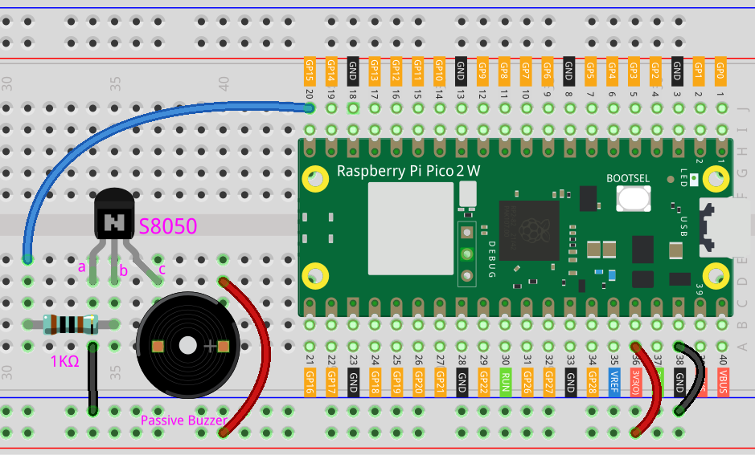

.. _iot_ble_piano:

8.14 Bluetooth Piano
==========================================

The project uses a custom-built application to transform a Raspberry Pi Pico 2 W into a Bluetooth-enabled piano. The Pico 2 W runs a MicroPython script that sets up a BLE peripheral, enabling it to receive note data from a connected device. Upon receiving a note, the board processes the data and plays the corresponding frequency using a passive buzzer.

This project is a great way to explore the basics of Bluetooth Low Energy (BLE) communication, sound generation with PWM, and how to create interactive applications using Raspberry Pi Pico 2 W.

The app used in this project was developed with |link_appinventor|.

1. Build the Circuit
+++++++++++++++++++++++++++++++++

.. raw:: html

    

2. Create the Android App
+++++++++++++++++++++++++++++++++

You will develop the Android application using |link_appinventor|, a free web application ideal for beginners in Android development. It offers intuitive drag-and-drop features for creating functional applications.

Follow these steps to get started:

#. Go to |link_appinventor_login|, and click "online tool" to login. You will need a Google account to register with MIT App Inventor.

   .. image:: img/13-ai-signup.png
       :width: 90%
       :align: center

#. After logging in, navigate to **Projects** -> **Import project (.aia) from my computer**. Subsequently, upload the ``ble_piano_picow.aia`` file located in the following path: ``pico-2w-kit/micropython/iot/8.14-ble_piano``.

   Alternatively, you can download the file directly: :download:`ble_piano_picow.aia</_static/other/ble_piano_picow.aia>`

   .. image:: img/13-ai-import.png
        :align: center

#. Once uploaded, the app template will appear in the MIT App Inventor interface. This pre-configured template can be customized after you become familiar with the platform.

#. MIT App Inventor has two main sections: **Designer** and **Blocks**. You can switch between these two sections in the upper right corner of the page.

   .. image:: img/13-ai-intro-1.png

#. The **Designer** allows you to add buttons, text, screens, and modify the overall aesthetic of your app.

   .. image:: img/14-ai-intro-2.png
      :width: 100%
   
#. Next, there's the **Blocks** section. This section lets you craft custom functionalities for your app, allowing you to program each component on the app's GUI to achieve desired features.

   .. image:: img/14-ai-intro-3.png
      :width: 100%

#. To install the app on a phone, navigate to the **Build** tab.

   .. image:: img/13-ai-intro-4.png
      :width: 60%
      :align: center

   * Generate a ``.apk`` file. After selecting this option, a page will appear allowing you to choose between downloading a ``.apk`` file or scanning a QR code for installation. Follow the installation guide to complete the application installation. 

     Alternatively, download our pre-compiled APK file here: :download:`ble_piano_picow.apk</_static/other/ble_piano_picow.apk>`

   * If you wish to publish this app to Google Play or another app marketplace, you can generate a ``.aab`` file.

3. Run the Code
+++++++++++++++++++++++++++++++++

Open the ``8.14-ble_piano.py`` file under the path of ``pico-2w-kit/micropython/iot/8.14-ble_piano``, or copy this code into your IDE.
   
.. note:: 
   This code depends on the ``ble_advertising.py`` file. Make sure to upload it to the Pico board before running the script.

.. code-block:: python

   import bluetooth
   import random
   import struct
   import time
   from ble_example.ble_advertising import advertising_payload
   from machine import Pin, PWM
   import time
   
   from micropython import const
   
   buzzer = PWM(Pin(15)) 
   
   NOTES = {
       'NOTE_C4': 262,
       'NOTE_D4': 294,
       'NOTE_E4': 330,
       'NOTE_F4': 349,
       'NOTE_G4': 392,
       'NOTE_A4': 440,
       'NOTE_B4': 494,
       'NOTE_C5': 523
   }
   
   _IRQ_CENTRAL_CONNECT = const(1)
   _IRQ_CENTRAL_DISCONNECT = const(2)
   _IRQ_GATTS_WRITE = const(3)
   
   _FLAG_READ = const(0x0002)
   _FLAG_WRITE_NO_RESPONSE = const(0x0004)
   _FLAG_WRITE = const(0x0008)
   _FLAG_NOTIFY = const(0x0010)
   
   _PIANO_UUID = bluetooth.UUID("952cc3a7-1801-4c07-b141-e1e3964f54b5")
   _NOTE_CHAR = (
       bluetooth.UUID("ea30277b-d7a5-4eeb-af70-6179c45d7ee6"),
       _FLAG_READ | _FLAG_WRITE | _FLAG_WRITE_NO_RESPONSE,
   )
   _PIANO_SERVICE = (
       _PIANO_UUID,
       (_NOTE_CHAR,),
   )
   
   
   class BLEPiano:
       def __init__(self, ble, name="ble-piano"):
   
           self._ble = ble
           self._ble.active(True)
           self._ble.irq(self._irq)
   
           handles = self._ble.gatts_register_services((_PIANO_SERVICE,))
           # print("Registered handles:", handles)
   
           ((self._handle_note,),) = handles
           self._connections = set()
   
           self._write_callback = None
   
           self._payload = advertising_payload(name=name, services=[_PIANO_UUID])
           self._advertise()
   
       def _irq(self, event, data):
           # Track connections so we can send notifications.
           if event == _IRQ_CENTRAL_CONNECT:
               conn_handle, _, _ = data
               print("New connection", conn_handle)
               self._connections.add(conn_handle)
           elif event == _IRQ_CENTRAL_DISCONNECT:
               conn_handle, _, _ = data
               print("Disconnected", conn_handle)
               self._connections.remove(conn_handle)
               # Start advertising again to allow a new connection.
               self._advertise()
           elif event == _IRQ_GATTS_WRITE:
               conn_handle, value_handle = data
               value = self._ble.gatts_read(value_handle)
               # print("Write event: conn_handle={}, value_handle={}, value={}".format(conn_handle, value_handle, value))
               if value_handle == self._handle_note and self._write_callback:
                   self._write_callback(value)
                   
   
       def is_connected(self):
           return len(self._connections) > 0
   
       def _advertise(self, interval_us=500000):
           print("Starting advertising")
           self._ble.gap_advertise(interval_us, adv_data=self._payload)
   
       def on_write(self, callback):
           self._write_callback = callback
   
   def note_update(data):
       print("Receive:", data)
   
       decoded_data = data.decode('utf-8').rstrip('*\x00')
   
       buzzer.freq(NOTES[decoded_data])
       buzzer.duty_u16(32768)  
       time.sleep(0.15)
       buzzer.duty_u16(0)  
   
   def demo():
       ble = bluetooth.BLE()
       piano = BLEPiano(ble,"pico2w")
   
       while True:
           if piano.is_connected():
               piano.on_write(note_update)
           # time.sleep_ms(100)
   
   if __name__ == "__main__":
       demo()

4. App and Bluetooth Connection
++++++++++++++++++++++++++++++++++++++++++

Ensure that the "BLE Piano" app created earlier is installed on your phone.

#. Enable Bluetooth on your phone.

#. Open the **BLE Piano** app.

   .. image:: img/14_app_2.png
      :width: 25%
      :align: center

#. When you open the app for the first time, you will see two consecutive prompts requesting permissions. These permissions are required for Bluetooth functionality.

   .. image:: img/14_app_3.png
      :width: 90%
      :align: center

#. In the APP, click on **Connect** button to establish a connection between the APP and Pico 2 W via bluetooth.

   .. image:: img/14_app_4.png
      :width: 90%
      :align: center

#. This page displays a list of all Bluetooth devices. Choose the ``xx.xx.xx.xx.xx.xx pico2w`` option from the list. Each device name is displayed alongside its MAC address.

   .. image:: img/13_app_5.png
      :width: 60%
      :align: center

#. If no devices appear in the list, try enabling the location feature on your phone. (On some Android versions, the location setting is linked to Bluetooth functionality.)

#. Once connected, the system will redirect you to the main screen. You can tap the music note button to play the corresponding note. The app sends the note data to the Pico board, which drives the buzzer to play the specified note based on the data.

   .. image:: img/14_app_7.png
      :width: 90%
      :align: center