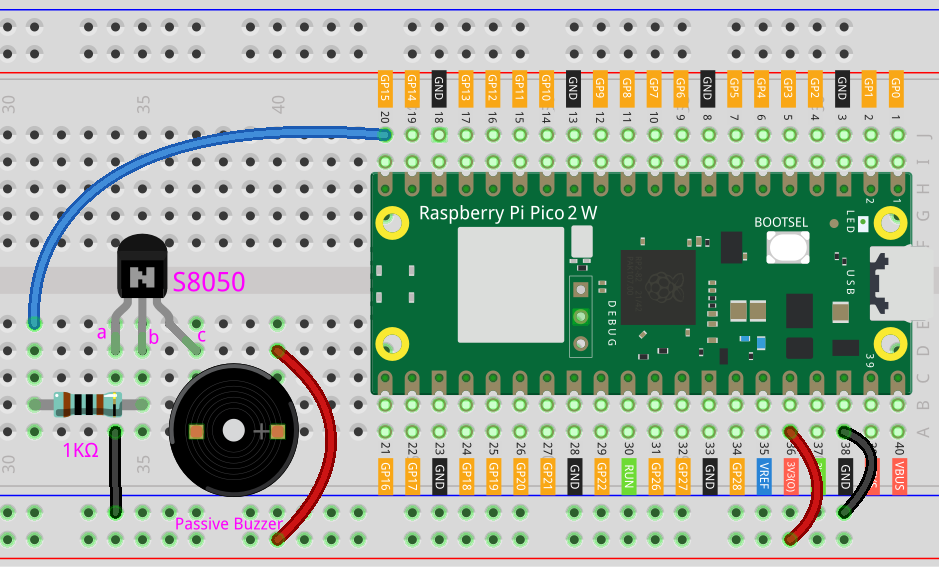

.. note:: 

    こんにちは、SunFounder Raspberry Pi & Arduino & ESP32 Enthusiasts Communityへようこそ！仲間たちと一緒にRaspberry Pi、Arduino、ESP32についてさらに深く学びましょう。

    **参加する理由は？**

    - **専門家のサポート**: コミュニティやチームの助けを借りて、購入後の問題や技術的な課題を解決できます。
    - **学びと共有**: ヒントやチュートリアルを交換し、スキルを向上させましょう。
    - **限定プレビュー**: 新製品の発表や先行情報をいち早く入手できます。
    - **特別割引**: 最新製品の特別割引をお楽しみください。
    - **イベント・プレゼント**: プレゼント企画や祝日セールに参加しましょう。

    👉 一緒に探求し、創造を楽しみませんか？[|link_sf_facebook|]をクリックして、今すぐ参加しましょう！

.. _py_iot_ble_piano:

8.14 Bluetoothピアノ
==========================================

このプロジェクトでは、カスタムアプリケーションを使ってRaspberry Pi Pico 2 WをBluetooth対応のピアノに変身させます。Pico 2 Wでは、BLE周辺機器として動作するMicroPythonスクリプトを実行し、接続されたデバイスから受け取ったノートデータを処理します。データを受信すると、パッシブブザーを使って対応する周波数を再生します。

本プロジェクトを通じて、Bluetooth Low Energy (BLE)通信の基礎、PWMを用いたサウンド生成、およびRaspberry Pi Pico 2 Wを使ったインタラクティブなアプリケーション作成を学ぶことができます。

このプロジェクトで使用するアプリは、 |link_appinventor| を利用して開発されています。

1. 回路を作成する
+++++++++++++++++++++++++++++++++

**必要なコンポーネント**

このプロジェクトでは、以下のコンポーネントが必要です。

キット一式を購入するのが便利です。こちらのリンクから購入できます：

.. list-table::
    :widths: 20 20 20
    :header-rows: 1

    *   - 名前	
        - このキットに含まれるアイテム
        - リンク
    *   - Pico 2 W スターターキット	
        - 450以上
        - |link_pico2w_kit|

別々に購入することもできます。以下のリンクから購入可能です。

.. list-table::
    :widths: 5 20 5 20
    :header-rows: 1

    *   - SN
        - コンポーネント	
        - 数量
        - リンク

    *   - 1
        - :ref:`cpn_pico_2w`
        - 1
        - |link_pico2w_buy|
    *   - 2
        - Micro USBケーブル
        - 1
        - 
    *   - 3
        - :ref:`cpn_breadboard`
        - 1
        - |link_breadboard_buy|
    *   - 4
        - :ref:`cpn_wire`
        - 複数
        - |link_wires_buy|
    *   - 5
        - :ref:`cpn_transistor`
        - 1(S8050)
        - |link_transistor_buy|
    *   - 6
        - :ref:`cpn_resistor`
        - 1(1KΩ)
        - |link_resistor_buy|
    *   - 7
        - パッシブ :ref:`cpn_buzzer`
        - 1
        - |link_passive_buzzer_buy|

.. raw:: html

    

2. Androidアプリを作成する
+++++++++++++++++++++++++++++++++

|link_appinventor| という無料のウェブアプリを使用してAndroidアプリケーションを開発します。初心者にも優しいドラッグ＆ドロップ操作で、機能的なアプリを簡単に作成可能です。

以下の手順に従ってください：

#. |link_appinventor_login| へアクセスし、"online tool"をクリックしてログインします。GoogleアカウントでMIT App Inventorに登録が必要です。

   .. image:: img/13-ai-signup.png
       :width: 90%
       :align: center

#. ログイン後、 **Projects** -> **Import project (.aia) from my computer** を選択し、 ``pico-2w-kit/micropython/iot/8.14-ble_piano`` にある ``ble_piano_picow.aia`` ファイルをアップロードします。

   または、こちらから直接ファイルをダウンロード可能です：:download:`ble_piano_picow.aia</_static/other/ble_piano_picow.aia>`

   .. image:: img/13-ai-import.png
        :align: center

#. アップロードが完了すると、MIT App Inventorのインターフェイスにあらかじめ設定されたアプリのテンプレートが表示されます。プラットフォームに慣れてきたら、さらに自由にカスタマイズできます。
 
#. MIT App Inventorには、 **Designer** と **Blocks** という2つのメインセクションがあります。ページ右上のタブで切り替えが可能です。

   .. image:: img/13-ai-intro-1.png

#. **Designer** では、ボタンやテキスト、画面の配置など、アプリの見た目やレイアウトを変更できます。

   .. image:: img/14-ai-intro-2.png
      :width: 100%
   
#. **Blocks** セクションでは、アプリの各コンポーネントに対して、どのような機能を実装するかをブロックを組み合わせる形でプログラミングできます。

   .. image:: img/14-ai-intro-3.png
      :width: 100%

#. スマートフォンにアプリをインストールするには、 **Build** タブをクリックします。

   .. image:: img/13-ai-intro-4.png
      :width: 60%
      :align: center

   * ``.apk`` ファイルを生成します。選択後、 ``.apk`` ファイルをダウンロードするか、QRコードをスキャンしてインストールするかが選べます。インストールガイドに従ってアプリをインストールしてください。

     または、事前コンパイル済みのAPKファイルを以下からダウンロードできます： :download:`ble_piano_picow.apk</_static/other/ble_piano_picow.apk>`

   * Google Playなどのアプリマーケットに公開したい場合は、 ``.aab`` ファイルを生成できます。

3. コードを実行する
+++++++++++++++++++++++++++++++++

``pico-2w-kit/micropython/iot/8.14-ble_piano`` のパスにある ``8.14-ble_piano.py`` ファイルを開くか、下記のコードをIDEにコピーしてください。
   
.. note:: 
   このコードは ``ble_advertising.py`` ファイルに依存しています。実行前にPicoボードにアップロードしてください。

.. code-block:: python

   import bluetooth
   import random
   import struct
   import time
   from ble_example.ble_advertising import advertising_payload
   from machine import Pin, PWM
   import time
   
   from micropython import const
   
   buzzer = PWM(Pin(15)) 
   
   NOTES = {
       'NOTE_C4': 262,
       'NOTE_D4': 294,
       'NOTE_E4': 330,
       'NOTE_F4': 349,
       'NOTE_G4': 392,
       'NOTE_A4': 440,
       'NOTE_B4': 494,
       'NOTE_C5': 523
   }
   
   _IRQ_CENTRAL_CONNECT = const(1)
   _IRQ_CENTRAL_DISCONNECT = const(2)
   _IRQ_GATTS_WRITE = const(3)
   
   _FLAG_READ = const(0x0002)
   _FLAG_WRITE_NO_RESPONSE = const(0x0004)
   _FLAG_WRITE = const(0x0008)
   _FLAG_NOTIFY = const(0x0010)
   
   _PIANO_UUID = bluetooth.UUID("952cc3a7-1801-4c07-b141-e1e3964f54b5")
   _NOTE_CHAR = (
       bluetooth.UUID("ea30277b-d7a5-4eeb-af70-6179c45d7ee6"),
       _FLAG_READ | _FLAG_WRITE | _FLAG_WRITE_NO_RESPONSE,
   )
   _PIANO_SERVICE = (
       _PIANO_UUID,
       (_NOTE_CHAR,),
   )
   
   
   class BLEPiano:
       def __init__(self, ble, name="ble-piano"):
   
           self._ble = ble
           self._ble.active(True)
           self._ble.irq(self._irq)
   
           handles = self._ble.gatts_register_services((_PIANO_SERVICE,))
           # print("Registered handles:", handles)
   
           ((self._handle_note,),) = handles
           self._connections = set()
   
           self._write_callback = None
   
           self._payload = advertising_payload(name=name, services=[_PIANO_UUID])
           self._advertise()
   
       def _irq(self, event, data):
           # Track connections so we can send notifications.
           if event == _IRQ_CENTRAL_CONNECT:
               conn_handle, _, _ = data
               print("New connection", conn_handle)
               self._connections.add(conn_handle)
           elif event == _IRQ_CENTRAL_DISCONNECT:
               conn_handle, _, _ = data
               print("Disconnected", conn_handle)
               self._connections.remove(conn_handle)
               # 新しい接続を許可するため、再度広告を開始
               self._advertise()
           elif event == _IRQ_GATTS_WRITE:
               conn_handle, value_handle = data
               value = self._ble.gatts_read(value_handle)
               # print("Write event: conn_handle={}, value_handle={}, value={}".format(conn_handle, value_handle, value))
               if value_handle == self._handle_note and self._write_callback:
                   self._write_callback(value)
                   
   
       def is_connected(self):
           return len(self._connections) > 0
   
       def _advertise(self, interval_us=500000):
           print("Starting advertising")
           self._ble.gap_advertise(interval_us, adv_data=self._payload)
   
       def on_write(self, callback):
           self._write_callback = callback
   
   def note_update(data):
       print("Receive:", data)
   
       decoded_data = data.decode('utf-8').rstrip('*\x00')
   
       buzzer.freq(NOTES[decoded_data])
       buzzer.duty_u16(32768)  
       time.sleep(0.15)
       buzzer.duty_u16(0)  
   
   def demo():
       ble = bluetooth.BLE()
       piano = BLEPiano(ble,"pico2w")
   
       while True:
           if piano.is_connected():
               piano.on_write(note_update)
           # time.sleep_ms(100)
   
   if __name__ == "__main__":
       demo()

4. アプリとBluetoothの接続
++++++++++++++++++++++++++++++++++++++++++

先ほど作成した「BLE Piano」アプリがスマートフォンにインストールされていることを確認してください。

#. スマートフォンのBluetoothを有効にします。

#. **BLE Piano** アプリを開きます。

   .. image:: img/14_app_2.png
      :width: 25%
      :align: center

#. 初回起動時に、連続する2つのダイアログが表示され、権限を求められます。これはBluetooth機能を使用するために必要です。

   .. image:: img/14_app_3.png
      :width: 90%
      :align: center

#. アプリ内で **Connect** ボタンを押し、Pico 2 WとBluetoothで接続します。

   .. image:: img/14_app_4.png
      :width: 90%
      :align: center

#. このページには、すべてのBluetoothデバイスが表示されます。 ``xx.xx.xx.xx.xx.xx pico2w`` のように表示されるデバイスを選択します。各デバイス名の横にはMACアドレスが表示されます。

   .. image:: img/13_app_5.png
      :width: 60%
      :align: center

#. リストにデバイスが表示されない場合は、スマートフォンで位置情報を有効にしてみてください。（Androidの一部バージョンでは、位置情報設定がBluetooth機能と連動しています。）

#. 接続が完了すると、メイン画面に遷移します。音符のボタンをタップすると対応するノートが再生されます。アプリがノートデータをPicoボードに送信し、Pico側でブザーを鳴らして指定したノートを演奏します。

   .. image:: img/14_app_7.png
      :width: 90%
      :align: center