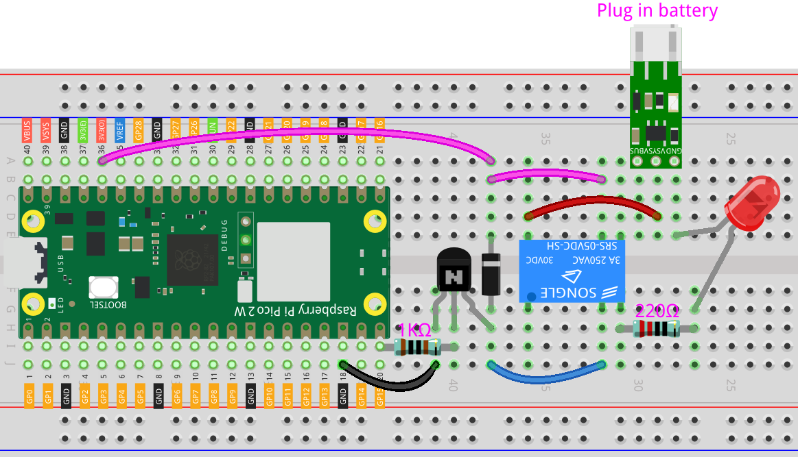

.. _iot_Bluetooth_voice_control_relay:

8.15 Bluetooth Voice-control Relay
==========================================

This project demonstrates the use of a Raspberry Pi Pico 2 W to control a relay through Bluetooth Low Energy (BLE). The Pico W receives BLE commands from a smartphone or other BLE-capable device. When it receives a "1" signal, the relay is switched on, and when it receives a "0" signal, the relay is switched off.

This project is ideal for those exploring BLE communication and IoT applications with the Raspberry Pi Pico 2 W.

1. Build the Circuit
+++++++++++++++++++++++++++++++++

.. warning ::

   This example demonstrates how to use a relay to control an LED. While the relay can connect to other appliances in practical applications, exercise extreme caution when working with high AC voltage. Improper or incorrect use may result in serious injury or death. Always prioritize safety.
   

.. raw:: html

    

2. Create the Android App
+++++++++++++++++++++++++++++++++

You will develop the Android application using |link_appinventor|, a free web application ideal for beginners in Android development. It offers intuitive drag-and-drop features for creating functional applications.

Follow these steps to get started:

#. Go to |link_appinventor_login|, and click "online tool" to login. You will need a Google account to register with MIT App Inventor.

   .. image:: img/13-ai-signup.png
       :width: 90%
       :align: center

#. After logging in, navigate to **Projects** -> **Import project (.aia) from my computer**. Subsequently, upload the ``ble_relay_picow.aia`` file located in the following path: ``pico-2w-kit/micropython/iot/8.15-ble_relay``.

   Alternatively, you can download the file directly: :download:`ble_relay_picow.aia</_static/other/ble_relay_picow.aia>`

   .. image:: img/13-ai-import.png
        :align: center

#. Once uploaded, the app template will appear in the MIT App Inventor interface. This pre-configured template can be customized after you become familiar with the platform.

#. MIT App Inventor has two main sections: **Designer** and **Blocks**. You can switch between these two sections in the upper right corner of the page.

   .. image:: img/13-ai-intro-1.png

#. The **Designer** allows you to add buttons, text, screens, and modify the overall aesthetic of your app.

   .. image:: img/15-ai-intro-2.png
      :width: 100%
   
#. Next, there's the **Blocks** section. This section lets you craft custom functionalities for your app, allowing you to program each component on the app's GUI to achieve desired features.

   .. image:: img/15-ai-intro-3.png
      :width: 100%

#. To install the app on a phone, navigate to the **Build** tab.

   .. image:: img/13-ai-intro-4.png
      :width: 60%
      :align: center

   * Generate a ``.apk`` file. After selecting this option, a page will appear allowing you to choose between downloading a ``.apk`` file or scanning a QR code for installation. Follow the installation guide to complete the application installation. 

     Alternatively, download our pre-compiled APK file here: :download:`ble_relay_picow.apk</_static/other/ble_relay_picow.apk>`

   * If you wish to publish this app to Google Play or another app marketplace, you can generate a ``.aab`` file.

3. Run the Code
+++++++++++++++++++++++++++++++++

Open the ``8.15-ble_relay.py`` file under the path of ``pico-2w-kit/micropython/iot/8.15-ble_relay``, or copy this code into your IDE.
   
.. note:: 
   This code depends on the ``ble_advertising.py`` file. Make sure to upload it to the Pico board before running the script.

.. code-block:: python

   import bluetooth
   import random
   import struct
   import time
   from ble_example.ble_advertising import advertising_payload
   from machine import Pin
   import time
   
   from micropython import const
   
   relay = machine.Pin(15, machine.Pin.OUT)
   
   _IRQ_CENTRAL_CONNECT = const(1)
   _IRQ_CENTRAL_DISCONNECT = const(2)
   _IRQ_GATTS_WRITE = const(3)
   
   _FLAG_READ = const(0x0002)
   _FLAG_WRITE_NO_RESPONSE = const(0x0004)
   _FLAG_WRITE = const(0x0008)
   _FLAG_NOTIFY = const(0x0010)
   
   _RELAY_UUID = bluetooth.UUID("46719f98-3141-4bbb-aede-47a7630d024b")
   _SWITCH_CHAR = (
       bluetooth.UUID("08b82cd0-6877-4308-b08d-a32520c327a2"),
       _FLAG_READ | _FLAG_WRITE | _FLAG_WRITE_NO_RESPONSE,
   )
   _RELAY_SERVICE = (
       _RELAY_UUID,
       (_SWITCH_CHAR,),
   )
   
   
   class BLERelay:
       def __init__(self, ble, name="ble-relay"):
   
           self._ble = ble
           self._ble.active(True)
           self._ble.irq(self._irq)
   
           handles = self._ble.gatts_register_services((_RELAY_SERVICE,))
           # print("Registered handles:", handles)
   
           ((self._handle_note,),) = handles
           self._connections = set()
   
           self._write_callback = None
   
           self._payload = advertising_payload(name=name, services=[_RELAY_UUID])
           self._advertise()
   
       def _irq(self, event, data):
           # Track connections so we can send notifications.
           if event == _IRQ_CENTRAL_CONNECT:
               conn_handle, _, _ = data
               print("New connection", conn_handle)
               self._connections.add(conn_handle)
           elif event == _IRQ_CENTRAL_DISCONNECT:
               conn_handle, _, _ = data
               print("Disconnected", conn_handle)
               self._connections.remove(conn_handle)
               # Start advertising again to allow a new connection.
               self._advertise()
           elif event == _IRQ_GATTS_WRITE:
               conn_handle, value_handle = data
               value = self._ble.gatts_read(value_handle)
               # print("Write event: conn_handle={}, value_handle={}, value={}".format(conn_handle, value_handle, value))
               if value_handle == self._handle_note and self._write_callback:
                   self._write_callback(value)
                   
   
       def is_connected(self):
           return len(self._connections) > 0
   
       def _advertise(self, interval_us=500000):
           print("Starting advertising")
           self._ble.gap_advertise(interval_us, adv_data=self._payload)
   
       def on_write(self, callback):
           self._write_callback = callback
   
   def relay_update(data):
       print("Receive:", data)
   
       decoded_data = int(data.decode('utf-8').rstrip('\x00'))
   
       # print(decoded_data)
   
       relay.value(decoded_data)
   
   
   def demo():
       ble = bluetooth.BLE()
       relay = BLERelay(ble,"pico2w")
   
       while True:
           if relay.is_connected():
               relay.on_write(relay_update)
           # time.sleep_ms(100)
   
   if __name__ == "__main__":
       demo()
   

4. App and Bluetooth Connection
++++++++++++++++++++++++++++++++++++++++++

Ensure that the "Voice-Controlled Relay BLE" app created earlier is installed on your phone.

#. Enable Bluetooth on your phone.

#. Open the **Voice-Controlled Relay BLE** app.

   .. image:: img/15_app_2.png
      :width: 25%
      :align: center

#. When you open the app for the first time, you will see two consecutive prompts requesting permissions. These permissions are required for Bluetooth functionality.

   .. image:: img/15_app_3.png
      :width: 100%
      :align: center

#. In the APP, click on **Connect** button to establish a connection between the APP and Pico 2 W via bluetooth.

   .. image:: img/15_app_4.png
      :width: 55%
      :align: center

#. This page displays a list of all Bluetooth devices. Choose the ``xx.xx.xx.xx.xx.xx pico2w`` option from the list. Each device name is displayed alongside its MAC address.

   .. image:: img/13_app_5.png
      :width: 60%
      :align: center

#. If no devices appear in the list, try enabling the location feature on your phone. (On some Android versions, the location setting is linked to Bluetooth functionality.)

#. Once connected, you will be redirected to the main screen. Tap the microphone icon to control the relay using voice commands. If your voice command contains "on," the relay will activate. If it contains "off," the relay will deactivate.

   .. image:: img/15_app_7.png
      :width: 80%
      :align: center