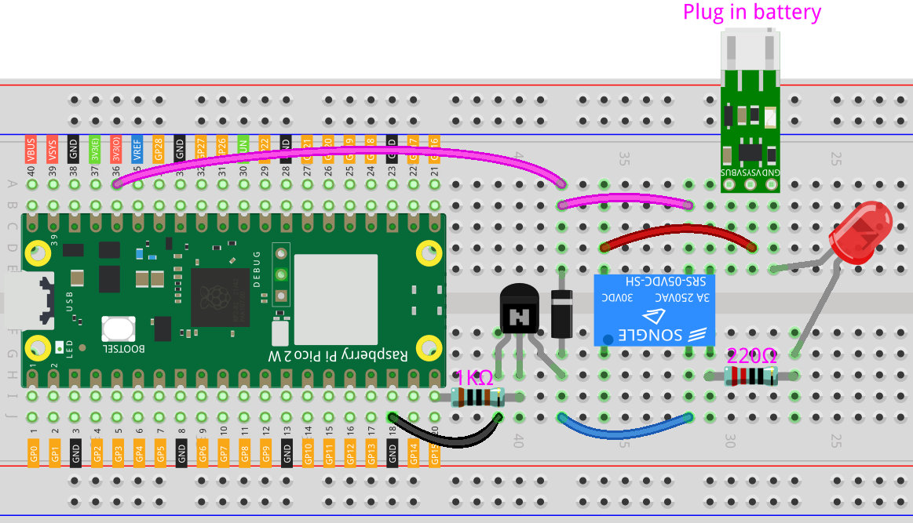

.. note:: 

    Hallo und herzlich willkommen in der SunFounder Raspberry Pi & Arduino & ESP32 Enthusiasten-Community auf Facebook! Tauche gemeinsam mit anderen Tüftler*innen noch tiefer in die Welt von Raspberry Pi, Arduino und ESP32 ein.

    **Warum beitreten?**

    - **Expertenhilfe**: Erhalte Unterstützung bei Problemen nach dem Kauf sowie bei technischen Herausforderungen – durch unser Team und unsere Community.
    - **Lernen & Teilen**: Tausche Tipps und Anleitungen aus, um deine Fähigkeiten zu erweitern.
    - **Exklusive Einblicke**: Erhalte frühzeitige Informationen zu neuen Produktankündigungen und einen Blick hinter die Kulissen.
    - **Spezialrabatte**: Genieße exklusive Rabatte auf unsere neuesten Produkte.
    - **Festliche Aktionen & Gewinnspiele**: Nimm an spannenden Aktionen und Verlosungen teil.

    👉 Bereit, mit uns zu entdecken und zu gestalten? Klicke auf [|link_sf_facebook|] und sei dabei!

.. _py_iot_ble_relay:

8.15 Bluetooth-Sprachgesteuertes Relais
==========================================

In diesem Projekt zeigen wir, wie ein Relais mithilfe eines Raspberry Pi Pico 2 W über Bluetooth Low Energy (BLE) gesteuert werden kann. Der Pico W empfängt BLE-Befehle von einem Smartphone oder einem anderen BLE-fähigen Gerät. Wenn er ein „1“-Signal empfängt, wird das Relais eingeschaltet – bei einem „0“-Signal wieder ausgeschaltet.

Das Projekt eignet sich perfekt für alle, die die BLE-Kommunikation und IoT-Anwendungen mit dem Raspberry Pi Pico 2 W kennenlernen möchten.

1. Schaltung aufbauen
+++++++++++++++++++++++++++++++++

**Benötigte Komponenten**

Für dieses Projekt benötigen wir folgende Komponenten:

Ein vollständiges Set ist sehr praktisch – hier der Link:

.. list-table::
    :widths: 20 20 20
    :header-rows: 1

    *   - Name	
        - ENTHALTENE KOMPONENTEN
        - LINK
    *   - Pico 2 W Starter Kit	
        - 450+
        - |link_pico2w_kit|

Die Komponenten können alternativ auch einzeln gekauft werden:

.. list-table::
    :widths: 5 20 5 20
    :header-rows: 1

    *   - SN
        - KOMPONENTE	
        - ANZAHL
        - LINK

    *   - 1
        - :ref:`cpn_pico_2w`
        - 1
        - |link_pico2w_buy|
    *   - 2
        - Micro-USB-Kabel
        - 1
        - 
    *   - 3
        - :ref:`cpn_breadboard`
        - 1
        - |link_breadboard_buy|
    *   - 4
        - :ref:`cpn_wire`
        - Mehrere
        - |link_wires_buy|
    *   - 5
        - :ref:`cpn_transistor`
        - 1 (S8050)
        - |link_transistor_buy|
    *   - 6
        - :ref:`cpn_diode`
        - 1
        - 
    *   - 7
        - :ref:`cpn_resistor`
        - 1 (1KΩ), 1 (220Ω)
        - |link_resistor_buy|
    *   - 8
        - :ref:`cpn_relay`
        - 1
        - |link_relay_buy|
    *   - 9
        - :ref:`cpn_lipo_charger`
        - 1
        -  
    *   - 10
        - Power Pack
        - 1
        - 

.. warning::

   In diesem Beispiel wird gezeigt, wie ein Relais zur Steuerung einer LED verwendet wird. Auch wenn das Relais in der Praxis andere Geräte schalten kann, ist beim Umgang mit Netzspannung äußerste Vorsicht geboten! Unsachgemäßer Einsatz kann zu schweren Verletzungen oder Tod führen. Sicherheit steht immer an erster Stelle!

.. raw:: html

    

2. Android-App erstellen
+++++++++++++++++++++++++++++++++

Die Android-App wird mit |link_appinventor| entwickelt – einer kostenlosen Webanwendung, die ideal für Einsteiger ist. Sie bietet eine intuitive Drag-and-Drop-Oberfläche zur App-Erstellung.

So startest du:

#. Gehe zu |link_appinventor_login| und klicke auf „Online-Tool“, um dich anzumelden. Du benötigst ein Google-Konto zur Registrierung bei MIT App Inventor.

   .. image:: img/13-ai-signup.png
       :width: 90%
       :align: center

#. Nach der Anmeldung navigierst du zu **Projekte** → **Projekt (.aia) von meinem Computer importieren**. Lade dort die Datei ``ble_relay_picow.aia`` hoch, die du unter ``pico-2w-kit/micropython/iot/8.15-ble_relay`` findest.

   Alternativ kannst du die Datei direkt hier herunterladen: :download:`ble_relay_picow.aia</_static/other/ble_relay_picow.aia>`

   .. image:: img/13-ai-import.png
        :align: center

#. Nach dem Upload erscheint die App-Vorlage in der Oberfläche. Du kannst sie nach Belieben anpassen, sobald du dich mit der Plattform vertraut gemacht hast.

#. MIT App Inventor hat zwei Hauptbereiche: **Designer** und **Blocks**. Oben rechts kannst du zwischen ihnen umschalten.

   .. image:: img/13-ai-intro-1.png

#. Im **Designer** kannst du Schaltflächen, Texte und Layouts hinzufügen und das Design deiner App gestalten.

   .. image:: img/15-ai-intro-2.png
      :width: 100%

#. Im **Blocks**-Bereich programmierst du das Verhalten der App – per Drag-and-Drop der Logikblöcke.

   .. image:: img/15-ai-intro-3.png
      :width: 100%

#. Um die App auf dem Smartphone zu installieren, gehe auf den Reiter **Build**.

   .. image:: img/13-ai-intro-4.png
      :width: 60%
      :align: center

   * Erstelle eine ``.apk``-Datei. Danach kannst du sie entweder herunterladen oder per QR-Code auf dem Smartphone installieren. Folge dem Installationsassistenten.

     Alternativ kannst du die vorgefertigte APK-Datei hier herunterladen: :download:`ble_relay_picow.apk</_static/other/ble_relay_picow.apk>`

   * Wenn du die App z. B. im Play Store veröffentlichen möchtest, kannst du auch eine ``.aab``-Datei generieren.

3. Code ausführen
+++++++++++++++++++++++++++++++++

Öffne die Datei ``8.15-ble_relay.py`` im Verzeichnis ``pico-2w-kit/micropython/iot/8.15-ble_relay`` oder kopiere den Code in deine IDE.

.. note:: 
   Dieser Code benötigt zusätzlich die Datei ``ble_advertising.py``. Achte darauf, sie vor dem Start auf den Pico hochzuladen.

.. code-block:: python

   import bluetooth
   import random
   import struct
   import time
   from ble_example.ble_advertising import advertising_payload
   from machine import Pin
   import time
   
   from micropython import const
   
   relay = machine.Pin(15, machine.Pin.OUT)
   
   _IRQ_CENTRAL_CONNECT = const(1)
   _IRQ_CENTRAL_DISCONNECT = const(2)
   _IRQ_GATTS_WRITE = const(3)
   
   _FLAG_READ = const(0x0002)
   _FLAG_WRITE_NO_RESPONSE = const(0x0004)
   _FLAG_WRITE = const(0x0008)
   _FLAG_NOTIFY = const(0x0010)
   
   _RELAY_UUID = bluetooth.UUID("46719f98-3141-4bbb-aede-47a7630d024b")
   _SWITCH_CHAR = (
       bluetooth.UUID("08b82cd0-6877-4308-b08d-a32520c327a2"),
       _FLAG_READ | _FLAG_WRITE | _FLAG_WRITE_NO_RESPONSE,
   )
   _RELAY_SERVICE = (
       _RELAY_UUID,
       (_SWITCH_CHAR,),
   )
   
   
   class BLERelay:
       def __init__(self, ble, name="ble-relay"):
   
           self._ble = ble
           self._ble.active(True)
           self._ble.irq(self._irq)
   
           handles = self._ble.gatts_register_services((_RELAY_SERVICE,))
           # print("Registered handles:", handles)
   
           ((self._handle_note,),) = handles
           self._connections = set()
   
           self._write_callback = None
   
           self._payload = advertising_payload(name=name, services=[_RELAY_UUID])
           self._advertise()
   
       def _irq(self, event, data):
           # Track connections so we can send notifications.
           if event == _IRQ_CENTRAL_CONNECT:
               conn_handle, _, _ = data
               print("New connection", conn_handle)
               self._connections.add(conn_handle)
           elif event == _IRQ_CENTRAL_DISCONNECT:
               conn_handle, _, _ = data
               print("Disconnected", conn_handle)
               self._connections.remove(conn_handle)
               # Start advertising again to allow a new connection.
               self._advertise()
           elif event == _IRQ_GATTS_WRITE:
               conn_handle, value_handle = data
               value = self._ble.gatts_read(value_handle)
               # print("Write event: conn_handle={}, value_handle={}, value={}".format(conn_handle, value_handle, value))
               if value_handle == self._handle_note and self._write_callback:
                   self._write_callback(value)
                   
   
       def is_connected(self):
           return len(self._connections) > 0
   
       def _advertise(self, interval_us=500000):
           print("Starting advertising")
           self._ble.gap_advertise(interval_us, adv_data=self._payload)
   
       def on_write(self, callback):
           self._write_callback = callback
   
   def relay_update(data):
       print("Receive:", data)
   
       decoded_data = int(data.decode('utf-8').rstrip('\x00'))
   
       # print(decoded_data)
   
       relay.value(decoded_data)
   
   
   def demo():
       ble = bluetooth.BLE()
       relay = BLERelay(ble,"pico2w")
   
       while True:
           if relay.is_connected():
               relay.on_write(relay_update)
           # time.sleep_ms(100)
   
   if __name__ == "__main__":
       demo()

4. App- und Bluetooth-Verbindung
++++++++++++++++++++++++++++++++++++++++++

Stelle sicher, dass die App **Voice-Controlled Relay BLE** installiert ist.

#. Aktiviere Bluetooth auf deinem Smartphone.

#. Öffne die App **Voice-Controlled Relay BLE**.

   .. image:: img/15_app_2.png
      :width: 25%
      :align: center

#. Beim ersten Öffnen erscheinen zwei aufeinanderfolgende Berechtigungsabfragen – diese sind für die Bluetooth-Funktion notwendig.

   .. image:: img/15_app_3.png
      :width: 100%
      :align: center

#. Tippe in der App auf **Connect**, um eine Verbindung zum Pico 2 W herzustellen.

   .. image:: img/15_app_4.png
      :width: 55%
      :align: center

#. Es erscheint eine Liste aller verfügbaren Bluetooth-Geräte. Wähle dort ``xx.xx.xx.xx.xx.xx pico2w`` aus – jedes Gerät wird mit seiner MAC-Adresse angezeigt.

   .. image:: img/13_app_5.png
      :width: 60%
      :align: center

#. Falls keine Geräte erscheinen, aktiviere die Standortfunktion auf deinem Smartphone (bei manchen Android-Versionen ist Bluetooth damit verknüpft).

#. Nach erfolgreicher Verbindung gelangst du zurück zur Hauptseite. Tippe dort auf das Mikrofon-Symbol, um das Relais per Sprachbefehl zu steuern. Bei „on“ schaltet sich das Relais ein, bei „off“ aus.

   .. image:: img/15_app_7.png
      :width: 80%
      :align: center