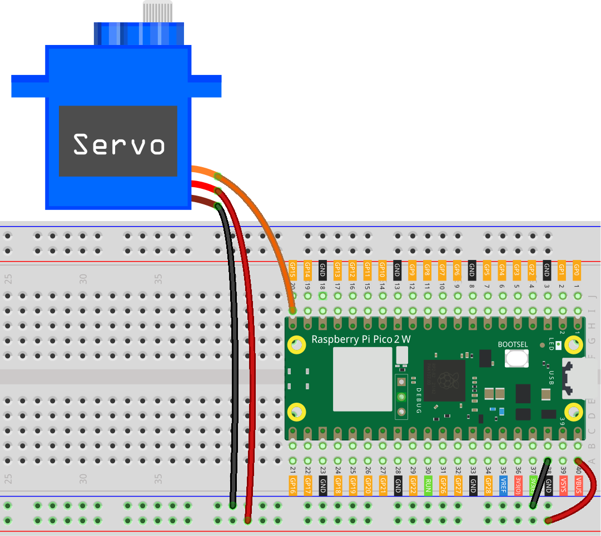

.. note::

    Hello, welcome to the SunFounder Raspberry Pi & Arduino & ESP32 Enthusiasts Community on Facebook! Dive deeper into Raspberry Pi, Arduino, and ESP32 with fellow enthusiasts.

    **Why Join?**

    - **Expert Support**: Solve post-sale issues and technical challenges with help from our community and team.
    - **Learn & Share**: Exchange tips and tutorials to enhance your skills.
    - **Exclusive Previews**: Get early access to new product announcements and sneak peeks.
    - **Special Discounts**: Enjoy exclusive discounts on our newest products.
    - **Festive Promotions and Giveaways**: Take part in giveaways and holiday promotions.

    👉 Ready to explore and create with us? Click [|link_sf_facebook|] and join today!

.. _py_iot_ble_lock:

8.16 Bluetooth Lock Controller
==========================================

The project uses a Raspberry Pi Pico 2 W board with Bluetooth capabilities to create a smart lock system. The lock's servo motor, connected to the Pico 2 W, is controlled wirelessly via a custom mobile application. The app sends lock and unlock commands to the board using BLE (Bluetooth Low Energy) communication.

This project demonstrates how to use the Raspberry Pi Pico 2 W for IoT applications, integrating Bluetooth functionality with physical control mechanisms. It provides an engaging way to explore BLE communication and servo control using MicroPython.

The app used in this project was developed with |link_appinventor|.

1. Build the Circuit
+++++++++++++++++++++++++++++++++

**Required Components**

In this project, we need the following components. 

It's definitely convenient to buy a whole kit, here's the link: 

.. list-table::
    :widths: 20 20 20
    :header-rows: 1

    *   - Name	
        - ITEMS IN THIS KIT
        - LINK
    *   - Pico 2 W Starter Kit	
        - 450+
        - |link_pico2w_kit|

You can also buy them separately from the links below.

.. list-table::
    :widths: 5 20 5 20
    :header-rows: 1

    *   - SN
        - COMPONENT	
        - QUANTITY
        - LINK

    *   - 1
        - :ref:`cpn_pico_2w`
        - 1
        - |link_pico2w_buy|
    *   - 2
        - Micro USB Cable
        - 1
        - 
    *   - 3
        - :ref:`cpn_breadboard`
        - 1
        - |link_breadboard_buy|
    *   - 4
        - :ref:`cpn_wire`
        - Several
        - |link_wires_buy|
    *   - 5
        - :ref:`cpn_servo`
        - 1
        - |link_servo_buy|

.. raw:: html

    

2. Create the Android App
+++++++++++++++++++++++++++++++++

You will develop the Android application using |link_appinventor|, a free web application ideal for beginners in Android development. It offers intuitive drag-and-drop features for creating functional applications.

Follow these steps to get started:

#. Go to |link_appinventor_login|, and click "online tool" to login. You will need a Google account to register with MIT App Inventor.

   .. image:: img/13-ai-signup.png
       :width: 90%
       :align: center

#. After logging in, navigate to **Projects** -> **Import project (.aia) from my computer**. Subsequently, upload the ``ble_lock_picow.aia`` file located in the following path: ``pico-2w-kit/micropython/iot/8.16-ble_lock``.

   Alternatively, you can download the file directly: :download:`ble_lock_picow.aia</_static/other/ble_lock_picow.aia>`

   .. image:: img/13-ai-import.png
        :align: center

#. Once uploaded, the app template will appear in the MIT App Inventor interface. This pre-configured template can be customized after you become familiar with the platform.

#. MIT App Inventor has two main sections: **Designer** and **Blocks**. You can switch between these two sections in the upper right corner of the page.

   .. image:: img/13-ai-intro-1.png

#. The **Designer** allows you to add buttons, text, screens, and modify the overall aesthetic of your app.

   .. image:: img/16-ai-intro-2.png
      :width: 100%
   
#. Next, there's the **Blocks** section. This section lets you craft custom functionalities for your app, allowing you to program each component on the app's GUI to achieve desired features.

   .. image:: img/16-ai-intro-3.png
      :width: 100%

#. To install the app on a phone, navigate to the **Build** tab.

   .. image:: img/13-ai-intro-4.png
      :width: 60%
      :align: center

   * Generate a ``.apk`` file. After selecting this option, a page will appear allowing you to choose between downloading a ``.apk`` file or scanning a QR code for installation. Follow the installation guide to complete the application installation. 

     Alternatively, download our pre-compiled APK file here: :download:`ble_lock_picow.apk</_static/other/ble_lock_picow.apk>`

   * If you wish to publish this app to Google Play or another app marketplace, you can generate a ``.aab`` file.

3. Run the Code
+++++++++++++++++++++++++++++++++

Open the ``8.16-ble_lock.py`` file under the path of ``pico-2w-kit/micropython/iot/8.16-ble_lock``, or copy this code into your IDE.
   
.. note:: 
   This code depends on the ``ble_advertising.py`` file. Make sure to upload it to the Pico board before running the script.

.. code-block:: python

   import bluetooth
   import random
   import struct
   import time
   from ble_example.ble_advertising import advertising_payload
   from machine import Pin
   import time
   
   import struct
   from micropython import const
   
   servo = machine.PWM(machine.Pin(15))
   servo.freq(50)
   
   _IRQ_CENTRAL_CONNECT = const(1)
   _IRQ_CENTRAL_DISCONNECT = const(2)
   _IRQ_GATTS_WRITE = const(3)
   
   _FLAG_READ = const(0x0002)
   _FLAG_WRITE_NO_RESPONSE = const(0x0004)
   _FLAG_WRITE = const(0x0008)
   _FLAG_NOTIFY = const(0x0010)
   
   _LOCK_UUID = bluetooth.UUID("f3ac7f80-5045-47b0-88fe-24d858e2e92f")
   _SWITCH_CHAR = (
       bluetooth.UUID("808b6a74-8d38-4114-8cb7-0ac9465db42d"),
       _FLAG_READ | _FLAG_WRITE | _FLAG_WRITE_NO_RESPONSE,
   )
   _LOCK_SERVICE = (
       _LOCK_UUID,
       (_SWITCH_CHAR,),
   )
   
   
   class BLELock:
       def __init__(self, ble, name="PICO-LOCK"):
   
           self._ble = ble
           self._ble.active(True)
           self._ble.irq(self._irq)
   
           handles = self._ble.gatts_register_services((_LOCK_SERVICE,))
           # print("Registered handles:", handles)
   
           ((self._handle_note,),) = handles
           self._connections = set()
   
           self._write_callback = None
   
           self._payload = advertising_payload(name=name, services=[_LOCK_UUID])
           self._advertise()
   
       def _irq(self, event, data):
           # Track connections so we can send notifications.
           if event == _IRQ_CENTRAL_CONNECT:
               conn_handle, _, _ = data
               print("New connection", conn_handle)
               self._connections.add(conn_handle)
           elif event == _IRQ_CENTRAL_DISCONNECT:
               conn_handle, _, _ = data
               print("Disconnected", conn_handle)
               self._connections.remove(conn_handle)
               # Start advertising again to allow a new connection.
               self._advertise()
           elif event == _IRQ_GATTS_WRITE:
               conn_handle, value_handle = data
               value = self._ble.gatts_read(value_handle)
               # print("Write event: conn_handle={}, value_handle={}, value={}".format(conn_handle, value_handle, value))
               if value_handle == self._handle_note and self._write_callback:
                   self._write_callback(value)
                   
   
       def is_connected(self):
           return len(self._connections) > 0
   
       def _advertise(self, interval_us=500000):
           print("Starting advertising")
           self._ble.gap_advertise(interval_us, adv_data=self._payload)
   
       def on_write(self, callback):
           self._write_callback = callback
   
   def interval_mapping(x, in_min, in_max, out_min, out_max):
       return (x - in_min) * (out_max - out_min) / (in_max - in_min) + out_min
   
   def servo_write(pin,angle):
       pulse_width=interval_mapping(angle, 0, 180, 0.5,2.5)
       duty=int(interval_mapping(pulse_width, 0, 20, 0,65535))
       pin.duty_u16(duty)
   
   def lock_update(data):
       print("Receive:", data)
   
       decoded_data = struct.unpack('I', data)[0]
   
       if decoded_data == 1:
           servo_write(servo,90)
       else:
           servo_write(servo,0)
   
   
   def demo():
       ble = bluetooth.BLE()
       piano = BLELock(ble,"pico2w")
   
       while True:
           if piano.is_connected():
               piano.on_write(lock_update)
           # time.sleep_ms(100)
   
   if __name__ == "__main__":
       demo()

4. App and Bluetooth Connection
++++++++++++++++++++++++++++++++++++++++++

Ensure that the "Bluetooth controlled lock ble" app created earlier is installed on your phone.

#. Enable Bluetooth on your phone.

#. Open the **Bluetooth controlled lock ble** app.

   .. image:: img/16_app_2.png
      :width: 25%
      :align: center

#. When you open the app for the first time, you will see two consecutive prompts requesting permissions. These permissions are required for Bluetooth functionality.

   .. image:: img/16_app_3.png
      :width: 100%
      :align: center

#. In the APP, click the lock icon to establish a Bluetooth connection between the application and the Pico 2 W.

   .. image:: img/16_app_4.png
      :width: 55%
      :align: center

#. This page displays a list of all Bluetooth devices. Choose the ``xx.xx.xx.xx.xx.xx pico2w`` option from the list. Each device name is displayed alongside its MAC address.

   .. image:: img/13_app_5.png
      :width: 60%
      :align: center

#. If no devices appear in the list, try enabling the location feature on your phone. (On some Android versions, the location setting is linked to Bluetooth functionality.)

#. Once connected, you will be redirected to the main screen. Click the unlock or lock button to control the servo motor, unlocking or locking it as needed.

   .. image:: img/16_app_7.png
      :width: 90%
      :align: center