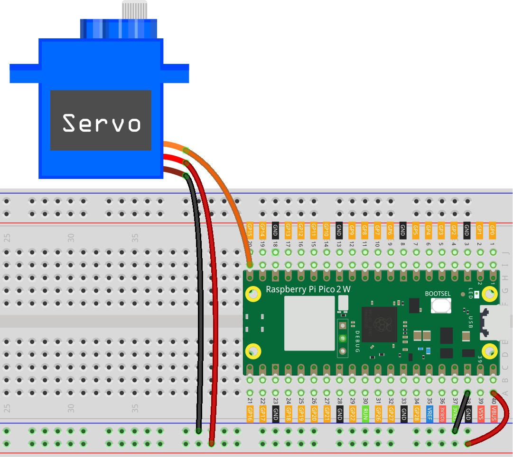

.. note::

    Hallo und herzlich willkommen in der SunFounder-Community für Raspberry Pi-, Arduino- und ESP32-Enthusiasten auf Facebook! Tauche gemeinsam mit anderen Technikfans tiefer in die Welt von Raspberry Pi, Arduino und ESP32 ein.

    **Warum solltest du mitmachen?**

    - **Expertenhilfe**: Erhalte Unterstützung bei technischen Problemen oder Fragen nach dem Kauf – durch unser Team und die Community.
    - **Lernen & Teilen**: Tausche Tipps und Anleitungen aus, um deine Fähigkeiten zu erweitern.
    - **Exklusive Vorschauen**: Erfahre als Erster von neuen Produktankündigungen und erhalte exklusive Einblicke.
    - **Spezielle Rabatte**: Profitiere von exklusiven Rabatten auf unsere neuesten Produkte.
    - **Aktionen & Gewinnspiele**: Nimm an saisonalen Aktionen und spannenden Verlosungen teil.

    👉 Bereit, gemeinsam mit uns Neues zu entdecken und zu entwickeln? Klicke auf [|link_sf_facebook|] und tritt noch heute bei!

.. _py_iot_ble_lock:

8.16 Bluetooth-Schloss-Controller
==========================================

In diesem Projekt wird das Raspberry Pi Pico 2 W mit Bluetooth-Funktionalität verwendet, um ein intelligentes Schlosssystem zu entwickeln. Der am Pico 2 W angeschlossene Servomotor des Schlosses wird drahtlos über eine selbst entwickelte mobile App gesteuert. Die App sendet per BLE (Bluetooth Low Energy) Sperr- und Entsperrbefehle an das Board.

Dieses Projekt zeigt, wie man das Raspberry Pi Pico 2 W für IoT-Anwendungen nutzen kann – durch Integration von Bluetooth-Funktionen mit physischer Steuerung. Es bietet eine spannende Möglichkeit, BLE-Kommunikation und Servosteuerung mit MicroPython zu erlernen.

Die in diesem Projekt verwendete App wurde mit |link_appinventor| entwickelt.

1. Schaltung aufbauen
+++++++++++++++++++++++++++++++++

**Benötigte Komponenten**

Für dieses Projekt werden folgende Bauteile benötigt.

Ein Komplettset ist besonders praktisch – hier ist der Link:

.. list-table::
    :widths: 20 20 20
    :header-rows: 1

    *   - Name
        - ENTHALTENE TEILE
        - LINK
    *   - Pico 2 W Starter Kit
        - 450+
        - |link_pico2w_kit|

Die Komponenten können alternativ auch einzeln über die folgenden Links erworben werden:

.. list-table::
    :widths: 5 20 5 20
    :header-rows: 1

    *   - SN
        - KOMPONENTE
        - MENGE
        - LINK

    *   - 1
        - :ref:`cpn_pico_2w`
        - 1
        - |link_pico2w_buy|
    *   - 2
        - Micro-USB-Kabel
        - 1
        - 
    *   - 3
        - :ref:`cpn_breadboard`
        - 1
        - |link_breadboard_buy|
    *   - 4
        - :ref:`cpn_wire`
        - Mehrere
        - |link_wires_buy|
    *   - 5
        - :ref:`cpn_servo`
        - 1
        - |link_servo_buy|

.. raw:: html

    

2. Android-App erstellen
+++++++++++++++++++++++++++++++++

Du erstellst die Android-App mit |link_appinventor| – einer kostenlosen Webanwendung, die besonders für Einsteiger geeignet ist. Sie bietet eine intuitive Drag-and-Drop-Oberfläche zur App-Erstellung.

So startest du:

#. Besuche |link_appinventor_login| und klicke auf "Online-Tool", um dich anzumelden. Du benötigst ein Google-Konto zur Registrierung bei MIT App Inventor.

   .. image:: img/13-ai-signup.png
       :width: 90%
       :align: center

#. Gehe nach der Anmeldung zu **Projekte** -> **Projekt (.aia) von meinem Computer importieren** und lade die Datei ``ble_lock_picow.aia`` hoch, die sich unter folgendem Pfad befindet: ``pico-2w-kit/micropython/iot/8.16-ble_lock``.

   Alternativ kannst du die Datei direkt herunterladen: :download:`ble_lock_picow.aia</_static/other/ble_lock_picow.aia>`

   .. image:: img/13-ai-import.png
        :align: center

#. Nach dem Hochladen erscheint die App-Vorlage in der Oberfläche von MIT App Inventor. Diese vorkonfigurierte Vorlage kannst du später individuell anpassen.

#. MIT App Inventor besteht aus zwei Hauptbereichen: **Designer** und **Blocks**. Du kannst oben rechts zwischen ihnen wechseln.

   .. image:: img/13-ai-intro-1.png

#. Im **Designer** fügst du Schaltflächen, Texte und Oberflächenelemente hinzu und gestaltest das Aussehen der App.

   .. image:: img/16-ai-intro-2.png
      :width: 100%

#. Im Bereich **Blocks** kannst du die Funktionen der App programmieren und das Verhalten einzelner Elemente festlegen.

   .. image:: img/16-ai-intro-3.png
      :width: 100%

#. Um die App auf deinem Smartphone zu installieren, gehe zum Reiter **Build**.

   .. image:: img/13-ai-intro-4.png
      :width: 60%
      :align: center

   * Erstelle eine ``.apk``-Datei. Nach Auswahl dieser Option kannst du die Datei herunterladen oder per QR-Code installieren. Folge der Anleitung zur Installation der App.

     Oder lade die vorkompilierte APK-Datei direkt herunter: :download:`ble_lock_picow.apk</_static/other/ble_lock_picow.apk>`

   * Wenn du die App im Google Play Store veröffentlichen möchtest, kannst du eine ``.aab``-Datei generieren.

3. Code ausführen
+++++++++++++++++++++++++++++++++

Öffne die Datei ``8.16-ble_lock.py`` unter dem Pfad ``pico-2w-kit/micropython/iot/8.16-ble_lock`` oder kopiere den Code in deine IDE.

.. note::
   Dieser Code benötigt zusätzlich die Datei ``ble_advertising.py``. Stelle sicher, dass sie auf das Pico-Board hochgeladen wird, bevor du das Skript ausführst.

.. code-block:: python

   import bluetooth
   import random
   import struct
   import time
   from ble_example.ble_advertising import advertising_payload
   from machine import Pin
   import time
   
   import struct
   from micropython import const
   
   servo = machine.PWM(machine.Pin(15))
   servo.freq(50)
   
   _IRQ_CENTRAL_CONNECT = const(1)
   _IRQ_CENTRAL_DISCONNECT = const(2)
   _IRQ_GATTS_WRITE = const(3)
   
   _FLAG_READ = const(0x0002)
   _FLAG_WRITE_NO_RESPONSE = const(0x0004)
   _FLAG_WRITE = const(0x0008)
   _FLAG_NOTIFY = const(0x0010)
   
   _LOCK_UUID = bluetooth.UUID("f3ac7f80-5045-47b0-88fe-24d858e2e92f")
   _SWITCH_CHAR = (
       bluetooth.UUID("808b6a74-8d38-4114-8cb7-0ac9465db42d"),
       _FLAG_READ | _FLAG_WRITE | _FLAG_WRITE_NO_RESPONSE,
   )
   _LOCK_SERVICE = (
       _LOCK_UUID,
       (_SWITCH_CHAR,),
   )
   
   
   class BLELock:
       def __init__(self, ble, name="PICO-LOCK"):
   
           self._ble = ble
           self._ble.active(True)
           self._ble.irq(self._irq)
   
           handles = self._ble.gatts_register_services((_LOCK_SERVICE,))
           # print("Registered handles:", handles)
   
           ((self._handle_note,),) = handles
           self._connections = set()
   
           self._write_callback = None
   
           self._payload = advertising_payload(name=name, services=[_LOCK_UUID])
           self._advertise()
   
       def _irq(self, event, data):
           # Track connections so we can send notifications.
           if event == _IRQ_CENTRAL_CONNECT:
               conn_handle, _, _ = data
               print("New connection", conn_handle)
               self._connections.add(conn_handle)
           elif event == _IRQ_CENTRAL_DISCONNECT:
               conn_handle, _, _ = data
               print("Disconnected", conn_handle)
               self._connections.remove(conn_handle)
               # Start advertising again to allow a new connection.
               self._advertise()
           elif event == _IRQ_GATTS_WRITE:
               conn_handle, value_handle = data
               value = self._ble.gatts_read(value_handle)
               # print("Write event: conn_handle={}, value_handle={}, value={}".format(conn_handle, value_handle, value))
               if value_handle == self._handle_note and self._write_callback:
                   self._write_callback(value)
                   
   
       def is_connected(self):
           return len(self._connections) > 0
   
       def _advertise(self, interval_us=500000):
           print("Starting advertising")
           self._ble.gap_advertise(interval_us, adv_data=self._payload)
   
       def on_write(self, callback):
           self._write_callback = callback
   
   def interval_mapping(x, in_min, in_max, out_min, out_max):
       return (x - in_min) * (out_max - out_min) / (in_max - in_min) + out_min
   
   def servo_write(pin,angle):
       pulse_width=interval_mapping(angle, 0, 180, 0.5,2.5)
       duty=int(interval_mapping(pulse_width, 0, 20, 0,65535))
       pin.duty_u16(duty)
   
   def lock_update(data):
       print("Receive:", data)
   
       decoded_data = struct.unpack('I', data)[0]
   
       if decoded_data == 1:
           servo_write(servo,90)
       else:
           servo_write(servo,0)
   
   
   def demo():
       ble = bluetooth.BLE()
       piano = BLELock(ble,"pico2w")
   
       while True:
           if piano.is_connected():
               piano.on_write(lock_update)
           # time.sleep_ms(100)
   
   if __name__ == "__main__":
       demo()

4. App- und Bluetooth-Verbindung
++++++++++++++++++++++++++++++++++++++++++

Stelle sicher, dass die zuvor erstellte App Bluetooth controlled lock ble auf deinem Smartphone installiert ist.

#. Aktiviere Bluetooth auf deinem Smartphone.

#. Öffne die App **Bluetooth controlled lock ble**.

   .. image:: img/16_app_2.png
      :width: 25%
      :align: center

#. Beim ersten Start der App erscheinen zwei aufeinanderfolgende Berechtigungsanfragen. Diese sind für die Bluetooth-Funktionalität notwendig.

   .. image:: img/16_app_3.png
      :width: 100%
      :align: center

#. Tippe auf das Schlosssymbol, um die Bluetooth-Verbindung zwischen App und Pico 2 W herzustellen.

   .. image:: img/16_app_4.png
      :width: 55%
      :align: center

#. Es wird eine Liste aller verfügbaren Bluetooth-Geräte angezeigt. Wähle das Gerät mit dem Namen ``xx.xx.xx.xx.xx.xx pico2w`` aus (Name plus MAC-Adresse).

   .. image:: img/13_app_5.png
      :width: 60%
      :align: center

#. Falls keine Geräte angezeigt werden, aktiviere gegebenenfalls die Standortdienste auf deinem Smartphone (bei manchen Android-Versionen ist Bluetooth daran gekoppelt).

#. Nach erfolgreicher Verbindung wirst du auf die Hauptseite der App weitergeleitet. Tippe auf „Sperren“ oder „Entsperren“, um den Servomotor entsprechend zu steuern.

   .. image:: img/16_app_7.png
      :width: 90%
      :align: center