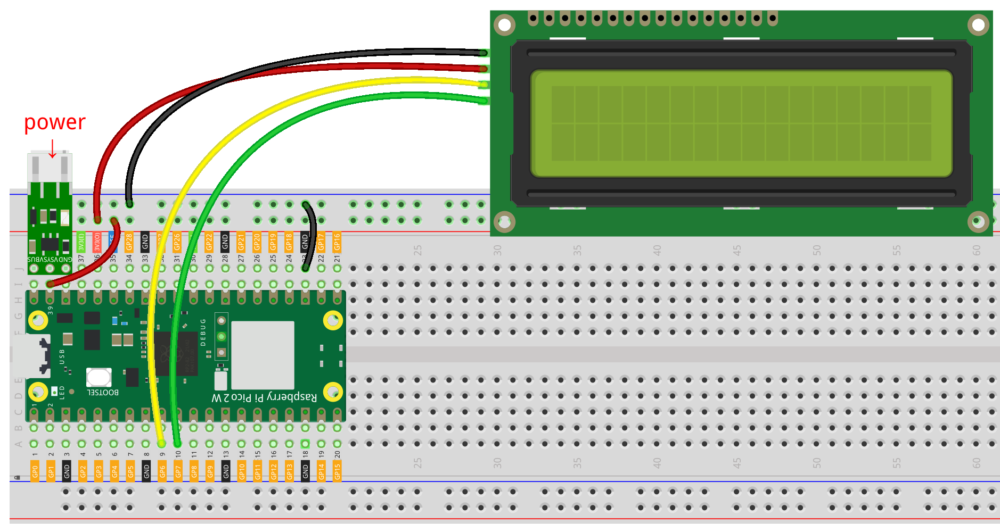
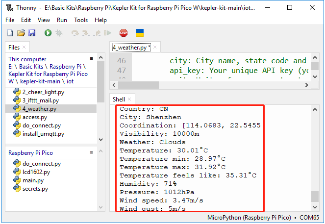

.. note::
    Hallo und willkommen in der SunFounder Raspberry Pi & Arduino & ESP32 Enthusiasten-Gemeinschaft auf Facebook! Tauche tiefer in die Welt des Raspberry Pi, Arduino und ESP32 ein mit anderen Enthusiasten.

    **Warum beitreten?**

    - **Expertenunterstützung**: Löse Nachverkaufsprobleme und technische Herausforderungen mit Hilfe unserer Gemeinschaft und unseres Teams.
    - **Lernen & Teilen**: Austausch von Tipps und Tutorials zur Verbesserung deiner Fähigkeiten.
    - **Exklusive Vorschauen**: Erhalte frühen Zugang zu neuen Produktankündigungen und Einblicke.
    - **Sonderangebote**: Genieße exklusive Rabatte auf unsere neuesten Produkte.
    - **Festliche Aktionen und Gewinnspiele**: Nimm an Gewinnspielen und Feiertagsaktionen teil.

    👉 Bist du bereit, mit uns zu erkunden und zu kreieren? Klicke auf [|link_sf_facebook|] und trete heute bei!

.. _py_iot_openweather:

8.4 Echtzeit-Wetterdaten von @OpenWeatherMap 
================================================

In diesem Projekt erstellst du eine intelligente Uhr, die neben der Uhrzeit auch das Wetter in deiner Stadt auf einem LCD anzeigt.

**1. Benötigte Komponenten**

Für dieses Projekt benötigst du die folgenden Komponenten. Es ist definitiv praktisch, ein ganzes Kit zu kaufen, hier ist der Link:

.. list-table::
    :widths: 20 20 20
    :header-rows: 1

    *   - Name	
        - ITEMS IN THIS KIT
        - LINK
    *   - Pico 2 W Starter Kit	
        - 450+
        - |link_pico2w_kit|

Du kannst sie auch einzeln über die untenstehenden Links kaufen.

.. list-table::
    :widths: 5 20 5 20
    :header-rows: 1

    *   - SN
        - COMPONENT	
        - QUANTITY
        - LINK

    *   - 1
        - :ref:`cpn_pico_2w`
        - 1
        - |link_pico2w_buy|
    *   - 2
        - Micro USB Cable
        - 1
        - 
    *   - 3
        - :ref:`cpn_breadboard`
        - 1
        - |link_breadboard_buy|
    *   - 4
        - :ref:`cpn_wire`
        - Mehrere
        - |link_wires_buy|
    *   - 5
        - :ref:`cpn_i2c_lcd`
        - 1
        - |link_i2clcd1602_buy|
    *   - 6
        - :ref:`cpn_lipo_charger`
        - 1
        -  
    *   - 7
        - Power Pack
        - 1
        -  

**2. Den Schaltkreis aufbauen**

    .. warning:: 
        
        Stelle sicher, dass dein Li-po-Ladegerät wie im Diagramm gezeigt angeschlossen ist. Andernfalls könnte ein Kurzschluss deine Batterie und die Schaltung beschädigen.

**3. OpenWeather API-Schlüssel erhalten**

|link_openweather| ist ein Online-Dienst von OpenWeather Ltd, der weltweite Wetterdaten über eine API bereitstellt, einschließlich aktueller Wetterdaten, Prognosen, Nowcasts und historischen Wetterdaten für jeden geografischen Standort.

#. Besuche |link_openweather|, um dich anzumelden/ein Konto zu erstellen.

    .. image:: img/OWM-1.png

#. Klicke auf die API-Seite in der Navigationsleiste.

    .. image:: img/OWM-2.png

#. Finde **Current Weather Data** und klicke auf Abonnieren.

    .. image:: img/OWM-3.png

#. Unter **Current weather and forecasts collection** abonniere den entsprechenden Dienst. Für unser Projekt reicht die kostenlose Version.

   .. image:: img/OWM-4.png

#. Kopiere den Schlüssel von der Seite **API keys**.

   .. image:: img/OWM-5.png

#. Kopiere ihn in das Skript ``secrets.py`` auf dem Raspberry Pi Pico 2 W.

    .. image:: img/4_openweather1(1).png

    .. note::

        Wenn du die Skripte ``do_connect.py`` und ``secrets.py`` nicht auf deinem Pico 2 W hast, musst du sie dort erstellen. Bitte siehe :ref:`py_iot_access`, um sie zu erstellen.

    .. code-block:: python
        :emphasize-lines: 5

        secrets = {
        'ssid': 'SSID',
        'password': 'PASSWORD',
        'openweather_api_key':'OPENWEATHERMAP_API_KEY'
        }

**4. Das Skript ausführen**

#. Öffne die Datei ``8.4_weather.py`` unter dem Pfad ``pico-2w-kit-main/micropython/iot``, klicke auf den Knopf **Run current script** oder drücke F5, um es auszuführen.

    .. image:: img/4_openweather2.png

#. Nachdem das Skript ausgeführt wurde, werden die Uhrzeit und die Wetterinformationen deines Standorts auf dem I2C LCD1602 angezeigt.

    .. note:: 

        Wenn der Bildschirm während des Betriebs leer bleibt, kannst du das Potentiometer auf der Rückseite des Moduls drehen, um den Kontrast zu erhöhen.

#. Wenn du möchtest, dass dieses Skript beim Booten ausgeführt wird, kannst du es als „main.py“ auf dem Raspberry Pi Pico 2 W speichern.

**Wie funktioniert es?**

Dieses Projekt benötigt eine Netzwerkverbindung. Verwende die Methode :ref:`py_iot_access`, um eine Verbindung zum Netzwerk herzustellen.

.. code-block:: python

    from secrets import *
    from do_connect import *
    do_connect()

from do_connect import * : Dies importiert die Funktion  `do_connect()` , welche die Logik zum Verbinden mit Wi-Fi unter Verwendung des `network`-Moduls enthält. Sobald die Funktion `do_connect()` aufgerufen wird, verbindet sie sich mit dem in `secrets.py` angegebenen Wi-Fi-Netzwerk. Wenn die Verbindung fehlschlägt, wird eine Ausnahme ausgelöst; wenn sie erfolgreich ist, wird mit dem nächsten Schritt fortgefahren.

from secrets import * : Die Datei `secrets.py` ist in der Regel eine separate Datei, die dazu dient, deine Wi-Fi-SSID, das Passwort und andere sensible Informationen (wie API-Schlüssel) zu speichern. Dadurch wird vermieden, dass sensible Informationen direkt in der Hauptcode-Datei eingebettet werden.

Nachdem eine Internetverbindung hergestellt wurde, helfen diese Codezeilen, deinen Pico 2 W auf die Greenwich Mean Time zu synchronisieren.

.. code-block:: python

   import ntptime
   while True:
      try:
         ntptime.settime()
         print('Time Set Successfully')
         break
      except OSError:
         print('Time Setting...')
         continue   

Initialisiere dein LCD. Bitte siehe :ref:`py_lcd` für Details zur Verwendung.

.. code-block:: python

   from lcd1602 import LCD
   lcd=LCD()
   lcd.clear() 
   string = 'Loading...'
   lcd.message(string)

Wir müssen die Einheit für einige Wetterdaten (z.B. Temperatur, Windgeschwindigkeit) auswählen, bevor wir die Wetterdaten erhalten. In diesem Fall ist die Einheit „metrisch“.

.. code-block:: python

   # Open Weather
   TEMPERATURE_UNITS = {
      "standard": "K",
      "metric": "°C",
      "imperial": "°F",
   }

   SPEED_UNITS = {
      "standard": "m/s",
      "metric": "m/s",
      "imperial": "mph",
   }

   units = "metric"

Als nächstes holt diese Funktion die Wetterdaten von ``openweathermap.org``. 
Wir senden eine URL-Nachricht mit deiner Stadt, API-Schlüsseln und einer 
festgelegten Einheit. Als Ergebnis erhältst du eine ``JSON``-Datei mit Wetterdaten.

.. code-block:: python

   def get_weather(city, api_key, units='metric', lang='en'):
      '''
      Get weather data from openweathermap.org
         city: City name, state code and country code divided by comma, Please, refer to ISO 3166 for the state codes or country codes. https://www.iso.org/obp/ui/#search
         api_key: Your unique API key (you can always find it on your openweather account page under the "API key" tab https://home.openweathermap.org/api_keys)
         unit: Units of measurement. standard, metric and imperial units are available. If you do not use the units parameter, standard units will be applied by default. More: https://openweathermap.org/current#data
         lang: You can use this parameter to get the output in your language. More: https://openweathermap.org/current#multi
      '''
      url = f"https://api.openweathermap.org/data/2.5/weather?q={city}&appid={api_key}&units={units}&lang={lang}"
      print(url)
      res = urequests.post(url)
      return res.json()

Wenn du diese Rohdaten ausgibst, wirst du Informationen sehen, die denen unten ähnlich sind.

.. code-block:: python

   Wetterdatenbeispiel:
   {
       'timezone': 28800,
       'sys': {
           'type': 2,
           'sunrise': 1659650200,
           'country': 'CN',
           'id': 2031340,
           'sunset': 1659697371
       },
       'base': 'stations',
       'main': {
           'pressure': 1008,
           'feels_like': 304.73,
           'temp_max': 301.01,
           'temp': 300.4,
           'temp_min': 299.38,
           'humidity': 91,
           'sea_level': 1008,
           'grnd_level': 1006
       },
       'visibility': 10000,
       'id': 1795565,
       'clouds': {
           'all': 96
       }, 
       'coord': {
           'lon': 114.0683,
           'lat': 22.5455
       },
       'name': 'Shenzhen',
       'cod': 200,
       'weather':[{
           'id': 804,
           'icon': '04d',
           'main': 'Clouds',
           'description': 'overcast clouds'
       }],
       'dt': 1659663579,
       'wind': {
           'gust': 7.06,
           'speed': 3.69,
           'deg': 146
       }
   }

Wir haben die Funktion ``print_weather(weather_data)`` verwendet, um diese Rohdaten in ein leicht lesbares Datenformat umzuwandeln und auszudrucken.

Diese Funktion wird jedoch nicht aufgerufen, und du kannst diese Zeile in ``while True`` bei Bedarf auskommentieren.

.. code-block:: python
   :emphasize-lines: 2

   # shell print
   print_weather(weather_data)

In der Schleife ``while True`` wird zuerst die Funktion ``get_weather()`` aufgerufen, um die benötigten Informationen über das ``weather``, die ``temperatur`` und die ``humidity`` für dieses Projekt abzurufen.

.. code-block:: python

   weather_data = get_weather('shenzhen', secrets['openweather_api_key'], units=units)
   weather=weather_data["weather"][0]["main"]
   t=weather_data["main"]["temp"]
   rh=weather_data["main"]["humidity"]

Hole die lokale Zeit. Die Funktion ``time.localtime()`` wird hier aufgerufen, um eine Reihe von Tupeln (Jahr, Monat, Tag, Stunde, Minute, Sekunde, Wochentag, Jahrestag) zurückzugeben. Wir haben ``hour`` und ``minute`` daraus entnommen.

Beachte, dass wir den Pico 2 W bereits auf die Greenwich Mean Time synchronisiert haben, daher müssen wir die Zeitzone deines Standorts hinzufügen.

.. code-block:: python
    
    # get time (+24 allows for western hemisphere)
    # if negative, add 24
    # hours = time.localtime()[3] + int(weather_data["timezone"] / 3600) + 24  #only for west hemisphere

    hours=time.localtime()[3]+int(weather_data["timezone"] / 3600)
    mins=time.localtime()[4]

Schließlich werden die Wetterinformationen und die Zeit einfach auf dem LCD1602 angezeigt.

.. code-block:: python

   lcd.clear() 
   time.sleep_ms(200)
   string = f'{hours:02d}:{mins:02d} {weather}\n'
   lcd.message(string)
   string = f'{t}{TEMPERATURE_UNITS[units]} {rh}%rh'
   lcd.message(string)

Dein LCD1602 wird zu einer Uhr, die alle 30 Sekunden aktualisiert wird, wenn die Hauptschleife alle 30 Sekunden ausgeführt wird.

.. OPW's documentation page, where you can find all the technical information for each product. https://openweathermap.org/api

.. View the obtained key https://home.openweathermap.org/api_keys
.. Current weather data page https://openweathermap.org/current
.. https://openweathermap.org/appid
