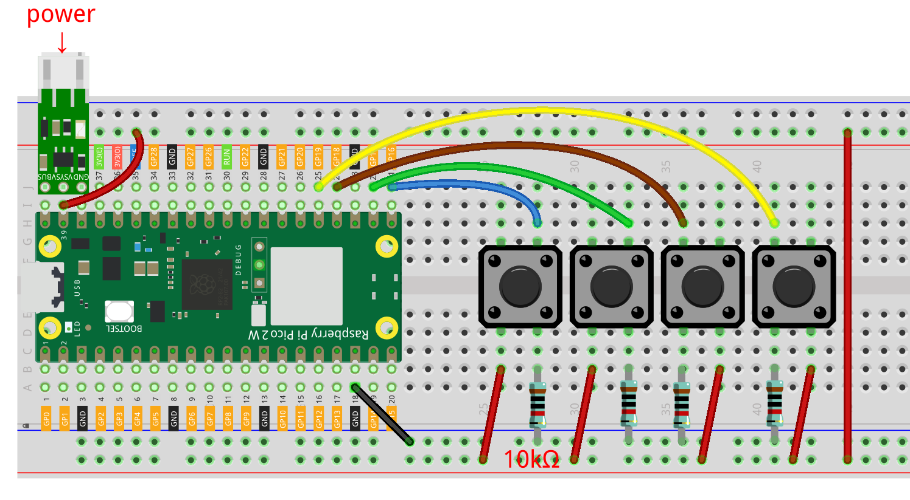

.. note::

    Hallo und willkommen in der SunFounder Raspberry Pi & Arduino & ESP32 Enthusiasten-Gemeinschaft auf Facebook! Tauche tiefer in die Welt des Raspberry Pi, Arduino und ESP32 ein mit anderen Enthusiasten.

    **Warum beitreten?**

    - **Expertenunterstützung**: Löse Nachverkaufsprobleme und technische Herausforderungen mit Hilfe unserer Gemeinschaft und unseres Teams.
    - **Lernen & Teilen**: Austausch von Tipps und Tutorials zur Verbesserung deiner Fähigkeiten.
    - **Exklusive Vorschauen**: Erhalte frühen Zugang zu neuen Produktankündigungen und Einblicke.
    - **Sonderangebote**: Genieße exklusive Rabatte auf unsere neuesten Produkte.
    - **Festliche Aktionen und Gewinnspiele**: Nimm an Gewinnspielen und Feiertagsaktionen teil.

    👉 Bist du bereit, mit uns zu erkunden und zu kreieren? Klicke auf [|link_sf_facebook|] und trete heute bei!

.. _py_iot_mqtt_publish:

8.5 Rufsystem mit @MQTT
============================================

Message Queuing Telemetry Transport (MQTT) ist ein einfaches Messaging-Protokoll 
und das verbreitetste Protokoll für das Internet der Dinge (IoT).

MQTT definiert die Art und Weise, wie IoT-Geräte Daten übertragen. 
Sie sind ereignisgesteuert und verwenden das Pub/Sub-Modell zur Verknüpfung. 
Der Sender (Publisher) und der Empfänger (Subscriber) kommunizieren über Themen. 
Ein Gerät veröffentlicht eine Nachricht zu einem spezifischen Thema, 
und alle Geräte, die dieses Thema abonniert haben, erhalten die Nachricht.

In diesem Abschnitt wird ein Serviceklingelsystem mit Pico 2 W, HiveMQ 
(ein kostenloser öffentlicher MQTT-Brokerdienst) und vier Tasten erstellt. 
Die vier Tasten stehen für vier Tische im Restaurant, und du kannst auf 
HiveMQ sehen, welche Tischgäste Service benötigen, wenn der Kunde die Taste drückt.

**1. Benötigte Komponenten**

Für dieses Projekt benötigst du die folgenden Komponenten. 

Es ist definitiv praktisch, ein ganzes Kit zu kaufen, hier ist der Link:

.. list-table::
    :widths: 20 20 20
    :header-rows: 1

    *   - Name	
        - ITEMS IN THIS KIT
        - LINK
    *   - Pico 2 W Starter Kit	
        - 450+
        - |link_pico2w_kit|

Du kannst sie auch einzeln über die untenstehenden Links kaufen.

.. list-table::
    :widths: 5 20 5 20
    :header-rows: 1

    *   - SN
        - COMPONENT	
        - QUANTITY
        - LINK

    *   - 1
        - :ref:`cpn_pico_2w`
        - 1
        - |link_pico2w_buy|
    *   - 2
        - Micro USB Cable
        - 1
        - 
    *   - 3
        - :ref:`cpn_breadboard`
        - 1
        - |link_breadboard_buy|
    *   - 4
        - :ref:`cpn_wire`
        - Mehrere
        - |link_wires_buy|
    *   - 5
        - :ref:`cpn_resistor`
        - 4(10KΩ)
        - |link_resistor_buy|
    *   - 6
        - :ref:`cpn_button`
        - 4
        - |link_button_buy|
    *   - 7
        - :ref:`cpn_lipo_charger`
        - 1
        -  
    *   - 8
        - Power Pack
        - 1
        -  

**2. Den Schaltkreis aufbauen**

    .. warning:: 
        
        Stelle sicher, dass dein Li-po-Ladegerät wie im Diagramm gezeigt angeschlossen ist. Andernfalls könnte ein Kurzschluss deine Batterie und die Schaltung beschädigen.

**3. Besuche HiveMQ**

HiveMQ ist ein MQTT-Broker und eine auf dem Client basierende Messaging-Plattform, die schnelle, effiziente und zuverlässige Datenübertragung zu IoT-Geräten ermöglicht.

1. Öffne |link_hivemq| in deinem Browser.

2. Verbinde den Client mit dem Standard-Public-Proxy.

   .. image:: img/mqtt-1.png

3. Klicke auf **Add New Topic Subscription**.

   .. image:: img/mqtt-2.png

4. Gib die Themen ein, denen du folgen möchtest, und klicke auf **Subscribe**. Die hier eingestellten Themen sollten persönlicher sein, um Nachrichten von anderen Benutzern zu vermeiden, und achte auf Groß- und Kleinschreibung.

   .. image:: img/mqtt-3.png

**4. Installiere das MQTT-Modul**

Bevor wir mit dem Projekt beginnen können, müssen wir das MQTT-Modul für Pico 2 W installieren.

1. Verbinde dich mit dem Netzwerk, indem du ``do_connect()`` in der Shell ausführst, die wir zuvor geschrieben haben.

    .. note::
        * Gib die folgenden Befehle in die Shell ein und drücke ``Enter``, um sie auszuführen.
        * Wenn du die Skripte ``do_connect.py`` und ``secrets.py`` nicht auf deinem Pico 2 W hast, siehe :ref:`py_iot_access`, um sie zu erstellen.

    .. code-block:: python

        from do_connect import *
        do_connect()

2. Nach einer erfolgreichen Netzwerkverbindung importiere das Modul ``mip`` in der Shell und verwende ``mip``, um das Modul ``umqtt.simple`` zu installieren, ein vereinfachter MQTT-Client für MicroPython.

    .. code-block:: python

        import mip
        mip.install('umqtt.simple')

3. Du wirst sehen, dass das Modul ``umqtt`` nach Abschluss unter dem Pfad ``/micropython/libs/`` von Pico 2 W installiert ist.

    .. image:: img/5_calling_system1.png

**5. Führe das Skript aus**

#. Öffne die Datei ``8.5_mqtt_publish.py`` unter dem Pfad ``pico-2w-kit-main/micropython/iot``.

#. Klicke auf den Knopf **Run current script** oder drücke F5, um es auszuführen.

    .. image:: img/5_calling_system2.png

#. Gehe zurück zu |link_hivemq| und wenn du eine der Tasten auf dem Steckbrett drückst, wirst du die Nachrichtenaufforderung auf HiveMQ sehen können.

    .. image:: img/mqtt-4.png

#. Wenn du möchtest, dass dieses Skript beim Booten ausgeführt wird, kannst du es als ``main.py`` auf dem Raspberry Pi Pico 2 W speichern.

**Wie funktioniert es?**

Dieses Projekt benötigt eine Netzwerkverbindung, verwende die Methode :ref:`py_iot_access`, um dich mit dem Netzwerk zu verbinden.

.. code-block:: python

    from secrets import *
    from do_connect import *
    do_connect()
    
from do_connect import * : Dies importiert die Funktion `do_connect()`, welche die Logik für die Verbindung mit Wi-Fi unter Verwendung des `network`-Moduls enthält. Nachdem die Funktion `do_connect()` aufgerufen wurde, verbindet sie sich mit dem in `secrets.py` angegebenen Wi-Fi-Netzwerk. Wenn die Verbindung fehlschlägt, wird eine Ausnahme ausgelöst; wenn sie erfolgreich ist, wird mit dem nächsten Schritt fortgefahren.

from secrets import * : Die Datei `secrets.py` ist in der Regel eine separate Datei, die dazu dient, deine Wi-Fi-SSID, das Passwort und andere sensible Informationen (wie API-Schlüssel) zu speichern. Dies hilft, sensible Informationen nicht direkt im Hauptcode einzubetten.

Initialisiere 4 Tastenpins.

.. code-block:: python

    sensor1 = Pin(16, Pin.IN)
    sensor2 = Pin(17, Pin.IN)
    sensor3 = Pin(18, Pin.IN)
    sensor4 = Pin(19, Pin.IN)

Erstelle zwei Variablen, um die ``URL`` und ``client ID`` des MQTT-Brokers zu speichern, mit dem wir uns verbinden werden. 
Da wir einen öffentlichen Broker verwenden, wird unsere ``client ID`` nicht verwendet, selbst wenn eine erforderlich ist.

.. code-block:: python

    mqtt_server = 'broker.hivemq.com'
    client_id = 'Jimmy'

Verbinde dich mit dem MQTT-Agenten und halte die Verbindung eine Stunde lang aufrecht. Wenn es fehlschlägt, setze den Pico 2 W zurück.

.. code-block:: python

    try:
        client = MQTTClient(client_id, mqtt_server, keepalive=3600)
        client.connect()
        print('Connected to %s MQTT Broker'%(mqtt_server))
    except OSError as e:
        print('Failed to connect to the MQTT Broker. Reconnecting...')
        time.sleep(5)
        machine.reset()

Erstelle eine Variable ``topic``, das ist das Thema, dem der Abonnent folgen muss. Es sollte das gleiche sein wie das Thema, das in **Schritt 4** von **3. Besuche HiveMQ** oben ausgefüllt wurde.
Übrigens konvertiert ``b`` hier Zeichenfolge zu Byte, weil MQTT ein binär-basiertes Protokoll ist, bei dem die Steuerelemente binäre Bytes sind und keine Textzeichenfolgen.

.. code-block:: python

    topic = b'SunFounder MQTT Test'

Setze Unterbrechungen für jede Taste. Wenn eine Taste gedrückt wird, wird eine Nachricht unter ``topic`` veröffentlicht.

.. code-block:: python

    def press1(pin):
        message = b'button 1 is pressed'
        client.publish(topic, message)
        print(message)

    sensor1.irq(trigger=machine.Pin.IRQ_RISING, handler=press1)

* `UMQTT Client API  <https://pypi.org/project/micropython-umqtt.simple/>`_

.. https://www.tomshardware.com/how-to/send-and-receive-data-raspberry-pi-pico-w-mqtt