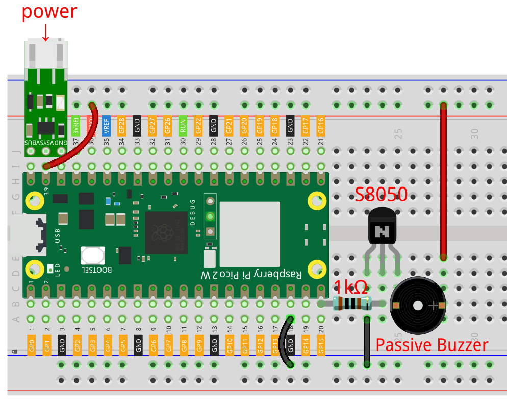

.. note::

    Hallo und willkommen in der SunFounder Raspberry Pi & Arduino & ESP32 Enthusiasten-Gemeinschaft auf Facebook! Tauche tiefer in die Welt des Raspberry Pi, Arduino und ESP32 ein mit anderen Enthusiasten.

    **Warum beitreten?**

    - **Expertenunterstützung**: Löse Nachverkaufsprobleme und technische Herausforderungen mit Hilfe unserer Gemeinschaft und unseres Teams.
    - **Lernen & Teilen**: Austausch von Tipps und Tutorials zur Verbesserung deiner Fähigkeiten.
    - **Exklusive Vorschauen**: Erhalte frühen Zugang zu neuen Produktankündigungen und Einblicke.
    - **Sonderangebote**: Genieße exklusive Rabatte auf unsere neuesten Produkte.
    - **Festliche Aktionen und Gewinnspiele**: Nimm an Gewinnspielen und Feiertagsaktionen teil.

    👉 Bist du bereit, mit uns zu erkunden und zu kreieren? Klicke auf [|link_sf_facebook|] und trete heute bei!

.. _py_iot_mqtt_subscribe:

8.6 Cloud-Musikplayer mit @MQTT
=========================================

Es wird empfohlen, zunächst das Projekt :ref:`py_iot_mqtt_publish` durchzuführen, um die Installation einiger Module abzuschließen und die Konfiguration der HiveMQ-Plattform abzuschließen.

In diesem Projekt fungiert der Pico 2 W als Abonnent und empfängt den Liednamen unter dem Thema.
Wenn der Liedname bereits im Code vorhanden ist, wird der Pico 2 W dazu bringen, dass der Summer das Lied spielt.

**1. Benötigte Komponenten**

Für dieses Projekt benötigst du die folgenden Komponenten. 

Es ist definitiv praktisch, ein ganzes Kit zu kaufen, hier ist der Link:

.. list-table::
    :widths: 20 20 20
    :header-rows: 1

    *   - Name	
        - ITEMS IN THIS KIT
        - LINK
    *   - Pico 2 W Starter Kit	
        - 450+
        - |link_pico2w_kit|

Du kannst sie auch einzeln über die untenstehenden Links kaufen.

.. list-table::
    :widths: 5 20 5 20
    :header-rows: 1

    *   - SN
        - COMPONENT	
        - QUANTITY
        - LINK

    *   - 1
        - :ref:`cpn_pico_2w`
        - 1
        - |link_pico2w_buy|
    *   - 2
        - Micro USB Cable
        - 1
        - 
    *   - 3
        - :ref:`cpn_breadboard`
        - 1
        - |link_breadboard_buy|
    *   - 4
        - :ref:`cpn_wire`
        - Mehrere
        - |link_wires_buy|
    *   - 5
        - :ref:`cpn_transistor`
        - 1(S8050)
        - |link_transistor_buy|
    *   - 6
        - :ref:`cpn_resistor`
        - 1(1KΩ)
        - |link_resistor_buy|
    *   - 7
        - Passiver :ref:`cpn_buzzer`
        - 1
        - |link_passive_buzzer_buy|
    *   - 8
        - :ref:`cpn_lipo_charger`
        - 1
        -  
    *   - 9
        - 18650 Battery
        - 1
        -  

**2. Den Schaltkreis aufbauen**

Das Kit enthält zwei Summer, wir verwenden einen passiven Summer (einen mit einer freiliegenden Leiterplatte auf der Rückseite). Der Summer benötigt einen Transistor, hier verwenden wir S8050.

    .. warning:: 
        
        Stelle sicher, dass dein Li-po-Ladegerät wie im Diagramm gezeigt angeschlossen ist. Andernfalls könnte ein Kurzschluss deine Batterie und die Schaltung beschädigen.

**3. Führe den Code aus**

#. Lade die Datei ``play_music.py`` unter dem Pfad ``pico-2w-kit-main/micropython/iot`` auf den Raspberry Pi Pico 2 W hoch.

    .. image:: img/mqtt-A-1.png

#. Öffne die Datei ``8.6_mqtt_subscribe_music.py`` unter dem Pfad ``pico-2w-kit-main/micropython/iot`` und klicke auf den Knopf **Run current script** oder drücke F5, um sie auszuführen.

    .. image:: img/6_cloud_player.png

    .. note::

        Bevor du den Code ausführst, musst du die Skripte ``do_connect.py`` und ``secrets.py`` auf deinem Pico 2 W erstellen. Bitte siehe :ref:`py_iot_access`, um sie zu erstellen.

#. Öffne |link_hivemq| in deinem Browser, trage das Thema als ``SunFounder MQTT Music`` ein, fülle den Liednamen als **Message** aus. Nachdem du auf den **Publish**-Knopf geklickt hast, wird der mit dem Pico 2 W verbundene Summer das entsprechende Lied spielen.

    .. note::
        In play_music.py sind ``nokia``, ``starwars``, ``nevergonnagiveyouup``, ``gameofthrone``, ``songofstorms``, ``zeldatheme``, ``harrypotter`` enthalten.

    .. image:: img/mqtt-5.png
        :width: 500

#. Wenn du möchtest, dass dieses Skript beim Booten ausgeführt wird, kannst du es als ``main.py`` auf dem Raspberry Pi Pico 2 W speichern.

**Wie funktioniert es?**

Um es einfacher zu verstehen, haben wir den MQTT-Code vom Rest getrennt.
Dadurch erhältst du den folgenden Code, der die grundlegendste Funktionalität von MQTT-Abonnements an drei Stellen implementiert.

.. code-block:: python
    :emphasize-lines: 13,14,15,16,20,28,29,30

    import time
    from umqtt.simple import MQTTClient

    # Importiert die Funktion `do_connect()`, die die Logik für die Verbindung mit Wi-Fi mit dem `network`-Modul enthält. Sobald die Funktion `do_connect()` aufgerufen wird, verbindet sie sich mit dem in `secrets.py` spezifizierten Wi-Fi-Netzwerk. Wenn die Verbindung fehlschlägt, wird eine Ausnahme ausgelöst; wenn erfolgreich, wird der nächste Schritt fortgesetzt.
    from do_connect import * 
    do_connect()

    mqtt_server = 'broker.hivemq.com'
    client_id = 'Jimmy'

    # um die Nachricht zu abonnieren
    topic = b'SunFounder MQTT Music'

    def callback(topic, message):
        print("New message on topic {}".format(topic.decode('utf-8')))
        message = message.decode('utf-8')
        print(message)

    try:
        client = MQTTClient(client_id, mqtt_server, keepalive=60)
        client.set_callback(callback)
        client.connect()
        print('Connected to %s MQTT Broker'%(mqtt_server))
    except OSError as e:
        print('Failed to connect to MQTT Broker. Reconnecting...')
        time.sleep(5)
        machine.reset()
        
    while True:
        client.subscribe(topic)
        time.sleep(1)

Beim Verbinden mit dem MQTT-Broker rufen wir die Funktion ``client.set_callback(callback)`` auf, die als Rückruf für die empfangenen Abonnementnachrichten dient.

.. code-block:: python
    :emphasize-lines: 3

    try:
        client = MQTTClient(client_id, mqtt_server, keepalive=60)
        client.set_callback(callback)
        client.connect()
        print('Connected to %s MQTT Broker'%(mqtt_server))
    except OSError as e:
        print('Failed to connect to MQTT Broker. Reconnecting...')
        time.sleep(5)
        machine.reset()

Als nächstes ist die Rückruffunktion, die die Nachricht aus dem abgerufenen Thema ausgibt.
MQTT ist ein binärbasiertes Protokoll, bei dem die Steuerelemente binäre Bytes und keine Textzeichenfolgen sind, daher müssen diese Nachrichten mit ``message.decode('utf-8')`` dekodiert werden.

.. code-block:: python

    def callback(topic, message):
        print("New message on topic {}".format(topic.decode('utf-8')))
        message = message.decode('utf-8')
        print(message)

Verwende eine ``While True``-Schleife, um regelmäßig Nachrichten unter diesem Thema zu erhalten.

.. code-block:: python

    while True:
        client.subscribe(topic)
        time.sleep(1)

Als nächstes wird Musik gespielt. Diese Funktion befindet sich im Skript ``play_music.py``, das aus drei Hauptteilen besteht.

   * „Tone“: Simuliert einen spezifischen Ton basierend auf der grundlegenden |link_piano_frequency|, die verwendet wird, um ihn zu spielen.

        .. code-block:: python

            NOTE_B0 =  31
            NOTE_C1 =  33
            ...
            NOTE_DS8 = 4978
            REST =      0

   * ``Score``: Bearbeite die Musik in ein Format, das das Programm verwenden kann. Diese Partituren stammen von `Robson Coutos kostenlosem Teilen <https://github.com/robsoncouto/arduino-songs>`, du kannst auch deine Lieblingsmusik im folgenden Format hinzufügen.

    .. code-block:: python

        # Noten der Melodie gefolgt von der Dauer.
        # eine 4 bedeutet eine Viertelnote, 8 eine Achtelnote, 16 eine Sechzehntelnote, usw.
        # !!negative Zahlen werden verwendet, um punktierte Noten darzustellen,
        # also bedeutet -4 eine punktierte Viertelnote, das heißt, eine Viertelnote plus eine Achtelnote!!
        song = {
            "nokia":[NOTE_E5, 8, NOTE_D5, 8, NOTE_FS4, 4, NOTE_GS4, 4, NOTE_CS5, 8, NOTE_B4, 8, NOTE_D4, 4, 
                        NOTE_E4, 4,NOTE_B4, 8, NOTE_A4, 8, NOTE_CS4, 4, NOTE_E4, 4, NOTE_A4, 2],
            "starwars":[,,,],
            "nevergonnagiveyouup":[,,,],
            "gameofthrone":[,,,],
            "songofstorms":[,,,],
            "zeldatheme":[,,,],
            "harrypotter":[,,,],
        }

    * ``Play``: Dieser Teil ist im Grunde gleich wie :ref:`py_pa_buz`, jedoch leicht optimiert, um zu der oben genannten Partitur zu passen.

   .. code-block:: python

       import time
       import machine

       # Ändere dies, um das Lied langsamer oder schneller zu machen
       tempo = 220

       # dies berechnet die Dauer einer ganzen Note in ms
       wholenote = (60000 * 4) / tempo

       def tone(pin,frequency,duration):
           if frequency is 0:
               pass
           else:
               pin.freq(frequency)
               pin.duty_u16(30000)
           time.sleep_ms(duration)
           pin.duty_u16(0)

       def noTone(pin):
           tone(pin,0,100)

       def play(pin,melody):

           # iteriere über die Noten der Melodie.
           # Denke daran, das Array ist doppelt so groß wie die Anzahl der Noten (Noten + Dauer)
           for thisNote in range(0,len(melody),2):
               # berechnet die Dauer jeder Note
               divider = melody[thisNote+1]
               if divider > 0:
                   noteDuration = wholenote/divider
               elif divider < 0:
                   noteDuration = wholenote/-(divider)
                   noteDuration *= 1.5

               # wir spielen nur die Note für 90% der Dauer, lassen 10% als Pause
               tone(pin,melody[thisNote],int(noteDuration*0.9))

               # Warte die spezifische Dauer, bevor die nächste Note gespielt wird.
               time.sleep_ms(int(noteDuration))

               # stoppe die Wellenformgenerierung vor der nächsten Note.
               noTone(pin)

Geh zurück zur Hauptfunktion und lass MQTT die Musikwiedergabe auslösen.
In der Rückruffunktion, bestimme, ob die gesendete Nachricht der Name eines Liedes ist, das enthalten ist.
Wenn ja, weise den Liednamen der Variablen ``melody`` zu und setze ``play_flag`` auf ``True``.

.. code-block:: python
    :emphasize-lines: 5,6,7,8

    def callback(topic, message):
        print("New message on topic {}".format(topic.decode('utf-8')))
        message = message.decode('utf-8')
        print(message)
        if message in song.keys():
            global melody,play_flag
            melody = song[message]
            play_flag = True

In der Hauptschleife, wenn ``play_flag`` ``True`` ist, spiele ``melody``.

.. code-block:: python
    :emphasize-lines: 4,5,6

    while True:
        client.subscribe(topic)
        time.sleep(1)
        if play_flag is True:
            play(buzzer,melody)
            play_flag = False