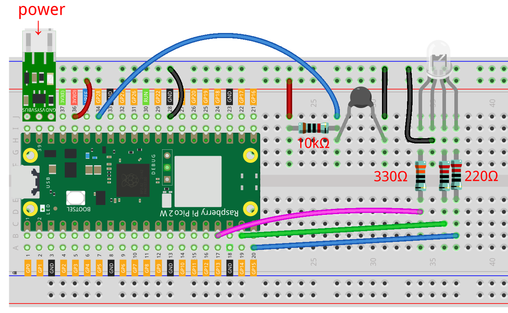

.. note:: 

    こんにちは、SunFounder Raspberry Pi & Arduino & ESP32 Enthusiasts Communityへようこそ！仲間たちと一緒にRaspberry Pi、Arduino、ESP32についてさらに深く学びましょう。

    **参加する理由は？**

    - **専門家のサポート**: コミュニティやチームの助けを借りて、購入後の問題や技術的な課題を解決できます。
    - **学びと共有**: ヒントやチュートリアルを交換して、スキルを向上させましょう。
    - **限定プレビュー**: 新製品の発表や先行情報をいち早く手に入れましょう。
    - **特別割引**: 最新製品の特別割引をお楽しみください。
    - **イベント・プレゼント**: プレゼント企画や祝日セールに参加しましょう。

    👉 一緒に探求し、創造を楽しみませんか？[|link_sf_facebook|]をクリックして、今すぐ参加しましょう！

.. _py_iot_web_server:

8.7 Webサーバーのセットアップ
====================================

この記事では、Pico 2 WをWebサーバーにして、ブラウザを通じて回路を操作し、センサーの読み取り値を取得する方法を学びます。

|setup_web|

**1. 必要なコンポーネント**

このプロジェクトでは、以下のコンポーネントが必要です。

キット一式を購入するのが便利です。こちらのリンクから購入できます：

.. list-table::
    :widths: 20 20 20
    :header-rows: 1

    *   - 名前	
        - このキットに含まれるアイテム
        - リンク
    *   - Pico 2 W スターターキット	
        - 450以上
        - |link_pico2w_kit|

別々に購入することもできます。以下のリンクから購入可能です。

.. list-table::
    :widths: 5 20 5 20
    :header-rows: 1

    *   - SN
        - コンポーネント	
        - 数量
        - リンク

    *   - 1
        - :ref:`cpn_pico_2w`
        - 1
        - |link_pico2w_buy|
    *   - 2
        - Micro USBケーブル
        - 1
        - 
    *   - 3
        - :ref:`cpn_breadboard`
        - 1
        - |link_breadboard_buy|
    *   - 4
        - :ref:`cpn_wire`
        - 複数
        - |link_wires_buy|
    *   - 5
        - :ref:`cpn_resistor`
        - 4(1-330Ω, 2-220Ω, 1-10KΩ)
        - |link_resistor_buy|
    *   - 6
        - :ref:`cpn_rgb`
        - 1
        - |link_rgb_led_buy|
    *   - 7
        - :ref:`cpn_thermistor`
        - 1
        - |link_thermistor_buy|
    *   - 8
        - :ref:`cpn_lipo_charger`
        - 1
        -  
    *   - 9
        - Power Pack
        - 1
        -  

**2. 回路を組み立てる**

    .. warning:: 
        
        Li-po充電モジュールが図のように接続されていることを確認してください。そうしないと、短絡が原因でバッテリーや回路が損傷する可能性があります。

**3. コードを実行する**

    .. note::

        コードを実行する前に、Pico 2 Wに ``do_connect.py`` および ``secrets.py`` スクリプトがあることを確認してください。もしない場合は、 :ref:`py_iot_access` を参照して作成してください。

#. ``pico-2w-kit-main/micropython/iot`` のパスにある ``7_web_page.py`` ファイルを開きます。
#. **現在のスクリプトを実行** ボタンをクリックするか、F5を押して実行します。接続が成功すると、Pico 2 WのIPアドレスが表示されます。

    .. image:: img/7_web_server.png

#. Pico 2 WのIPアドレスをブラウザに入力し、このプロジェクトのために作成されたWebページにアクセスします。任意のボタンをクリックすると、RGB LEDの色が変更され、温度と湿度が更新されます。

    .. image:: img/web-1.png
        :width: 500

#. このスクリプトを起動時に実行できるようにしたい場合は、Raspberry Pi Pico 2 Wに ``main.py`` として保存できます。

**仕組みは？**

このプロジェクトはネットワーク接続を必要とし、 :ref:`py_iot_access` メソッドを使用してネットワークに接続します。

.. code-block:: python

    from secrets import *
    from do_connect import *
    
from do_connect import * : これは `do_connect()` 関数をインポートします。この関数には、 `network` モジュールを使用してWi-Fiに接続するロジックが含まれています。 `do_connect()` 関数が呼び出されると、 `secrets.py` で指定されたWi-Fiネットワークに接続します。接続に失敗した場合は例外が発生し、成功すれば次のステップに進みます。

from secrets import * :  `secrets.py` ファイルは通常、Wi-FiのSSID、パスワード、その他の機密情報（APIキーなど）を保存するために使用されます。これにより、機密情報をメインコードファイルに直接埋め込むことを避けることができます。

訪問するWebページは実際にはサーバー上でホストされており、サーバーのソケットは私たちが訪問した際にそのページを送信します。
ソケットは、サーバーが接続を希望するクライアントを待機する方法です。

このプロジェクトでは、Pico 2 Wがサーバーとなり、コンピュータはブラウザを通じてPico 2 WがホストするWebページにアクセスします。

まず、IPアドレスと |link_port| が必要なソケットを作成します。
ネットワーク接続およびIPの取得方法については :ref:`py_iot_access` に記載されています。ポートには80を使用します。
ソケットの設定後、それを返して次のステップで使用します。

`socket library - Python Docs <https://docs.python.org/3/library/socket.html>`_ 

.. code-block:: python

    import socket

    def open_socket(ip):
        # ソケットを開く
        address = (ip, 80)
        connection = socket.socket()
        connection.bind(address)
        connection.listen(1)
        print(connection)
        return(connection)

次に、先ほど設定したソケットを使用するWebサービスをセットアップします。
以下のコードは、Pico 2 Wがブラウザからのアクセスリクエストを受け取ることを可能にします。

.. code-block:: python

    def serve(connection):
        while True:
            client = connection.accept()[0]
            request = client.recv(1024)
            client.close()

次に、訪問者に送信するHTMLページが必要です。この例では、 ``html`` という変数に文字列形式でシンプルなHTMLページを格納しています。

.. note:: 
    自分のHTMLを作成したい場合は、 |link_html| でヘルプを受けることができます。

.. code-block:: python

    def webpage(value):
        html = f"""
                <!DOCTYPE html>
                <html>
                <body>
                <form action="./red">
                <input type="submit" value="red " />
                </form>
                <form action="./green">
                <input type="submit" value="green" />
                </form>
                <form action="./blue">
                <input type="submit" value="blue" />
                </form>
                <form action="./off">
                <input type="submit" value="off" />
                </form>
                
Temperature is {value} degrees Celsius

                </body>
                </html>
                """
        return html

訪問者にHTMLページを送信します。

.. code-block:: python
    :emphasize-lines: 5,6

    def serve(connection):
        while True:
            client = connection.accept()[0]
            request = client.recv(1024)
            html=webpage(0)
            client.send(html)
            client.close()

上記の部分を組み合わせると、ブラウザを通じてページにアクセスできるようになります。効果を確認するには、以下のコードをThonnyで実行してみてください。

.. code-block:: python

    import machine
    import socket

    from secrets import *
    from do_connect import *

    def webpage(value):
        html = f"""
                <!DOCTYPE html>
                <html>
                <body>
                <form action="./red">
                <input type="submit" value="red " />
                </form>
                <form action="./green">
                <input type="submit" value="green" />
                </form>
                <form action="./blue">
                <input type="submit" value="blue" />
                </form>
                <form action="./off">
                <input type="submit" value="off" />
                </form>
                
Temperature is {value} degrees Celsius

                </body>
                </html>
                """
        return html

    def open_socket(ip):
        # ソケットを開く
        address = (ip, 80)
        connection = socket.socket()
        connection.bind(address)
        connection.listen(1)
        print(connection)
        return(connection)

    def serve(connection):
        while True:
            client = connection.accept()[0]
            request = client.recv(1024)
            html=webpage(0)
            client.send(html)
            client.close()

    try:
        ip=do_connect()
        if ip is not None:
            connection=open_socket(ip)
            serve(connection)
    except KeyboardInterrupt:
        machine.reset()

上記のコードを実行すると、Webページのみが表示され、RGB LEDの制御やセンサーの読み取りができません。
Webサービスはさらに改良が必要です。

次に、ブラウザがWebページにアクセスした際にサーバーが受け取る情報が何であるかを確認する必要があります。そのため、 ``serve()`` を少し変更して ``request`` を表示させます。

.. code-block:: python
    :emphasize-lines: 5,6

    def serve(connection):
        while True:
            client = connection.accept()[0]
            request = client.recv(1024)
            request = str(request)
            print(request)  
            html=webpage(0)
            client.send(html)
            client.close()

スクリプトを再実行すると、Webページでキーを押すと、Shellに次のようなメッセージが表示されるのが確認できます。

.. code-block:: 

    b'GET /red? HTTP/1.1\r\nHost: 192.168.18.162\r\nConnection: keep-alive.......q=0.5\r\n\r\n'
    b'GET /favicon.ico HTTP/1.1\r\nHost: 192.168.18.162\r\nConnection: keep-alive.......q=0.5\r\n\r\n'
    b'GET /blue? HTTP/1.1\r\nHost: 192.168.18.162\r\nConnection: keep-alive.......q=0.5\r\n\r\n'
    b'GET /favicon.ico HTTP/1.1\r\nHost: 192.168.18.162\r\nConnection: keep-alive.......q=0.5\r\n\r\n'

これらは読みづらいです！！！

しかし、実際に必要なのは ``/red?`` や ``/blue?`` の前の小さな部分だけです。
これにより、どのボタンが押されたのかがわかります。そこで、 ``serve()`` を改良してキー入力情報を抽出しました。

.. code-block:: python
    :emphasize-lines: 6,7,8,9

    def serve(connection):
        while True:
            client = connection.accept()[0]
            request = client.recv(1024)
            request = str(request)
            try:
                request = request.split()[1]
            except IndexError:
                pass
            print(request)  
            html=webpage(0)
            client.send(html)
            client.close()

プログラムを再実行すると、Webページでキーを押すと、Shellに次のようなメッセージが表示されます。

.. code-block:: 

    /red?
    /favicon.ico
    /blue?
    /favicon.ico
    /off?
    /favicon.ico

その後、RGB LEDの色を ``request`` の値に従って変更します。

.. code-block:: python

    def serve(connection):
        while True:
            client = connection.accept()[0]
            request = client.recv(1024)
            request = str(request)
            try:
                request = request.split()[1]
            except IndexError:
                pass
            
            print(request)
            
            if request == '/off?':
                red.low()
                green.low()
                blue.low()
            elif request == '/red?':
                red.high()
                green.low()
                blue.low()
            elif request == '/green?':
                red.low()
                green.high()
                blue.low()
            elif request == '/blue?':
                red.low()
                green.low()
                blue.high()
 
            html=webpage(0)
            client.send(html)
            client.close()

最後に、Webページにサーミスタの値を表示する部分です（サーミスタの使用方法については :ref:`py_temp` を参照）。
この部分は実際にはHTMLのテキストを変更することによって行います。
``webpage(value)`` 関数でパラメータを設定し、単に受け取るパラメータを変更することで、Webページに表示される数字を変更します。

.. code-block:: python
    :emphasize-lines: 30,31

    def serve(connection):
        while True:
            client = connection.accept()[0]
            request = client.recv(1024)
            request = str(request)
            try:
                request = request.split()[1]
            except IndexError:
                pass
            
            #print(request)
            
            if request == '/off?':
                red.low()
                green.low()
                blue.low()
            elif request == '/red?':
                red.high()
                green.low()
                blue.low()
            elif request == '/green?':
                red.low()
                green.high()
                blue.low()
            elif request == '/blue?':
                red.low()
                green.low()
                blue.high()

            value='%.2f'%temperature()    
            html=webpage(value)
            client.send(html)
            client.close()

.. https://projects.raspberrypi.org/en/projects/get-started-pico-w/3