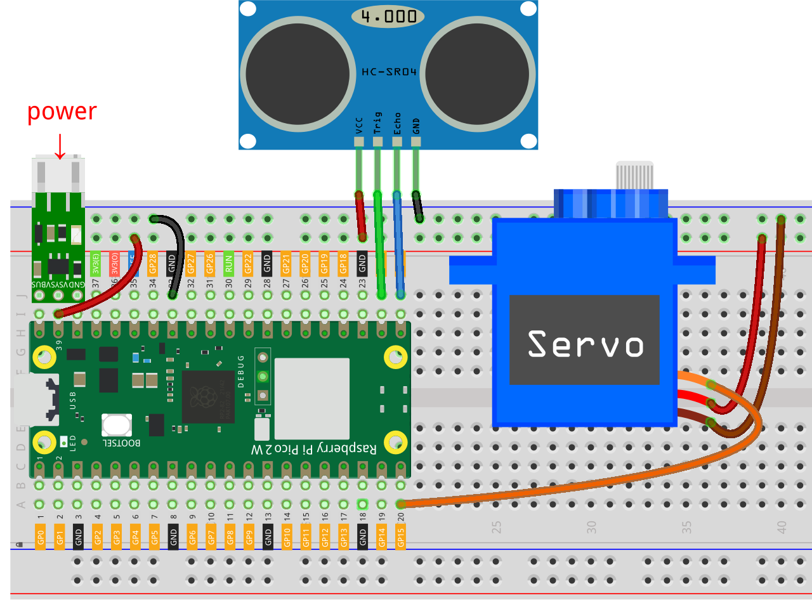

.. note::

    Hallo und willkommen in der SunFounder Raspberry Pi & Arduino & ESP32 Enthusiasten-Gemeinschaft auf Facebook! Tauche tiefer in die Welt des Raspberry Pi, Arduino und ESP32 ein mit anderen Enthusiasten.

    **Warum beitreten?**

    - **Expertenunterstützung**: Löse Nachverkaufsprobleme und technische Herausforderungen mit Hilfe unserer Gemeinschaft und unseres Teams.
    - **Lernen & Teilen**: Austausch von Tipps und Tutorials zur Verbesserung deiner Fähigkeiten.
    - **Exklusive Vorschauen**: Erhalte frühen Zugang zu neuen Produktankündigungen und Einblicke.
    - **Sonderangebote**: Genieße exklusive Rabatte auf unsere neuesten Produkte.
    - **Festliche Aktionen und Gewinnspiele**: Nimm an Gewinnspielen und Feiertagsaktionen teil.

    👉 Bist du bereit, mit uns zu erkunden und zu kreieren? Klicke auf [|link_sf_facebook|] und trete heute bei!

.. _py_iot_sunfounder_controller:

8.8 Spielen mit @SunFounder Controller
==========================================

In diesem Projekt lernst du, wie du ein Fernprojekt mit der Sunfounder Controller-App 
aufbaust. In einem LAN-Umfeld kannst du deine Pico 2 W-Schaltung mit deinem Smartphone/Tablet 
steuern. Diese App ist besonders nützlich, wenn du einen einfachen Roboter mit Pico 2 W bauen möchtest.

Hier verwenden wir die Schieberegler in der App, um den Winkel des Servos zu steuern, und das Messgerät 
in der App zeigt die durch Ultraschall erfasste Entfernung an.

**1. Benötigte Komponenten**

Für dieses Projekt benötigen wir die folgenden Komponenten. 

Es ist definitiv praktisch, ein ganzes Kit zu kaufen, hier ist der Link:

.. list-table::
    :widths: 20 20 20
    :header-rows: 1

    *   - Name
        - ITEMS IN THIS KIT
        - LINK
    *   - Pico 2 W Starter Kit
        - 450+
        - |link_pico2w_kit|

Du kannst sie auch einzeln über die untenstehenden Links kaufen.

.. list-table::
    :widths: 5 20 5 20
    :header-rows: 1

    *   - SN
        - COMPONENT
        - QUANTITY
        - LINK

    *   - 1
        - :ref:`cpn_pico_2w`
        - 1
        - |link_pico2w_buy|
    *   - 2
        - Micro USB Cable
        - 1
        - 
    *   - 3
        - :ref:`cpn_breadboard`
        - 1
        - |link_breadboard_buy|
    *   - 4
        - :ref:`cpn_wire`
        - Mehrere
        - |link_wires_buy|
    *   - 5
        - :ref:`cpn_servo`
        - 1
        - |link_servo_buy|
    *   - 6
        - :ref:`cpn_ultrasonic`
        - 1
        - |link_ultrasonic_buy|
    *   - 7
        - :ref:`cpn_lipo_charger`
        - 1
        -  
    *   - 8
        - Power Pack
        - 1
        -  

**2. Den Schaltkreis aufbauen**

.. warning:: 
        
    Stelle sicher, dass dein Li-po-Ladegerät wie im Diagramm gezeigt angeschlossen ist. Andernfalls könnte ein Kurzschluss deine Batterie und die Schaltung beschädigen.

**3. SunFounder Controller einrichten**

1. Installiere die `SunFounder Controller APP <https://docs.sunfounder.com/projects/sf-controller/en/latest/>`_ aus dem **APP Store(iOS)** oder **Google Play(Android)**.

2. Öffne die APP und klicke auf das **+** Symbol auf der Startseite, um einen Controller zu erstellen.

    .. image:: img/sc-a-2.jpg
        :width: 800

3. Hier wählen wir **Blank** und **Dual Stick**.

    .. image:: img/sc-a-3.jpg
        :width: 800

4. Jetzt erhalten wir einen leeren Controller.

    .. image:: img/sc-a-4.jpg
        :width: 800

5. Klicke auf das **H**-Feld und füge ein **Slider**-Widget hinzu.

    .. image:: img/sc-a-5.jpg
        :width: 800

6. Klicke auf das Zahnrad am Steuergerät, um das Einstellungsfenster zu öffnen.

    .. image:: img/sc-a-6.png
        :width: 300

7. Stelle das Maximum auf 180 und das Minimum auf 0 ein, dann klicke auf **Bestätigen**.

    .. image:: img/sc-a-7.jpg
        :width: 800

8. Klicke auf das L-Feld und füge ein Messgerät-Widget hinzu.

    .. image:: img/sc-a-8.jpg
        :width: 800

9. Klicke auf das Zahnrad des Messgeräts, öffne das Einstellungsfenster, stelle das Maximum auf 100, das Minimum auf 0 und die Einheit auf cm ein.

    .. image:: img/sc-a-9.jpg
        :width: 800

10. Nachdem du die Widget-Einstellungen abgeschlossen hast, klicke auf Speichern.

    .. image:: img/sc-a-10.png
        :width: 300

**4. Führe den Code aus**

.. note:: 
    Wenn dein Pico 2 W derzeit die Anvil-Firmware verwendet, musst du :ref:`install_micropython_on_pico`.

1. Lade die Dateien ``ws.py`` und ``websocket_helper.py`` aus dem Pfad ``pico-2w-kit-main/micropython/libs`` auf den Raspberry Pi Pico 2 W hoch.

    .. image:: img/9_sc3.png

2. Doppelklicke auf das Skript „ws.py“ und trage dein WiFi ``SSID`` und ``PASSWORD`` ein.

    .. image:: img/9_sc1.png

3. Öffne die Datei ``9_sunfounder_controller.py`` unter dem Pfad ``pico-2w-kit-main/micropython/iot``. Klicke auf den Knopf **Run current script** oder drücke F5, um es auszuführen. Nach erfolgreicher Verbindung siehst du die IP des Pico 2 W.

    .. image:: img/9_sc2.png

    .. note::
        Wenn du möchtest, dass dieses Skript beim Booten ausgeführt wird, kannst du es als ``main.py`` auf dem Raspberry Pi Pico 2 W speichern.

4. Kehre zur SunFounder Controller APP zurück und klicke auf den **Verbinden**-Knopf.

    .. image:: img/sc-c-4.jpg
        :width: 300

5. Wenn PicoW erkannt wird, tippe direkt darauf, um eine Verbindung herzustellen.

    .. image:: img/sc-c-5.jpg
        :width: 300

6. Wenn es nicht automatisch sucht, kannst du auch manuell die IP eingeben, um eine Verbindung herzustellen.

    .. image:: img/sc-c-6.png
        :width: 800

7. Wenn du nach dem Klicken auf die Ausführen-Taste den Schieberegler im H-Bereich verschiebst, stellt der Servo seinen Winkel ein. Das Messgerät im L-Bereich zeigt die Entfernung an, wenn deine Hand innerhalb von 100 cm vom Ultraschallsensor ist.

    .. image:: img/sc-c-8.jpg
        :width: 300

**Wie funktioniert es?**

Die Klasse ``WS_Server`` in der Bibliothek ``ws.py`` implementiert die Kommunikation mit der APP. Unten ist das Framework für die Implementierung der grundlegenden Funktionalität dargestellt.

.. code-block:: python

    from ws import WS_Server
    import json
    import time

    ws = WS_Server(8765) # init websocket 

    def main():
        ws.start()
        while True:
            status,result=ws.transfer()
            time.sleep_ms(100)

    try:
        main()
    finally:
        ws.stop()

Zuerst müssen wir ein ``WS_Server``-Objekt erstellen.

.. code-block:: python

    ws = WS_Server(8765)

Starten Sie es.

.. code-block:: python

    ws.start()

Als Nächstes wird eine ``while True``-Schleife verwendet, um den Datentransfer zwischen Pico 2 W und der SunFounder Controller-App durchzuführen.

.. code-block:: python

    while True:
        #  Datenübertragung via WebSocket
        status, result = ws.transfer()

        # Status der Datenübertragung
        print(status)

        # empfangene Daten
        print(result)

        # gesendete Daten
        print(ws.send_dict)

        time.sleep_ms(100)

``status`` ist ``False``, falls keine Daten von der SunFounder Controller-App empfangen werden können.

Und ``result`` sind die Daten, die Pico 2 W von der SunFounder Controller-App abruft.
Drucken Sie diese aus, und Sie werden so etwas wie das Folgende sehen. Dies ist der Wert aller Widget-Bereiche.

.. code-block:: 

    {'C': None, 'B': None, 'M': None,,,,, 'A': None, 'R': None}

Wie in diesem Fall drucken wir die Werte des H-Bereichs separat aus und verwenden sie zur Steuerung des Schaltkreises.

.. code-block:: python

        status,result=ws.transfer()
        #print(result)
        if status == True:
            print(result['H'])

Und das ``ws.send_dict`` Wörterbuch ist die Datenmenge, die Pico 2 W an die SunFounder Controller-App sendet. Es wird in der Klasse ``WS_Server`` erstellt und gesendet, wenn ``ws.transfer()`` ausgeführt wird.

Die Nachricht lautet wie folgt:

.. code-block:: python

    {'Check': 'SunFounder Controller', 'Name': 'Pico2W', 'Type': 'Blank'}

Dies ist eine leere Nachricht, um sie auf das Widget in der SunFounder Controller-App zu kopieren, müssen wir den entsprechenden Bereich im Wörterbuch mit einem Wert belegen. Zum Beispiel den Wert ``50`` dem L-Bereich zuweisen.

.. code-block:: python

        ws.send_dict['L'] = 50

Die Daten werden wie folgt angezeigt:

.. code-block:: python

    {'L': 50, 'Type': 'Blank', 'Name': 'Pico2W', 'Check': 'SunFounder Controller'}

Für weitere Details zur Nutzung der SunFounder Controller, siehe `SunFounder Controller APP <https://docs.sunfounder.com/projects/sf-controller/en/latest/>`_.