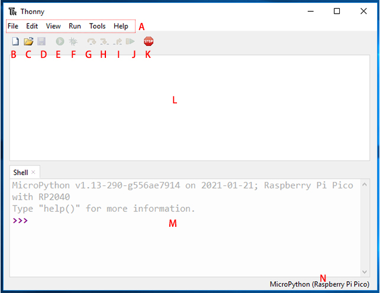

.. note:: 

    こんにちは、SunFounder Raspberry Pi & Arduino & ESP32 Enthusiasts Communityへようこそ！仲間たちと一緒にRaspberry Pi、Arduino、ESP32についてさらに深く学びましょう。

    **なぜ参加するべきか?**

    - **専門家のサポート**: 購入後の問題や技術的な課題を、コミュニティとチームのサポートで解決できます。
    - **学びと共有**: ヒントやチュートリアルを交換して、スキルを向上させましょう。
    - **限定プレビュー**: 新製品の発表に早期アクセスできます。
    - **特別割引**: 最新製品に特別割引を提供します。
    - **季節限定のプロモーションやプレゼント**: プレゼント企画や祝日プロモーションに参加できます。

    👉 一緒に探索し、創造を始めましょう！[|link_sf_facebook|] をクリックして、今すぐ参加しましょう！

.. _thonny_ide:

1.2 Thonny IDEのインストールと紹介
=======================================

PicoをMicroPythonでプログラムするには、統合開発環境（IDE）が必要です。ここでは、Thonnyをおすすめします。Thonny IDEにはPython 3.7があらかじめインストールされているため、インストールするだけで利用できます。

Webからのダウンロード
------------------------

PicoをMicroPythonでプログラムするには、統合開発環境（IDE）が必要です。ここでは、Thonnyをおすすめします。ThonnyにはPython 3.7が組み込まれており、簡単なインストーラーでインストールでき、プログラミングの学習をすぐに始められます。

.. note:: 

    Raspberry Pi Pico 2 WインタープリターはThonnyのバージョン3.3.3以降でのみ動作するため、すでにインストールされている場合はこの章をスキップできます。それ以外の場合は、最新バージョンに更新するか、インストールしてください。

#. |link_thonny| ウェブサイトにアクセスして、インストーラをダウンロードします。ページが開いたら、右上隅にある薄灰色のボックスをクリックし、使用しているオペレーティングシステムに対応するリンクを選択します。

   .. image:: img/download_thonny.png
    :width: 400

#. インストーラには新しい証明書が署名されていますが、その証明書の信頼性はまだ構築されていない場合があります。ブラウザの警告（例：Chromeでは「破棄」ではなく「保持」を選択）や、Windows Defenderの警告（ **詳細情報** ⇒ **実行** ）を通過する必要があるかもしれません。

   .. image:: img/install_thonny1.png

#. 次に、 **Next** と **Install** をクリックしてThonnyのインストールを完了させます。

   .. image:: img/install_thonny6.png

Thonny IDEの紹介
----------------------------------

* Ref: `realpython <https://realpython.com/micropython/>`_

* **A**: 新規作成、保存、編集、表示、実行、デバッグなどのメニューが表示されるメニューバー。
* **B**: 新しいファイルを作成するための紙のアイコン。
* **C**: Raspberry Pi Pico 2 Wがすでにコンピュータに接続されている場合、コンピュータまたはPicoに存在するファイルを開くことができます。
* **D**: フロッピーディスクのアイコンをクリックしてコードを保存します。コードをコンピュータまたはRaspberry Pi Pico 2 Wに保存するかどうかも選べます。
* **E**: 再生アイコンでコードを実行できます。コードを実行する前に、保存していない場合は保存してください。
* **F**: デバッグアイコンでコードのデバッグができます。コードを作成していると、構文エラーや論理エラーなど、さまざまなエラーに遭遇します。デバッグは、エラーを見つけて調査するためのツールです。

.. note:: 

     MicroPython（Raspberry Pi Pico）.COMxxがインタープリタとして選択されている場合、デバッグツールは使用できません。

     コードをデバッグするには、インタープリタをデフォルトインタープリタとして選択し、デバッグ後にコンピュータに保存してください。

     デバッグしたコードをRaspberry Pi Pico 2 Wに保存するには、再度MicroPython（Raspberry Pi Pico）.COMxxインタープリタを選択し、「名前を付けて保存」ボタンをクリックして、再度保存ボタンをクリックします。

* デバッグアイコンをクリックすると、G、H、Iの矢印アイコンを使ってプログラムをステップ実行できます。各矢印をクリックすると、評価中のPythonの行やセクションが黄色でハイライトされます。

    * **G**: 大きなステップ、次の行またはコードブロックにジャンプします。
    * **H**: 小さなステップ、各コンポーネントを詳細に評価します。
    * **I**: デバッガーを終了します。
* **J**: デバッグモードから再生モードに戻るためのボタンです。
* **K**: 停止アイコンを使用してコードの実行を停止します。
* **L**: スクリプトエリア、ここでPythonコードを記述できます。
* **M**: Pythonシェル、単一のコマンドを入力し、Enterキーを押すとそのコマンドが実行され、実行中のプログラムの情報が表示されます。これはREPL（Read, Evaluate, Print, Loop）とも呼ばれます。
* **N**: インタープリタ、現在プログラムを実行するために使用しているPythonのバージョンが表示され、手動で他のバージョンに変更できます。

.. note:: 

   **MicroPython（Raspberry Pi Pico 2 W）インタープリタオプションが表示されない場合は？**

   * PicoがUSBケーブルでコンピュータに接続されていることを確認してください。
   * Raspberry Pi Pico 2 Wインタープリタは、Thonnyのバージョン3.3.3以上でのみ利用できます。古いバージョンを使用している場合は、更新してください。
