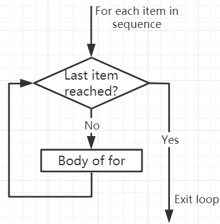

.. note::  

    こんにちは、SunFounder Raspberry Pi & Arduino & ESP32 Enthusiasts Communityへようこそ！仲間たちと一緒にRaspberry Pi、Arduino、ESP32についてさらに深く学びましょう。

    **なぜ参加するべきか？**

    - **専門家のサポート**: 購入後の問題や技術的な課題を、コミュニティやチームの助けを借りて解決できます。
    - **学びと共有**: ヒントやチュートリアルを交換し、スキルを向上させましょう。
    - **限定プレビュー**: 新製品の発表や先行情報をいち早く手に入れることができます。
    - **特別割引**: 最新製品の特別割引をお楽しみいただけます。
    - **季節限定プロモーションやプレゼント企画**: プレゼント企画や祝日セールに参加しましょう。

    👉 一緒に探求し、創造を楽しみませんか？[|link_sf_facebook|] をクリックして、今すぐ参加してください！

.. _syntax_forloop:

For Loops
============

``for`` ループは、リストや文字列など、アイテムの並び（シーケンス）を反復処理するために使用します。

forループの構文は以下の通りです:

.. code-block:: python

    for val in sequence:
        Body of for

ここで ``val`` は、シーケンス中のアイテムがループの各イテレーションで代入される変数です。

シーケンスの最後のアイテムに達するまでループは続行します。 ``for`` ループの本体と他のコードは、インデントによって区別されます。

**Flowchart of for Loop**

.. code-block:: python

    numbers = [1, 2, 3, 4]
    sum = 0

    for val in numbers:
        sum = sum+val
        
    print("The sum is", sum)

>>> %Run -c $EDITOR_CONTENT
The sum is 10

The break Statement
-------------------------

``break`` 文を使うと、まだすべてのアイテムを処理していない段階でもループを終了させることができます。

.. code-block:: python

    numbers = [1, 2, 3, 4]
    sum = 0

    for val in numbers:
        sum = sum+val
        if sum == 6:
            break
    print("The sum is", sum)

>>> %Run -c $EDITOR_CONTENT
The sum is 6

The continue Statement
--------------------------------------------

``continue`` 文を使うと、そのイテレーションの残りをスキップし、次のイテレーションに進むことができます。

.. code-block:: python

    numbers = [1, 2, 3, 4]

    for val in numbers:
        if val == 3:
            continue
        print(val)

>>> %Run -c $EDITOR_CONTENT
1
2
4

The range() function
--------------------------------------------

``range()`` 関数を使うと、一連の数値を生成できます。たとえば ``range(6)`` は0から5までの6つの数を生成します。

また、 ``range(start, stop, step_size)`` の形式で、開始値・終了値・ステップサイズを指定できます。ステップサイズを指定しない場合、デフォルトは1です。

``range`` は必要なときに値を生成する「遅延評価」を行いますが、in演算子やlen、 ``__getitem__`` が使える点でイテレータとは異なります。値をすべてメモリに保持するわけではなく、開始・終了・ステップを覚えておき、必要に応じて次の数を生成します。

生成される値をすべて見たい場合は、 ``list()`` 関数で強制的にリストとして取得できます。

.. code-block:: python

    print(range(6))

    print(list(range(6)))

    print(list(range(2, 6)))

    print(list(range(2, 10, 2)))

>>> %Run -c $EDITOR_CONTENT
range(0, 6)
[0, 1, 2, 3, 4, 5]
[2, 3, 4, 5]
[2, 4, 6, 8]

``range()`` を ``for`` ループと組み合わせることで、インデックスを使ったシーケンスの反復処理ができます。また、len()関数と組み合わせると便利です。

.. code-block:: python

    fruits = ['pear', 'apple', 'grape']

    for i in range(len(fruits)):
        print("I like", fruits[i])
        
>>> %Run -c $EDITOR_CONTENT
I like pear
I like apple
I like grape

Else in For Loop
--------------------------------

``for`` ループにはオプションとして ``else`` ブロックを付けられます。シーケンス内のすべてのアイテムを処理し終えると、 ``else`` 部分が実行されます。

ループ内で ``break`` が使われると、 ``for`` ループは途中で終了するため、 ``else`` 部分は実行されません。

つまり、中断がなければ ``for`` ループの ``else`` が実行される仕組みです。

.. code-block:: python

    for val in range(5):
        print(val)
    else:
        print("Finished")

>>> %Run -c $EDITOR_CONTENT
0
1
2
3
4
Finished

``break`` でループが終了した場合は、 ``else`` ブロックは実行されません。

.. code-block:: python

    for val in range(5):
        if val == 2: break
        print(val)
    else:
        print("Finished")

>>> %Run -c $EDITOR_CONTENT
0
1

