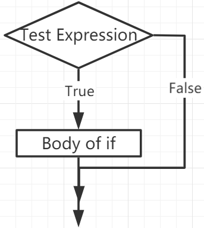
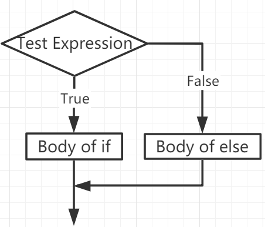
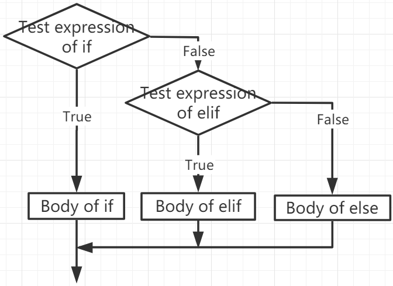

.. note::

    Hallo und herzlich willkommen in der SunFounder Raspberry Pi & Arduino & ESP32 Enthusiasten-Community auf Facebook! Tauche gemeinsam mit anderen Technikbegeisterten tiefer in die Welt von Raspberry Pi, Arduino und ESP32 ein.

    **Warum mitmachen?**

    - **Fachkundige Unterstützung**: Erhalte Hilfe bei Problemen nach dem Kauf und bei technischen Herausforderungen durch unsere Community und unser Team.
    - **Lernen & Teilen**: Tausche Tipps und Tutorials aus, um deine Fähigkeiten zu verbessern.
    - **Exklusive Vorschauen**: Erhalte frühzeitigen Zugang zu Produktankündigungen und Einblicken.
    - **Spezielle Rabatte**: Profitiere von exklusiven Rabatten auf unsere neuesten Produkte.
    - **Festliche Aktionen und Verlosungen**: Nimm an Gewinnspielen und Sonderaktionen zu Feiertagen teil.

    👉 Bereit, mit uns zu entdecken und zu gestalten? Klicke auf [|link_sf_facebook|] und trete noch heute bei!

If Else
=============

Entscheidungen müssen getroffen werden, wenn wir Code nur dann ausführen möchten, wenn eine bestimmte Bedingung erfüllt ist.

if
--------------------
.. code-block:: python

    if test expression:
        statement(s)

Hier prüft das Programm den ``Testausdruck`` und führt die ``Anweisung(en)`` nur aus, wenn der ``Testausdruck`` den Wert ``True`` hat.

Ist der ``Testausdruck`` ``False``, wird die Anweisung nicht ausgeführt.

In MicroPython definiert die Einrückung den Block des ``if``-Statements. Der Block beginnt mit einer Einrückung und endet mit der ersten nicht eingerückten Zeile.

Python interpretiert alle von Null verschiedenen Werte als "True". ``None`` und ``0`` gelten als "False".

**Ablaufdiagramm des if-Statements**

**Beispiel**

.. code-block:: python

    num = 8
    if num > 0:
        print(num, "is a positive number.")
    print("End with this line")

>>> %Run -c $EDITOR_CONTENT
8 is a positive number.
End with this line

if...else
-----------------------

.. code-block:: python

    if test expression:
        Body of if
    else:
        Body of else

Die ``if..else``-Anweisung prüft den ``Testausdruck`` und führt den ``if``-Block nur aus, wenn die Bedingung ``True`` ist.

Wenn die Bedingung ``False`` ist, wird der ``else``-Block ausgeführt. Die Einrückung trennt dabei die jeweiligen Blöcke.

**Ablaufdiagramm des if...else-Statements**

**Beispiel**

.. code-block:: python

    num = -8
    if num > 0:
        print(num, "is a positive number.")
    else:
        print(num, "is a negative number.")

>>> %Run -c $EDITOR_CONTENT
-8 is a negative number.

if...elif...else
--------------------

.. code-block:: python

    if test expression:
        Body of if
    elif test expression:
        Body of elif
    else: 
        Body of else

``Elif`` ist die Abkürzung für ``else if`` und erlaubt uns, mehrere Bedingungen zu überprüfen.

Wenn die ``if``-Bedingung ``False`` ist, wird die nächste ``elif``-Bedingung geprüft usw.

Sind alle Bedingungen ``False``, wird der ``else``-Block ausgeführt.

Es wird nur ein Block aus der ``if...elif...else``-Kette entsprechend der erfüllten Bedingung ausgeführt.

Ein ``if``-Block darf nur ein ``else`` enthalten, aber beliebig viele ``elif``-Blöcke.

**Ablaufdiagramm des if...elif...else-Statements**

**Beispiel**

.. code-block:: python

    x = 10
    y = 9

    if x > y:
        print("x is greater than y")
    elif x == y:
        print("x and y are equal")
    else:
        print("x is greater than y")

>>> %Run -c $EDITOR_CONTENT
x is greater than y

Verschachteltes if
---------------------

Wir können eine if-Anweisung in eine andere if-Anweisung einbetten – das nennt man ein verschachteltes if-Statement.

**Beispiel**

.. code-block:: python

    x = 67

    if x > 10:
        print("Above ten,")
        if x > 20:
            print("and also above 20!")
        else:
            print("but not above 20.")

>>> %Run -c $EDITOR_CONTENT
Above ten,
and also above 20!