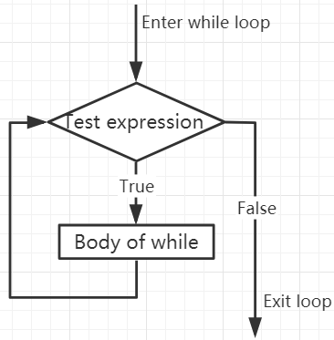

.. note::
   Hallo, willkommen in der SunFounder Raspberry Pi & Arduino & ESP32 Enthusiasten-Community auf Facebook! Tauche tiefer in die Welt von Raspberry Pi, Arduino und ESP32 ein zusammen mit anderen Begeisterten.

   **Warum beitreten?**

   - **Expertenunterstützung**: Löse Probleme nach dem Kauf und technische Herausforderungen mit Hilfe unserer Community und unseres Teams.
   - **Lernen & Teilen**: Tausche Tipps und Anleitungen aus, um deine Fähigkeiten zu verbessern.
   - **Exklusive Vorschauen**: Erhalte frühzeitigen Zugang zu neuen Produktankündigungen und exklusiven Einblicken.
   - **Sonderangebote**: Genieße exklusive Rabatte auf unsere neuesten Produkte.
   - **Festliche Aktionen und Verlosungen**: Nimm an Verlosungen und Feiertagsaktionen teil.

   👉 Bereit, mit uns zu erkunden und zu kreieren? Klicke auf [|link_sf_facebook|] und tritt heute bei!

.. _py_syntax_while:

While-Schleifen
====================

Die ``while``-Anweisung wird verwendet, um ein Programm in einer Schleife auszuführen, das heißt, ein Programm unter bestimmten Bedingungen wiederholt auszuführen, um dieselbe Aufgabe zu bearbeiten.

Ihre grundlegende Form ist:

.. code-block:: python

    while test expression:
        Body of while

In der ``while``-Schleife wird zunächst der ``test expression`` geprüft. Nur wenn der ``test expression`` den Wert ``True`` ergibt, wird der Schleifenkörper betreten. Nach jedem Durchlauf wird der ``test expression`` erneut geprüft. Dieser Prozess setzt sich fort, bis der ``test expression`` den Wert ``False`` ergibt.

In MicroPython wird der Körper der ``while``-Schleife durch Einrückung bestimmt.

Der Körper beginnt mit einer Einrückung und endet mit der ersten nicht eingerückten Zeile.

Python interpretiert jeden von Null verschiedenen Wert als ``True``. None und 0 werden als ``False`` interpretiert.

**Flussdiagramm der while-Schleife**

.. code-block:: python

    x = 10

    while x > 0:
        print(x)
        x -= 1

>>> %Run -c $EDITOR_CONTENT
10
9
8
7
6
5
4
3
2
1

Break-Anweisung
--------------------

Mit der Break-Anweisung können wir die Schleife stoppen, auch wenn die while-Bedingung wahr ist:

.. code-block:: python

    x = 10

    while x > 0:
        print(x)
        if x == 6:
            break
        x -= 1

>>> %Run -c $EDITOR_CONTENT
10
9
8
7
6

While-Schleife mit Else
--------------------------

Ähnlich wie die ``if``-Schleife kann auch die ``while``-Schleife einen optionalen ``else``-Block haben.

Wenn die Bedingung in der ``while``-Schleife als ``False`` bewertet wird, wird der ``else``-Teil ausgeführt.

.. code-block:: python

    x = 10

    while x > 0:
        print(x)
        x -= 1
    else:
        print("Game Over")

>>> %Run -c $EDITOR_CONTENT
10
9
8
7
6
5
4
3
2
1
Game Over